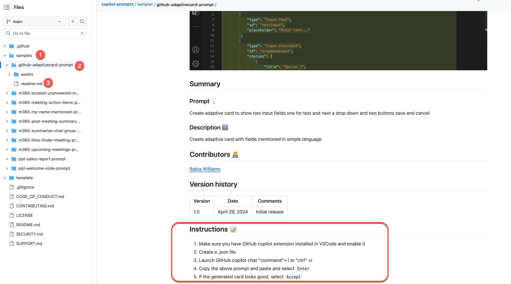

# Copilot Prompts

This repository contains sample prompts and agent instructions for Microsoft Copilot, GitHub Copilot, and Microsoft 365 Copilot. We welcome community contributions — if you have a great prompt or agent idea, please share your work and help others!

> **Disclaimer:** The sample prompts provided in this repository are for demonstration purposes. They may not always be accurate or suitable for your specific use case. Please use them at your own discretion and review and modify them as necessary. By using the prompts in this repository, you acknowledge these limitations and agree to use the content responsibly. The authors are not liable for any inaccuracies or issues that arise from their use.
> **Use of GitHub Avatars:** By contributing to this project, you grant us permission to use your GitHub avatar in our "Prompt of the Week Kudos" posts on LinkedIn. If you prefer a different photo or wish to opt out, please [open an issue](https://github.com/pnp/copilot-prompts/issues/new) or contact us directly.

## Have ideas, issues, or questions?

Please [create an issue](https://github.com/pnp/copilot-prompts/issues/new) — we'd love to hear from you.

## Authors

This repository's contributors are community members who volunteered their time to share prompt samples.

## How to use this repo

Go to the [samples](https://github.com/pnp/copilot-prompts/tree/main/samples) folder, select a prompts or agent-instructions or skills to see subfolders in them which are the samples of each type. Follow the instructions in its `readme.md`. Be sure to check the prerequisites before you get started.

## Contributions

Samples are submitted by Microsoft's product groups and the [Microsoft 365 and Power Platform community](http://aka.ms/m365pnp). We welcome community contributions — please review our [Contribution Guidance](./CONTRIBUTING.md) before submitting a pull request.

This repository has three types of samples:

| Type | Location | What it is |
|------|----------|------------|
| **Prompt samples** | `samples/prompts/{folder-name}/` | A prompt you use directly in Microsoft 365 Copilot, GitHub Copilot, or Microsoft Copilot |
| **Agent instruction samples** | `samples/agent-instructions/{agent-name}/` | A system prompt / agent instructions you paste into Copilot Studio to create an agent |
| **Skill samples** | `samples/skills/{skill-name}/` | A reusable `SKILL.md` instruction file that teaches GitHub Copilot a multi-step task |

Prompt and agent instruction samples share the same structure: a `readme.md` file and an `assets/` folder containing a `sample.json` metadata file. Skill samples add a `SKILL.md` file — the core skill definition that GitHub Copilot reads at runtime. See the [Skill Schema Spec](./SKILL-SCHEMA.md) for the full schema.

You can contribute in two ways — **using GitHub Copilot** to scaffold everything automatically, or **traditionally** by creating files manually.

---

### Option 1: Contribute using GitHub Copilot (recommended)

With GitHub Copilot in VS Code, built-in skills can scaffold your sample with the correct folder structure, README, and `sample.json`.

#### For prompt samples

Open GitHub Copilot Chat and say:

- *"Create a new prompt sample"*
- *"Scaffold a new prompt sample"*

#### For agent instruction / system prompt samples

Open GitHub Copilot Chat and say:

- *"Create an agent instruction"*
- *"Create a system prompt sample"*
- *"Build an agent"*

#### For skill samples

Open GitHub Copilot Chat and say:

- *"Create a new skill sample"*
- *"Scaffold a new skill"*
- *"Contribute a skill"*

GitHub Copilot will ask for the required details and generate the folder with all files.

> **Note:** After scaffolding, add a screenshot to the `assets/` folder and update the `sample.json` thumbnails.

---

### Option 2: Contribute traditionally

1. **Fork** the repository at https://aka.ms/copilot-prompt-library.
2. **Clone** your fork and create a new branch.
3. **Add a new folder:**
   - **Prompt samples:** `samples/prompts/<apphost-functionality-prompt>` (e.g., `ppt-sales-report-prompt`)
   - **Agent instructions:** `samples/agent-instructions/<agent-name>` (e.g., `communication-assistant`)
   - **Skills:** `samples/skills/<skill-name>` (e.g., `code-review-csharp`)
4. **Add a `readme.md`** — copy one from an existing sample of the same type and update it. For agent instruction samples, place your full system prompt in the **Instruction** section inside a fenced code block. For skill samples, also create a `SKILL.md` file following the [Skill Schema Spec](./SKILL-SCHEMA.md).
5. **Add an `assets/` folder** with screenshots and a `sample.json` file (copy from any existing sample and update the metadata).

> The `sample.json` feeds the [M365 Solution Gallery](https://adoption.microsoft.com/en-us/sample-solution-gallery/) for discoverability — make sure it's accurate.

## Resources

- [Microsoft Copilot for Microsoft 365](https://aka.ms/Copilot-For-M365)
- [Copilot Lab](https://copilot.cloud.microsoft/prompts)
- [GitHub Copilot Custom Skills](https://copilot.github.com/)
- [Skill Schema Specification](./SKILL-SCHEMA.md)

## Code of Conduct

This repository has adopted the [Microsoft Open Source Code of Conduct](https://opensource.microsoft.com/codeofconduct/). For more information see the [Code of Conduct FAQ](https://opensource.microsoft.com/codeofconduct/faq/) or contact [opencode@microsoft.com](mailto:opencode@microsoft.com) with any additional questions or comments.

> Sharing is caring!

