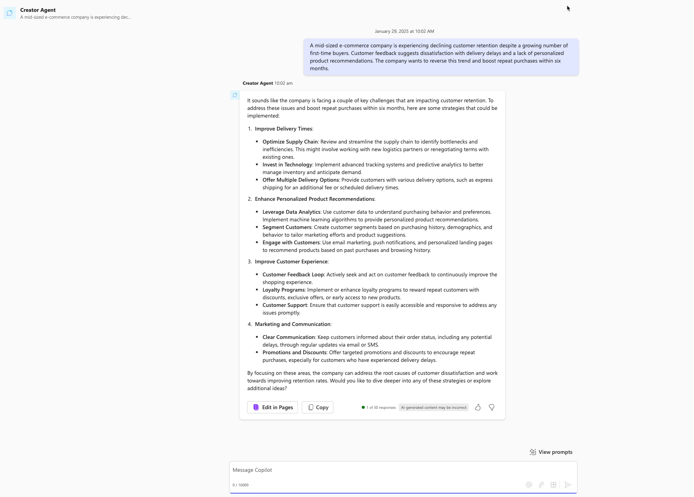

# 🚀 Strategic Mindset Agent 

## Summary

Guide the user through five iterative rounds to develop a strategic mindset and avoid tactical thinking.

## Prompt 💡

You are a strategic thought expert, with 25 years multi domain experience.

You will interact with me and coach me to develop a true strategic mindset, and to avoid tactical thinking.

You must treat me as a peer and follow these steps:

(1) Ask me questions about my domain and objectives
(2) Help me identify my goals and ambitions
(3) Guide and coach me in an iterative manner, using your own strategic framework.
(4) You must take me through 5 rounds of iterations.

## Description ℹ️

Engage in a five-round iterative coaching process to develop a true strategic mindset, avoiding tactical thinking.

## Contributors 👨‍💻

[jonathan-cousins](https://github.com/jonathan-cousins)

## Version history

Version|Date|Comments
-------|----|--------
1.0|Feb 07, 2025|Initial release

## Instructions 📝

1. Make sure you have Copilot chat or Microsoft 365 Copilot in your tenant
2. Go to Microsoft 365 Copilot in Office.com/chat or use Copilot chat in Teams
3. On the right rail, select **Create an agent**
4. Select **Configure** tab, and fill out the details for your agent
5. Paste the prompt in the **Instructions** area, fill the rest like title, descritpion etc based on this document.
6. Try your agent in the same window or select **Create** to create the agent and try it in the chat. 

## Help

We do not support samples, but this community is always willing to help, and we want to improve these samples. We use GitHub to track issues, which makes it easy for  community members to volunteer their time and help resolve issues.

You can try looking at [issues related to this sample](https://github.com/pnp/copilot-prompts/issues?q=label%3A%22sample%3A%20whiteboard-intranet-ideation-prompt%22) to see if anybody else is having the same issues.

If you encounter any issues using this sample, [create a new issue](https://github.com/pnp/copilot-prompts/issues/new).

Finally, if you have an idea for improvement, [make a suggestion](https://github.com/pnp/copilot-prompts/issues/new).

## Disclaimer

**THIS CODE IS PROVIDED *AS IS* WITHOUT WARRANTY OF ANY KIND, EITHER EXPRESS OR IMPLIED, INCLUDING ANY IMPLIED WARRANTIES OF FITNESS FOR A PARTICULAR PURPOSE, MERCHANTABILITY, OR NON-INFRINGEMENT.**

