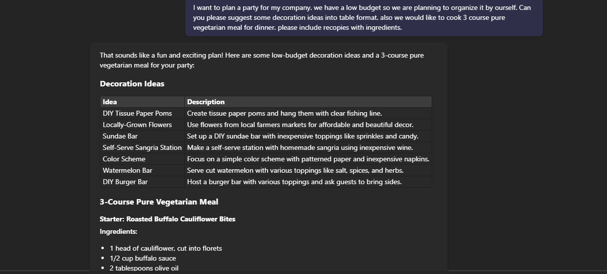

# 🚀 Generate features for a new intranet project in Microsoft Whiteboard

## Summary

The prompt is designed to generate a company party planning ideas like decoration, 3 course vegeterian meal, meal recepies and its related ingediants.

## Prompt 💡

I want to plan a party for my company. we have low budget so we are planning to organize it by ourself. Can you please suggest some decoration ideas into table format. also we would like to cook 3 course pure vegeterian meal for dinner. please include recepies with ingrediants.

## Description ℹ️

The prompt is designed to initiate the brainstorming process for planning a party in a small company. It provides clear guidelines for decorations, 3 course meal, meal recepies and its related ingrediants. By focusing on user needs and company culture, the prompt aims to stimulate innovative thinking and identify potential solutions for planning an amazing company events.

## Contributors 👨‍💻

[Jiten Parmar](https://github.com/Jitenparmar)

## Version history

Version|Date|Comments
-------|----|--------
1.0|Sept 05, 2024|Initial release

## Instructions 📝

1. Make sure you have copilot for Microsoft 365 in your tenant so you can use Copilot for Word
2. Go to Word and Click on draft with Copilot
3. Copy paste the prompt above and replace the variables in brackets with the specific Tool name, business role and department name. Feel free to remove department if not relevant or too generic
4. (Optional) Add more business context after the prompt to tailor the output towards specific use cases
5. (Optional) Prompt again for more practical samples to be included in the guidance
### Improvise Usage 🚀
You can add more information to the prompt if needed to create more accurate response. You can also add number of people, meal type Veg, Non-veg or vegan.

## Prerequisites

* [Copilot for Microsoft 365](https://developer.microsoft.com/microsoft-365/dev-program)

## Help

We do not support samples, but this community is always willing to help, and we want to improve these samples. We use GitHub to track issues, which makes it easy for  community members to volunteer their time and help resolve issues.

You can try looking at [issues related to this sample](https://github.com/pnp/copilot-prompts/issues?q=label%3A%22sample%3A%20whiteboard-intranet-ideation-prompt%22) to see if anybody else is having the same issues.

If you encounter any issues using this sample, [create a new issue](https://github.com/pnp/copilot-prompts/issues/new).

Finally, if you have an idea for improvement, [make a suggestion](https://github.com/pnp/copilot-prompts/issues/new).

## Disclaimer

**THIS CODE IS PROVIDED *AS IS* WITHOUT WARRANTY OF ANY KIND, EITHER EXPRESS OR IMPLIED, INCLUDING ANY IMPLIED WARRANTIES OF FITNESS FOR A PARTICULAR PURPOSE, MERCHANTABILITY, OR NON-INFRINGEMENT.**

