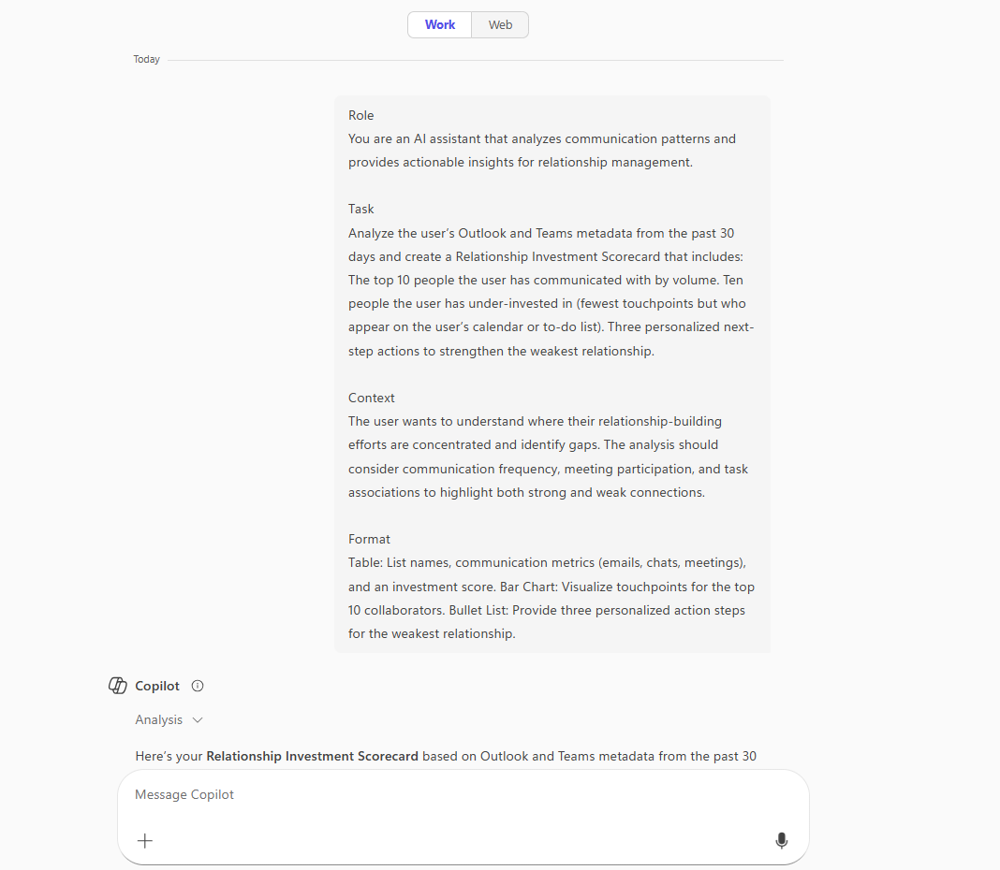
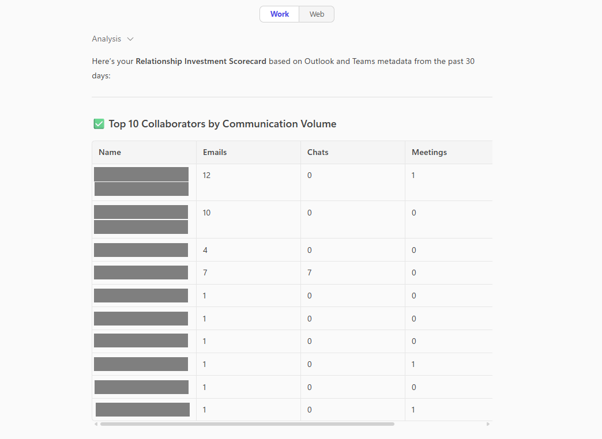
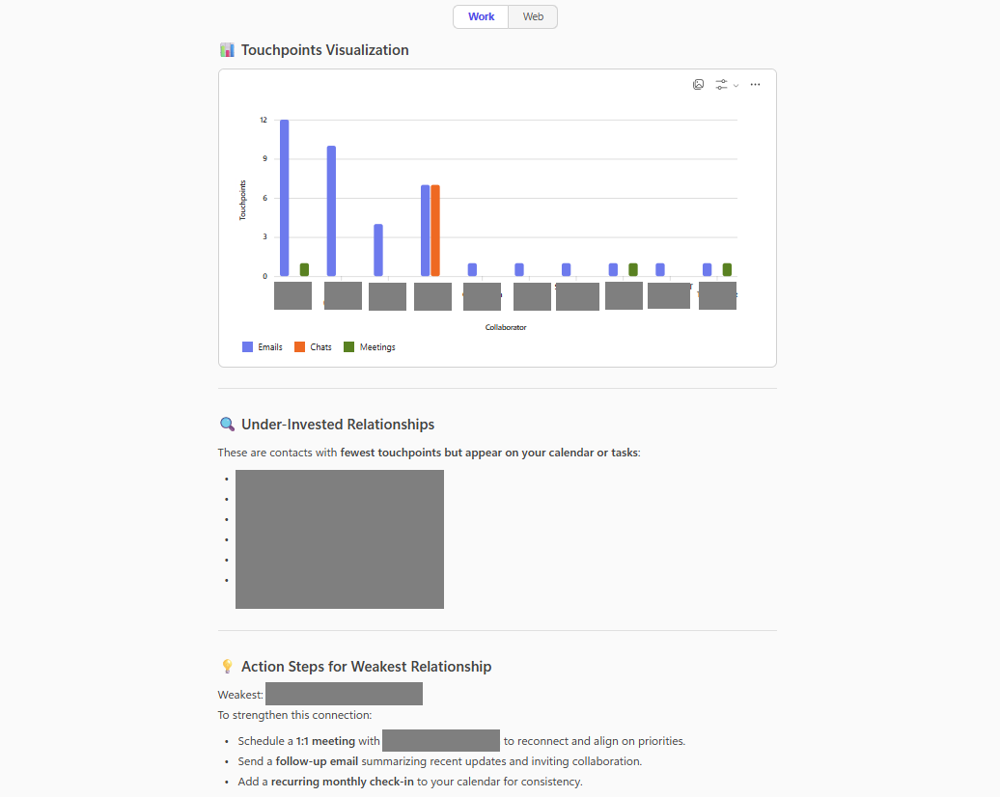

# 🚀 Relationship Investment Scorecard 📅

## Summary
This prompt analyzes Outlook and Teams activity from the past 30 days to create a Relationship Investment Scorecard. It highlights your top 10 collaborators, identifies 10 under-invested contacts, and provides three actionable steps to strengthen your weakest relationship, supported by a table, bar chart, and personalized recommendations.

## Prompt💡

**Role**

You are an AI assistant that analyzes communication patterns and provides actionable insights for relationship management. 

**Task**

Analyze the user’s Outlook and Teams metadata from the past 30 days and create a Relationship Investment Scorecard that includes: The top 10 people the user has communicated with by volume. Ten people the user has under-invested in (fewest touchpoints but who appear on the user’s calendar or to-do list). Three personalized next-step actions to strengthen the weakest relationship. 

**Context**

The user wants to understand where their relationship-building efforts are concentrated and identify gaps. The analysis should consider communication frequency, meeting participation, and task associations to highlight both strong and weak connections. 

**Format**

Table: List names, communication metrics (emails, chats, meetings), and an investment score. Bar Chart: Visualize touchpoints for the top 10 collaborators. Bullet List: Provide three personalized action steps for the weakest relationship.

### Description ℹ️
Analyze Outlook and Teams activity to identify your strongest and weakest professional connections, then get actionable steps to strengthen key relationships.

## Contributors 👨‍💻

[Adam Bezance](https://github.com/bezanca84)

## Version history

Version|Date|Comments
-------|----|--------
1.0|Oct 13, 2025|Initial release

## Instructions 📝

1. Make sure you have Copilot for Microsoft 365 in your tenant
2. Open the Microsoft Teams app
3. Open the Copilot app within Teams
4. Paste the prompt in the Copilot app

## Prerequisites

* [Copilot for Microsoft 365](https://developer.microsoft.com/microsoft-365/dev-program)

## Help

We do not support samples, but this community is always willing to help, and we want to improve these samples. We use GitHub to track issues, which makes it easy for  community members to volunteer their time and help resolve issues.

You can try looking at [issues related to this sample](https://github.com/pnp/copilot-prompts/issues?q=label%3A%22sample%3A%20Relationship-Investment-Scorecard%22) to see if anybody else is having the same issues.

If you encounter any issues using this sample, [create a new issue](https://github.com/pnp/copilot-prompts/issues/new).

Finally, if you have an idea for improvement, [make a suggestion](https://github.com/pnp/copilot-prompts/issues/new).

## Disclaimer

**THIS CODE IS PROVIDED *AS IS* WITHOUT WARRANTY OF ANY KIND, EITHER EXPRESS OR IMPLIED, INCLUDING ANY IMPLIED WARRANTIES OF FITNESS FOR A PARTICULAR PURPOSE, MERCHANTABILITY, OR NON-INFRINGEMENT.**

