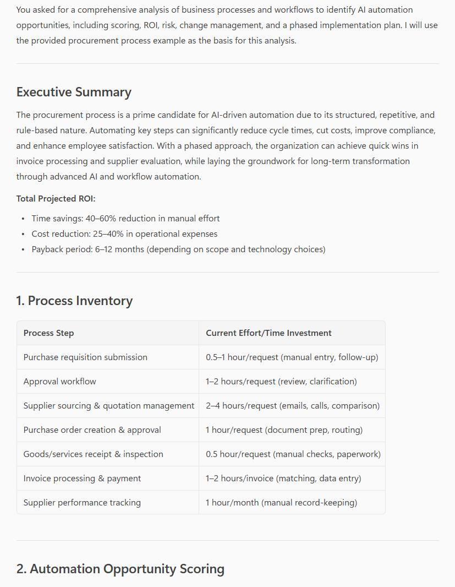

# 🚀 AI Automation Opportunity Finder & ROI Calculator 🤖

## Summary

This prompt analyzes business processes to identify AI and automation opportunities, calculate potential ROI, and create implementation roadmaps. Perfect for digital transformation initiatives and operational efficiency improvements.

## Prompt 💡

Analyze the following business processes and workflows to identify AI automation opportunities including:
- **Process inventory**: List all processes analyzed with current effort/time investment
- **Automation opportunity scoring**: Rate each process for automation potential (High/Medium/Low) based on:
  - Repetitiveness and volume
  - Rule-based decision making
  - Data availability and quality
  - Technical feasibility
  - Business impact
- **AI/Automation solutions**: Specific technologies and tools for each opportunity:
  - Robotic Process Automation (RPA)
  - Machine Learning models
  - Natural Language Processing
  - Computer Vision
  - Workflow automation
  - AI agents and assistants
- **ROI analysis for each opportunity**:
  - Time savings (hours per week/month)
  - Cost reduction estimates
  - Quality improvement metrics
  - Error reduction percentage
  - Employee satisfaction impact
  - Implementation cost estimate
  - Payback period
- **Implementation roadmap**: Phased approach with:
  - Quick wins (0-3 months)
  - Medium-term projects (3-6 months)
  - Long-term transformations (6-12 months)
- **Risk assessment**: Technical, operational, and change management risks
- **Change management plan**: Employee training, communication, and adoption strategies
- **Success metrics**: KPIs to measure automation success
- **Vendor/technology recommendations**: Specific tools and platforms to consider

Format the output with prioritization matrix, implementation timeline, and executive summary with total ROI projection.

Business process data:
{Paste_Your_Process_Documentation_Here}

Include:
- Department/function processes
- Current staffing and time allocation
- Pain points and bottlenecks
- Existing technology stack
- Budget range for automation

## Description ℹ️

This prompt helps organizations identify where AI and automation can deliver the most value. It provides data-driven recommendations for digital transformation, helping prioritize initiatives that maximize ROI while minimizing implementation risks.

## Contributors 👨‍💻

[Valeras Narbutas](https://github.com/ValerasNarbutas)

## Version history

Version|Date|Comments
-------|----|--------
1.0|Oct 31, 2024|Initial release

## Instructions 📝

1. Make sure you have Copilot for Microsoft 365 in your tenant
2. Open the Microsoft Teams app or Copilot in your browser
3. Open the Copilot app within Teams
4. Paste the prompt in the Copilot app
5. Replace {Paste_Your_Process_Documentation_Here} with your process information

### Improvise Usage 🚀

1. Request specific department analysis (HR, Finance, Sales, Operations)
2. Compare build vs. buy options for automation solutions
3. Generate proof-of-concept proposals for top opportunities
4. Create business case presentations for leadership approval
5. Request integration plans with existing systems
6. Analyze industry-specific automation use cases
7. Identify AI upskilling needs for employees
8. Generate vendor RFP requirements

## Prerequisites

* [Copilot for Microsoft 365](https://developer.microsoft.com/microsoft-365/dev-program)

## Help

We do not support samples, but this community is always willing to help, and we want to improve these samples. We use GitHub to track issues, which makes it easy for community members to volunteer their time and help resolve issues.

You can try looking at [issues related to this sample](https://github.com/pnp/copilot-prompts/issues?q=label%3A%22sample%3A%20m365-ai-automation-opportunity-finder%22) to see if anybody else is having the same issues.

If you encounter any issues using this sample, [create a new issue](https://github.com/pnp/copilot-prompts/issues/new).

Finally, if you have an idea for improvement, [make a suggestion](https://github.com/pnp/copilot-prompts/issues/new).

## Disclaimer

**THIS CODE IS PROVIDED *AS IS* WITHOUT WARRANTY OF ANY KIND, EITHER EXPRESS OR IMPLIED, INCLUDING ANY IMPLIED WARRANTIES OF FITNESS FOR A PARTICULAR PURPOSE, MERCHANTABILITY, OR NON-INFRINGEMENT.**

