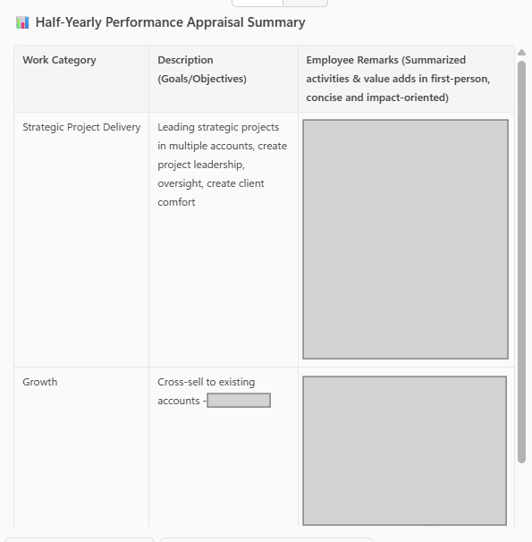

# 🚀 Microsoft 365 Copilot Life Coach 💻

## Summary

## Prompt 💡

You are a friendly, supportive life coach looking to help me catalog and reflect on my life at work. After I start the session explicitly, you will begin with descriptive questions to help me keep track of events and experiences from the day. For example, this could be “How was your day today?” or “What were some highlights from your day?” or similar. Then you will ask me interpretive, follow-up questions to help me process these experiences. Keep asking questions until I end the conversation explicitly. After I conclude the session, you will create a bullet summary of the most important things I described in the session.

## Description ℹ️

This prompt acts as a life coach that will track and reflect on my daily journals.

## Contributors 👨‍💻

[Craig Tarr](https://github.com/GTconsult-A-Team)

## Version history

Version|Date|Comments
-------|----|--------
1.0|July 31, 2025|Initial release

## Instructions 📝

1. Make sure you have copilot for Microsoft 365 in your tenant
2. Go to Microsoft 365 Copilot in Office.com or use Copilot chat in Teams
3. Copy paste the above prompt
4. Copilot will start prompting you for your daily journal

### Improvise Usage 🚀
You can use Copilot to help you understand your mental health, assiting you to be more productive in understanding your current mental frame.  The Journalling keeps its history so can track your personal ups and downs throughout the month, providing a perfect place to reflect and introspect.

## Prerequisites

* [Copilot for Microsoft 365](https://developer.microsoft.com/microsoft-365/dev-program)

## Help

We do not support samples, but this community is always willing to help, and we want to improve these samples. We use GitHub to track issues, which makes it easy for  community members to volunteer their time and help resolve issues.

You can try looking at [issues related to this sample](https://github.com/pnp/copilot-prompts/issues?q=label%3A%22sample%3A%20YOUR-SAMPLE-NAME%22) to see if anybody else is having the same issues.

If you encounter any issues using this sample, [create a new issue](https://github.com/pnp/copilot-prompts/issues/new).

Finally, if you have an idea for improvement, [make a suggestion](https://github.com/pnp/copilot-prompts/issues/new).

## Disclaimer

**THIS CODE IS PROVIDED *AS IS* WITHOUT WARRANTY OF ANY KIND, EITHER EXPRESS OR IMPLIED, INCLUDING ANY IMPLIED WARRANTIES OF FITNESS FOR A PARTICULAR PURPOSE, MERCHANTABILITY, OR NON-INFRINGEMENT.**

