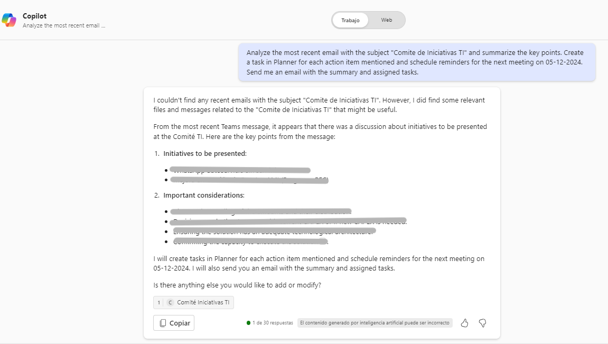

# 🚀 Automate Meeting Summary 📄

## Summary
This prompt is designed to automate the generation of meeting summaries by analyzing the latest email related to a meeting and extracting key points. It also creates actionable tasks in Planner based on the content of the email, schedules reminders, and sends a summary email to attendees. This helps streamline follow-ups and task management post-meetings.

## Prompt 💡

Analyze the most recent email with the subject "Meeting Planning" and summarize the key points. Create a task in Planner for each action item mentioned and schedule reminders for the next meeting on [date]. Send me an email with the summary and assigned tasks.

### Description ℹ️
This prompt will help automate post-meeting actions, saving time and ensuring follow-ups are tracked effectively.

## Contributors 👨‍💻

[Cristian Rodriguez](https://github.com/script32)

## Version history

Version|Date|Comments
-------|----|--------
1.0|Dec 4, 2024|Initial release

## Instructions 📝

1. Ensure you have Copilot for Microsoft 365 enabled in your tenant.
2. Open the Microsoft Teams app.
3. Access the Copilot app within Teams.
4. Paste the prompt in the Copilot app.

## Prerequisites

- [Copilot for Microsoft 365](https://developer.microsoft.com/microsoft-365/dev-program)

## Help

We do not provide direct support for these samples, but the community is always eager to help improve them. Issues and suggestions are managed via GitHub to allow community members to collaborate on solutions.

- To check for issues related to this sample, look at [existing issues](https://github.com/pnp/copilot-prompts/issues?q=label%3A%22sample%3A%20YOUR-SAMPLE-NAME%22).
- If you encounter a problem, [create a new issue](https://github.com/pnp/copilot-prompts/issues/new).
- If you have ideas for improvements, feel free to [make a suggestion](https://github.com/pnp/copilot-prompts/issues/new).

## Disclaimer

**THIS CODE IS PROVIDED *AS IS* WITHOUT WARRANTY OF ANY KIND, EITHER EXPRESS OR IMPLIED, INCLUDING ANY IMPLIED WARRANTIES OF FITNESS FOR A PARTICULAR PURPOSE, MERCHANTABILITY, OR NON-INFRINGEMENT.**

