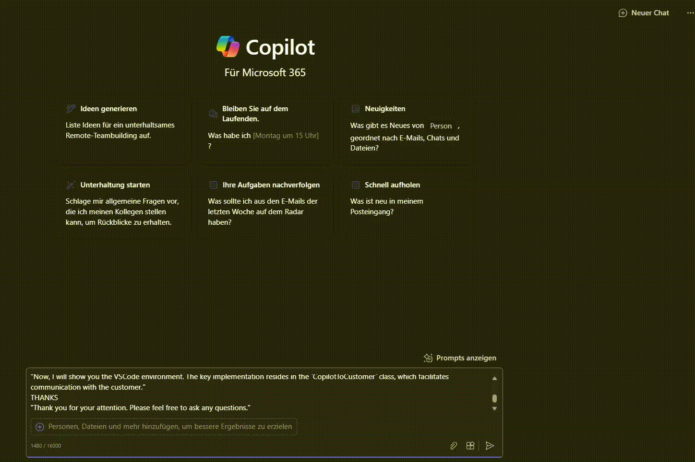

# 💬 Fluency and ⏱️ Timing Coach

## Summary

Preparing for a demo or presentation often requires crafting notes about what you plan to say and do. If English is not your first language, this script will help by:

- Optimizing the fluency of your notes
- Adding estimated speaking times for each section
- Summarizing the changes to help you learn and improve

### How to Use

Please replace the placeholders in the script as follows:
- **[mylanguage]**: Your native language, such as French, Italian, German, etc.
- **[speed]**: Your speaking speed. A typical speaking speed is between 130-150 words per minute.

### Example Structure

Your notes should follow this structure, with headings in capital letters:

**MYSELF**  
"Hello, my name is ... and I am a software developer passionate about implementing outstanding solutions."

**INTRO**  
"I will demonstrate a component/application I developed for a company, which enhances customer engagement through Copilot."

**SWITCH TO VSCODE**  
"Now, I will show you the VSCode environment. The key implementation resides in the `CopilotToCustomer` class, which facilitates communication with the customer."

**THANKS**  
"Thank you for your attention. Please feel free to ask any questions."

## Prompt💡

**Scenario:**  

I am presenting at a Microsoft Community Call. Below is my presentation script.

**Instructions:**

 
1. **Sentence Optimization:**  

   Simplify and adjust the English sentences for easier articulation. Since [mylanguage] is my mother tongue, optimize the script for smooth pronunciation, taking phonetics into account to enhance fluency.

2. **Speaking Time Indicators:**  

   For each heading (in capital letters), include:

   - Estimated speaking time for the section following the heading (mm:ss).

   - Cumulative "Total Time" from the start of the presentation to that point (mm:ss).  

Do not add additional time for explanations. Use [speed] words per minutes as a speaking rate

3. **Summary of Changes:**  

   Provide a table listing all changes, explaining:

   - Why each change was made.

   - How it improves the script's ease of speaking for a native French speaker.  

   This will allow me to review and learn from the adjustments.

### Description ℹ️

This prompt serves the following purposes:

- **Improves fluency**: Optimizes the speaker's notes for non-native English speakers, making it easier to present with confidence.
- **Adds speaking time**: Provides helpful timing information to guide the speaker through the presentation.
- **Summarizes changes**: Highlights adjustments made to the script, offering learning opportunities for improved speaking skills.

## Contributors 👨‍💻

[Nello D'Andrea](https://github.com/ferrarirosso)

## Version history

Version|Date|Comments
-------|----|--------
1.0|September 7, 2024|Initial release

## Instructions 📝

1. Make sure you have Copilot for Microsoft 365 in your tenant
2. Open the Microsoft Teams app
3. Open the Copilot app within Teams
4. Paste the prompt in the Copilot app
5. Change the parameters [mylanguage] and [speed] accordingly
6. Paste your speak notes

## Prerequisites

* [Copilot for Microsoft 365](https://developer.microsoft.com/microsoft-365/dev-program)

## Help

We do not support samples, but this community is always willing to help, and we want to improve these samples. We use GitHub to track issues, which makes it easy for  community members to volunteer their time and help resolve issues.

You can try looking at [issues related to this sample](https://github.com/pnp/copilot-prompts/issues?q=label%3A%22sample%3A%20YOUR-SAMPLE-NAME%22) to see if anybody else is having the same issues.

If you encounter any issues using this sample, [create a new issue](https://github.com/pnp/copilot-prompts/issues/new).

Finally, if you have an idea for improvement, [make a suggestion](https://github.com/pnp/copilot-prompts/issues/new).

## Disclaimer

**THIS CODE IS PROVIDED *AS IS* WITHOUT WARRANTY OF ANY KIND, EITHER EXPRESS OR IMPLIED, INCLUDING ANY IMPLIED WARRANTIES OF FITNESS FOR A PARTICULAR PURPOSE, MERCHANTABILITY, OR NON-INFRINGEMENT.**

