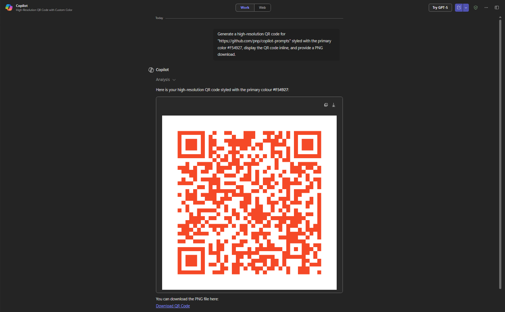

# 🤖 QR Code Generator Prompt

## Summary

A simple Copilot prompt that turns any text or URL into a high-resolution QR code styled with a single primary color.
The generated QR code is displayed inline and provided as a downloadable PNG.

## Prompt 💡

Generate a high-resolution QR code for "[INSERT_TEXT_OR_URL_HERE]" styled with the primary color "[PRIMARY_COLOR_HEX]", display the QR code inline, and provide a PNG download.

## Description ℹ️

This Copilot prompt makes it easy to transform any text or link into a scannable QR code in one step.
Just replace the placeholders with your text or URL and your desired primary color, and Copilot will return a ready-to-use QR code image inline with a PNG download option.

Example inputs:
* https://contoso.com/page?id=123&ref=qr%20test%20value
* Welcome to our SharePoint Hub

## Contributors 👨‍💻

[Tanel Vahk](https://github.com/tvahk)

## Version history

Version|Date|Comments
-------|----|--------
1.0|Oct 14, 2025|Initial release

## Instructions 📝

1. Ensure that Copilot for Microsoft 365 is available in your tenant.
2. Open Microsoft 365 Copilot via m365.cloud.microsoft or start a Copilot chat in Teams.
3. Copy and paste the prompt provided above.
4. Replace the placeholders:
* [INSERT_TEXT_OR_URL_HERE] → the text or URL you want to encode.
* [PRIMARY_COLOR_HEX] → your chosen hex color (e.g., #234238).
5. Run the prompt to generate and download the QR code.

### Improvise Usage 🚀
You can extend the prompt by requesting additional output formats like SVG or specifying the image size (e.g., 1024×1024).
You can also ask Copilot to add a centered logo to the QR code, use multiple brand colors, or generate the code with a custom background color. These small additions can help align the QR code with your branding and improve its visual appeal while keeping it fully scannable.

## Prerequisites

* [Copilot for Microsoft 365](https://developer.microsoft.com/microsoft-365/dev-program)

## Help

We do not support samples, but this community is always willing to help, and we want to improve these samples. We use GitHub to track issues, which makes it easy for  community members to volunteer their time and help resolve issues.

You can try looking at [issues related to this sample](https://github.com/pnp/copilot-prompts/issues?q=label%3A%22sample%3A%20YOUR-SAMPLE-NAME%22) to see if anybody else is having the same issues.

If you encounter any issues using this sample, [create a new issue](https://github.com/pnp/copilot-prompts/issues/new).

Finally, if you have an idea for improvement, [make a suggestion](https://github.com/pnp/copilot-prompts/issues/new).

## Disclaimer

**THIS CODE IS PROVIDED *AS IS* WITHOUT WARRANTY OF ANY KIND, EITHER EXPRESS OR IMPLIED, INCLUDING ANY IMPLIED WARRANTIES OF FITNESS FOR A PARTICULAR PURPOSE, MERCHANTABILITY, OR NON-INFRINGEMENT.**

