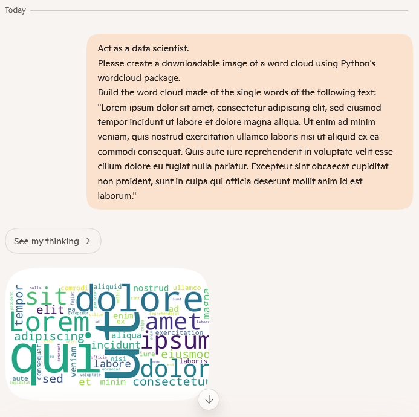
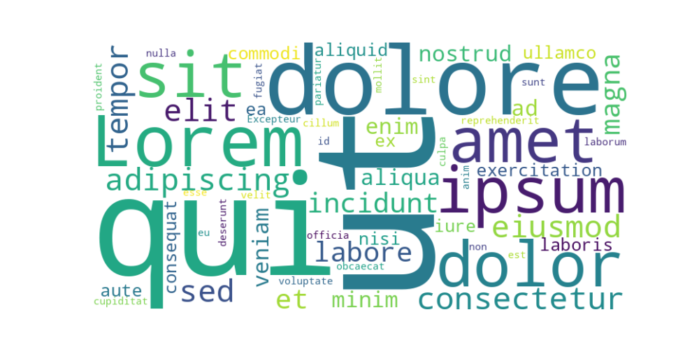

# 🚀 Word Cloud Generator

## Summary

This Copilot prompt generates a word cloud based on a given text (which is part of the prompt).

## Prompt 💡

Act as a data scientist.
Please create a downloadable image of a word cloud using Python's wordcloud package.
Build the word cloud made of the single words of the following text:
"Lorem ipsum dolor sit amet, consectetur adipiscing elit, sed eiusmod tempor incidunt ut labore et dolore magna aliqua. Ut enim ad minim veniam, quis nostrud exercitation ullamco laboris nisi ut aliquid ex ea commodi consequat. Quis aute iure reprehenderit in voluptate velit esse cillum dolore eu fugiat nulla pariatur. Excepteur sint obcaecat cupiditat non proident, sunt in culpa qui officia deserunt mollit anim id est laborum."

## Description ℹ️

This Copilot prompt helps to generate word clouds in order to visualize textual information to support presentations or workshops or simply to pimp project pages or GitHub readme files.
For this, please replace the text at the end of the prompt (`"Lorem ipsum [...] est laborum."`) by your own text.
After issuing your changed prompt to Copilot, you will be able to download the final generated image which will look like:

## Contributors 👨‍💻

[Christian Veenhuis](https://github.com/ChVeen)

## Version history

Version|Date|Comments
-------|----|--------
1.0|Oct 14, 2025|Initial release

## Instructions 📝

1. Ensure that Copilot for Microsoft 365 is available in your tenant.
2. Open Microsoft 365 Copilot via m365.cloud.microsoft or start a Copilot chat in Teams or use <https://copilot.microsoft.com>.
3. Copy and paste the prompt provided above.
4. Replace the text at the end of the prompt (`"Lorem ipsum [...] est laborum."`) by your own text.
5. Copilot will generate an image of the word cloud.

## Prerequisites

* [Copilot for Microsoft 365](https://developer.microsoft.com/microsoft-365/dev-program)
* [Microsoft Copilot](https://copilot.microsoft.com)

## Help

We do not support samples, but this community is always willing to help, and we want to improve these samples. We use GitHub to track issues, which makes it easy for community members to volunteer their time and help resolve issues.

You can try looking at [issues related to this sample](https://github.com/pnp/copilot-prompts/issues?q=label%3A%22sample%3A%20YOUR-SAMPLE-NAME%22) to see if anybody else is having the same issues.

If you encounter any issues using this sample, [create a new issue](https://github.com/pnp/copilot-prompts/issues/new).

Finally, if you have an idea for improvement, [make a suggestion](https://github.com/pnp/copilot-prompts/issues/new).

## Disclaimer

**THIS CODE IS PROVIDED *AS IS* WITHOUT WARRANTY OF ANY KIND, EITHER EXPRESS OR IMPLIED, INCLUDING ANY IMPLIED WARRANTIES OF FITNESS FOR A PARTICULAR PURPOSE, MERCHANTABILITY, OR NON-INFRINGEMENT.**

