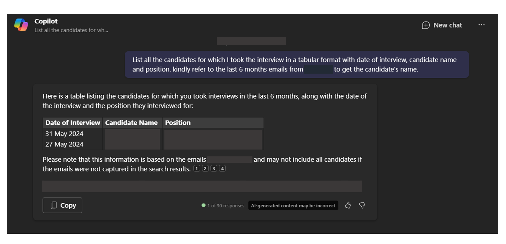

# 🚀 List the technical interviews list for a given period of time in tabular format

## Summary

This prompt helps technical panel to list all the candidates for which they took the interview in a given period of time, in this case the technical panel is asking copilot to get the list of candidates panel interviewed for the past 6 months and asking copilot to get the reference from Outlook mailbox.

## Prompt 💡

List all the candidates for which I took the interview in a tabular format with date of interview, candidate name and position. kindly refer to the last 6 months emails from Outlook to get the candidate's name.

## Description ℹ️

List all the candidates for which I took the interview in a tabular format with date of interview, candidate name and position. kindly refer to the last 6 months emails from Outlook to get the candidate's name.

## Contributors 👨‍💻

[Shrushti Shah](https://github.com/Shrusti13)

## Version history

Version|Date|Comments
-------|----|--------
1.0|July 19, 2024|Initial release

## Instructions 📝

1. Set up your environment with past dummy meetings, including metadata such as the interview date, candidate name, and position.
2. Make sure you have copilot for Microsoft 365 in your tenant
3. Go to Microsoft 365 Copilot in Office.com or use Copilot chat in Teams
4. Copy paste the above prompt
5. Copilot will ftech all the candidates which you interviewed.

### Improvise Usage 🚀
You can ask Copilot to get the information for any time frame and not necessarily 6 months. If you are billing hours for interviews on monthly basis then this prompt comes handy as you can ask Copilot to list the interviewed candidates in the tabular format along with interview dates and then you can accordingly bill hours.

## Prerequisites

* [Copilot for Microsoft 365](https://developer.microsoft.com/microsoft-365/dev-program)

## Help

We do not support samples, but this community is always willing to help, and we want to improve these samples. We use GitHub to track issues, which makes it easy for  community members to volunteer their time and help resolve issues.

You can try looking at [issues related to this sample](https://github.com/pnp/copilot-prompts/issues?q=label%3A%22sample%3A%20YOUR-SAMPLE-NAME%22) to see if anybody else is having the same issues.

If you encounter any issues using this sample, [create a new issue](https://github.com/pnp/copilot-prompts/issues/new).

Finally, if you have an idea for improvement, [make a suggestion](https://github.com/pnp/copilot-prompts/issues/new).

## Disclaimer

**THIS CODE IS PROVIDED *AS IS* WITHOUT WARRANTY OF ANY KIND, EITHER EXPRESS OR IMPLIED, INCLUDING ANY IMPLIED WARRANTIES OF FITNESS FOR A PARTICULAR PURPOSE, MERCHANTABILITY, OR NON-INFRINGEMENT.**

