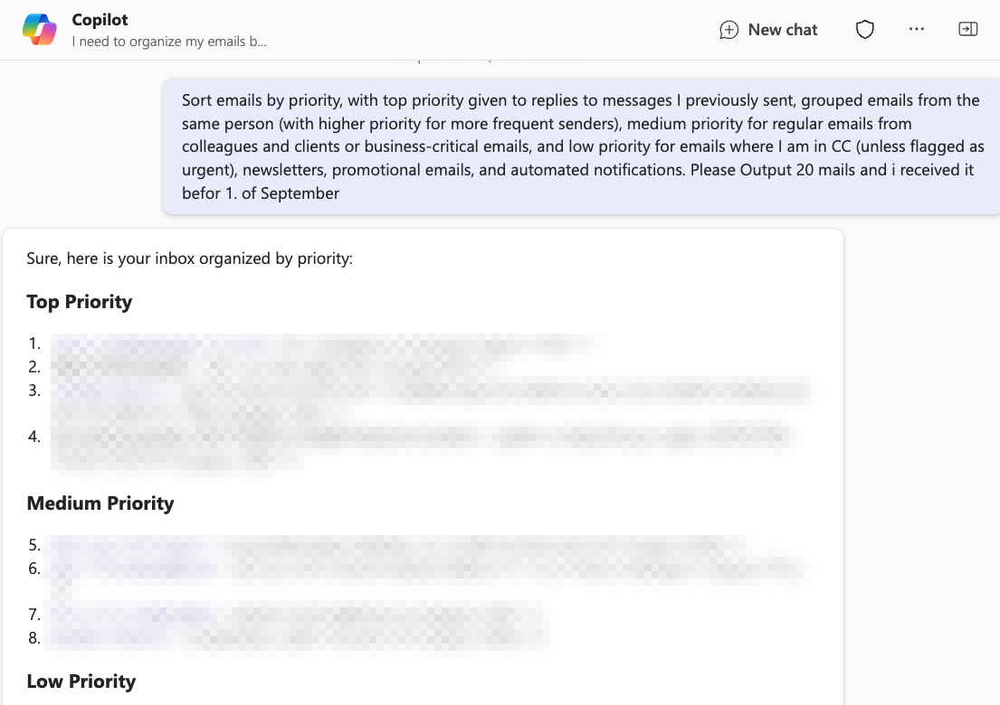

# 🚀 Mail overview by sorting and categorizing after vacation

## Summary

These prompts are designed to help you get organized by asking Copilot to sort emails into different priority levels and categorize them by required action. It will group your emails based on importance and urgency, making it easier to manage your inbox after vacation.

## Prompt💡

Sort emails by priority, with top priority given to replies to messages I previously sent, grouped emails from the same person (with higher priority for more frequent senders), medium priority for regular emails from colleagues and clients or business-critical emails, and low priority for emails where I am in CC (unless flagged as urgent), newsletters, promotional emails, and automated notifications, and please output 10 emails received before September 1, 2024.

Categorize emails by action, with "Immediate Action Needed" for replies to my emails or messages with urgent keywords, "Pending Review" for non-urgent emails that require attention, and "For Reference" for newsletters, announcements, and CC’d emails, and please output 10 emails received before September 1, 2024.

### Descriptionℹ️

After four weeks of vacation, I returned to the office feeling refreshed and ready to tackle my tasks. But as soon as I opened my inbox, the sight of hundreds of unread emails wiped that feeling away. Emails from colleagues, clients, external partners, newsletters, and endless CCs flooded my inbox.

With these two prompts, I worked to get organized again. I used one, and after finishing the results (mainly the top 3 or 5 results), I started a new chat and asked again in MS Teams.

**Structure behind**

1. **Sort by Priority:**
   - **Top Priority:**
     - Emails that are replies to messages I previously sent.
     - Group emails from the same person together; the more emails from the same person, the higher the priority.
     - Prioritize emails from frequent senders who have emailed multiple times.
   - **Medium Priority:**
     - Regular emails from colleagues and clients (non-reply).
     - Business-critical emails (announcements, reports).
   - **Low Priority:**
     - Emails where I am in CC (unless flagged as urgent).
     - Newsletters, promotional emails, and automated notifications.

2. **Categorize by Action:**
   - **Immediate Action Needed:** Replies to my emails or messages with urgent keywords (e.g., “urgent,” “asap”).
   - **Pending Review:** Non-urgent emails that require attention but not immediate action.
   - **For Reference:** Newsletters, announcements, and CC’d emails.

## Contributors 👨‍💻

[Peter Paul Krischner](https://github.com/petkir)

## Version history

Version|Date|Comments
-------|----|--------
1.0|Sep 27, 2024|Initial release

## Instructions 📝

1. Make sure you have Copilot for Microsoft 365 in your tenant
2. Open the Microsoft Teams app
3. Open the Copilot app within Teams
4. Paste the prompt in the Copilot app

## Prerequisites

* [Copilot for Microsoft 365](https://developer.microsoft.com/microsoft-365/dev-program)

## Help

We do not support samples, but this community is always willing to help, and we want to improve these samples. We use GitHub to track issues, which makes it easy for  community members to volunteer their time and help resolve issues.

You can try looking at [issues related to this sample](https://github.com/pnp/copilot-prompts/issues?q=label%3A%22sample%3A%20YOUR-SAMPLE-NAME%22) to see if anybody else is having the same issues.

If you encounter any issues using this sample, [create a new issue](https://github.com/pnp/copilot-prompts/issues/new).

Finally, if you have an idea for improvement, [make a suggestion](https://github.com/pnp/copilot-prompts/issues/new).

## Disclaimer

**THIS CODE IS PROVIDED *AS IS* WITHOUT WARRANTY OF ANY KIND, EITHER EXPRESS OR IMPLIED, INCLUDING ANY IMPLIED WARRANTIES OF FITNESS FOR A PARTICULAR PURPOSE, MERCHANTABILITY, OR NON-INFRINGEMENT.**

