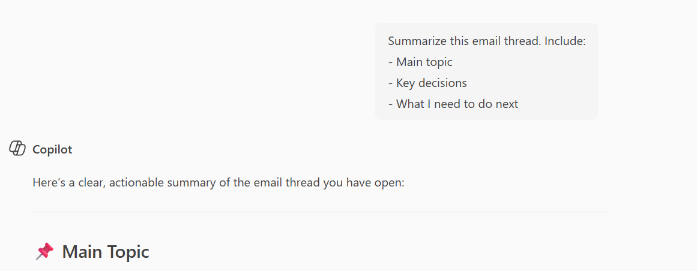

# Summarize This Email Thread

## Summary

Get the main points from long email threads in seconds.

## Prompt

```
Summarize this email thread. Include:
- Main topic
- Key decisions
- What I need to do next
```


## Description

Long email threads are hard to follow. This prompt gives you the important stuff in 3 bullet points.

Use it in Outlook when you have a long email chain and need to quickly understand what's going on.

## Contributors

[Sai Siva Ram Bandaru](https://github.com/saiiiiiii)

## Version history

Version|Date|Comments
-------|----|--------
1.0|January 29, 2025|Initial release

## Disclaimer

**THIS CODE IS PROVIDED *AS IS* WITHOUT WARRANTY OF ANY KIND, EITHER EXPRESS OR IMPLIED, INCLUDING ANY IMPLIED WARRANTIES OF FITNESS FOR A PARTICULAR PURPOSE, MERCHANTABILITY, OR NON-INFRINGEMENT.**

---

## Help

We do not support samples, but this community is always willing to help, and we want to improve these samples. We use GitHub to track issues, which makes it easy for community members to volunteer their time and help resolve issues.

If you encounter any issues while using this sample, [create a new issue](https://github.com/pnp/copilot-prompts/issues/new).

For questions regarding this sample, [create a new question](https://github.com/pnp/copilot-prompts/discussions).

Finally, if you have an idea for improvement, [make a suggestion](https://github.com/pnp/copilot-prompts/discussions).

