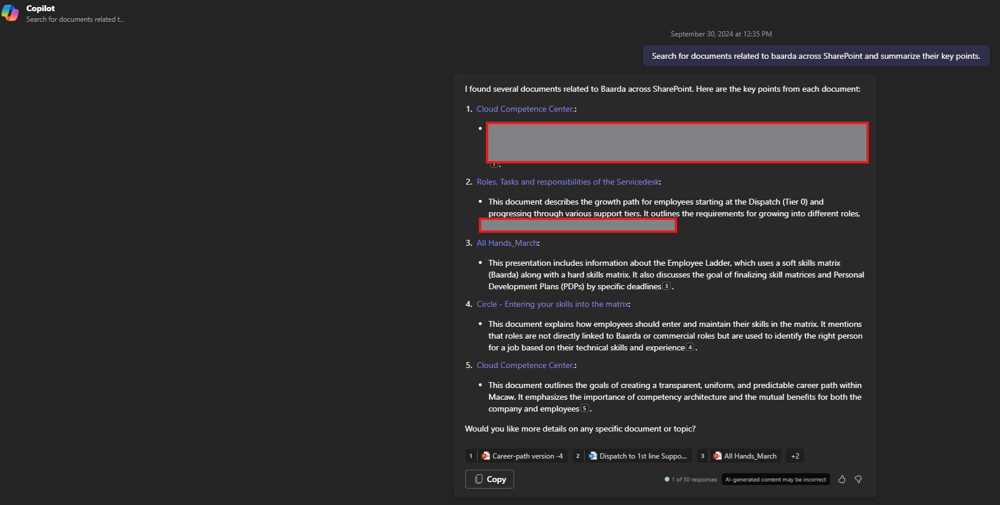

# Search for documents in SharePoint Online for specific topic and summarize the content    

## Summary 📜

This prompt helps you to search for documents in SharePoint Online for a specific topic and summarize the content. It will show the list of documents found in SharePoint Online and a summary of the content of the documents.

## Prompt 💡

Search for documents related to [topic] across SharePoint and summarize their key points.

## Description ℹ️

Copilot will generate summary of the documents found in SharePoint Online for the specific topic. It will show the list of documents found in SharePoint Online and a summary of the content of the documents.

## Contributors 👨‍💻

[Valeras Narbutas](https://github.com/ValerasNarbutas)

## Version history 📋

Version|Date|Comments
-------|----|--------
1.0|Sep 30, 2024|Initial release

## Instructions 📝

1. Make sure you have copilot for Microsoft 365 in your tenant
2. Go to Copilot app in Teams
3. Copy paste the above prompt
4. Replace the [topic] with the topic you want to search for

### Improvise Usage 🚀

You can add more information to the prompt if needed to show details of the documents found in SharePoint Online.

## Prerequisites 📦

* [Copilot for Microsoft 365](https://developer.microsoft.com/microsoft-365/dev-program)
* Meeting to be recorded

## Help 💁

We do not support samples, but this community is always willing to help, and we want to improve these samples. We use GitHub to track issues, which makes it easy for  community members to volunteer their time and help resolve issues.

You can try looking at [issues related to this sample](https://github.com/pnp/copilot-prompts/issues?q=label%3A%22sample%3A%20YOUR-SAMPLE-NAME%22) to see if anybody else is having the same issues.

If you encounter any issues using this sample, [create a new issue](https://github.com/pnp/copilot-prompts/issues/new).

Finally, if you have an idea for improvement, [make a suggestion](https://github.com/pnp/copilot-prompts/issues/new).

## Disclaimer

**THIS CODE IS PROVIDED *AS IS* WITHOUT WARRANTY OF ANY KIND, EITHER EXPRESS OR IMPLIED, INCLUDING ANY IMPLIED WARRANTIES OF FITNESS FOR A PARTICULAR PURPOSE, MERCHANTABILITY, OR NON-INFRINGEMENT.**

