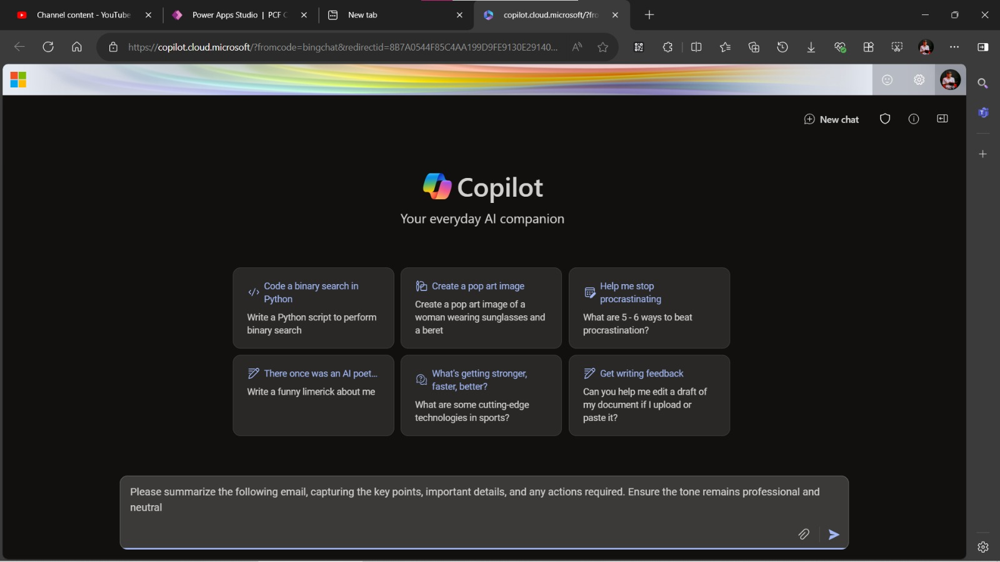

# 🚀 Summarise email discussions 💬

## Summary

## Prompt 💡

Please summarize the following email, capturing the key points, important details, and any actions required. Ensure the tone remains professional and neutral

## Description ℹ️

Summarize the following email, capturing the key points, important details, and any actions required. Ensure the tone remains professional and neutral

## Contributors 👨‍💻

[Sanika Sandip Thorat](https://github.com/SanikaTh)

## Version history

Version|Date|Comments
-------|----|--------
1.0|September 27, 2024|Initial release

## Instructions 📝

1. Make sure you have copilot for Microsoft 365 in your tenant
2. Copy and paste the prompt in Copilot app and replace [email] with actual name in email

### Improvise Usage 🚀
Suggest copilot to bring up any action items for you that was also discussed

## Prerequisites

* [Copilot for Microsoft 365](https://developer.microsoft.com/microsoft-365/dev-program)

## Help

We do not support samples, but this community is always willing to help, and we want to improve these samples. We use GitHub to track issues, which makes it easy for  community members to volunteer their time and help resolve issues.

You can try looking at [issues related to this sample](https://github.com/pnp/copilot-prompts/issues?q=label%3A%22sample%3A%20YOUR-SAMPLE-NAME%22) to see if anybody else is having the same issues.

If you encounter any issues using this sample, [create a new issue](https://github.com/pnp/copilot-prompts/issues/new).

Finally, if you have an idea for improvement, [make a suggestion](https://github.com/pnp/copilot-prompts/issues/new).

## Disclaimer

**THIS CODE IS PROVIDED *AS IS* WITHOUT WARRANTY OF ANY KIND, EITHER EXPRESS OR IMPLIED, INCLUDING ANY IMPLIED WARRANTIES OF FITNESS FOR A PARTICULAR PURPOSE, MERCHANTABILITY, OR NON-INFRINGEMENT.**

