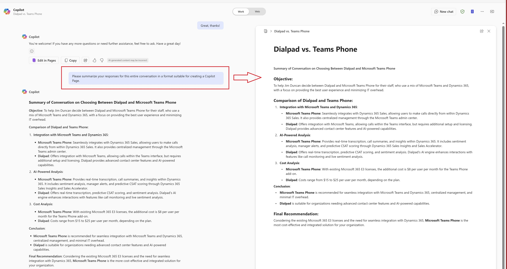

# 🤖 Summarize Copilot chat as page 📃

## Summary
This prompt is designed to generate a concise summary of the responses Copilot gave in a long conversation and save it as a Copilot Page.

## Prompt💡

Please summarize your responses for this entire conversation in a format suitable for creating a Copilot Page.

### Description ℹ️
This prompt will generate a summary of a long conversation you've had with Copilot and save it as a Copilot page. Example is a long conversation I had with Copilot to compare various aspects of Teams Phone against a third-party product in order to help in decision-making.

## Contributors 👨‍💻

[Jim Duncan](https://github.com/sparkitect)

## Version history

Version|Date|Comments
-------|----|--------
1.0|Feb 26, 2025|Initial release

## Instructions 📝

1. Make sure you have Copilot for Microsoft 365 in your tenant
2. Have a long, drawn out conversation with Copilot
3. End the conversation using this prompt to have a page created which summarizes what you and Copilot came up with together

## Prerequisites

* [Copilot for Microsoft 365](https://developer.microsoft.com/microsoft-365/dev-program)

## Help

We do not support samples, but this community is always willing to help, and we want to improve these samples. We use GitHub to track issues, which makes it easy for  community members to volunteer their time and help resolve issues.

You can try looking at [issues related to this sample](https://github.com/pnp/copilot-prompts/issues?q=is%3Aissue%20m365-summarize-responses-as-page) to see if anybody else is having the same issues.

If you encounter any issues using this sample, [create a new issue](https://github.com/pnp/copilot-prompts/issues/new).

Finally, if you have an idea for improvement, [make a suggestion](https://github.com/pnp/copilot-prompts/issues/new).

## Disclaimer

**THIS CODE IS PROVIDED *AS IS* WITHOUT WARRANTY OF ANY KIND, EITHER EXPRESS OR IMPLIED, INCLUDING ANY IMPLIED WARRANTIES OF FITNESS FOR A PARTICULAR PURPOSE, MERCHANTABILITY, OR NON-INFRINGEMENT.**

