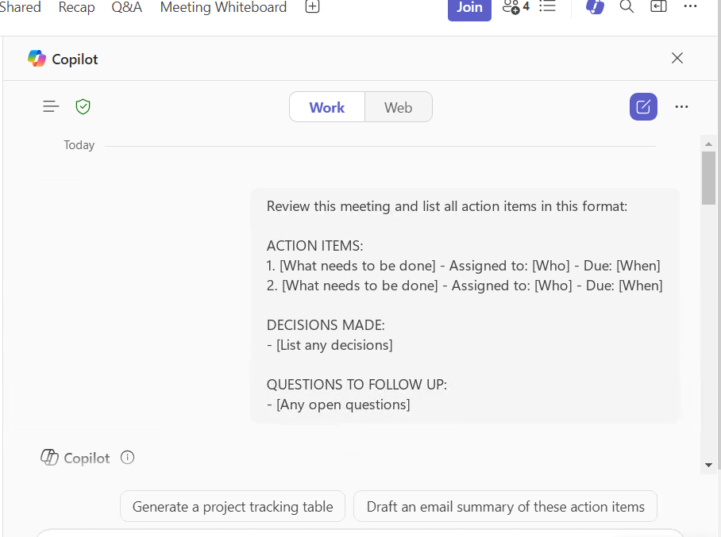

# Extract Action Items from Teams Meetings

## Summary

Turn your Teams meeting notes into a clear list of who needs to do what and by when.

## Prompt

```
Review this meeting and list all action items in this format:

ACTION ITEMS:
1. [What needs to be done] - Assigned to: [Who] - Due: [When]
2. [What needs to be done] - Assigned to: [Who] - Due: [When]

DECISIONS MADE:
- [List any decisions]

QUESTIONS TO FOLLOW UP:
- [Any open questions]
```



## Description

Use this prompt after a Teams meeting to automatically extract action items from the transcript. No more manually searching through meeting notes to find out who agreed to do what.

### When to use this:
- After team meetings
- Following client calls  
- After project discussions
- Any meeting where tasks were assigned

### How to use:
1. Finish your Teams meeting (make sure it was transcribed)
2. Open Copilot in Teams
3. Paste this prompt
4. Copy the results to share with your team

## Contributors

[Sai Siva Ram Bandaru](https://github.com/saiiiiiii)

## Version history

Version|Date|Comments
-------|----|--------
1.0|January 29, 2025|Initial release

## Prerequisites

* [Copilot for Microsoft 365](https://developer.microsoft.com/microsoft-365/dev-program)

## Help

We do not support samples, but this community is always willing to help, and we want to improve these samples. We use GitHub to track issues, which makes it easy for  community members to volunteer their time and help resolve issues.

You can try looking at [issues related to this sample](https://github.com/pnp/copilot-prompts/issues?q=label%3A%22sample%3A%20YOUR-SAMPLE-NAME%22) to see if anybody else is having the same issues.

If you encounter any issues using this sample, [create a new issue](https://github.com/pnp/copilot-prompts/issues/new).

Finally, if you have an idea for improvement, [make a suggestion](https://github.com/pnp/copilot-prompts/issues/new).

## Disclaimer

**THIS CODE IS PROVIDED *AS IS* WITHOUT WARRANTY OF ANY KIND, EITHER EXPRESS OR IMPLIED, INCLUDING ANY IMPLIED WARRANTIES OF FITNESS FOR A PARTICULAR PURPOSE, MERCHANTABILITY, OR NON-INFRINGEMENT.**

