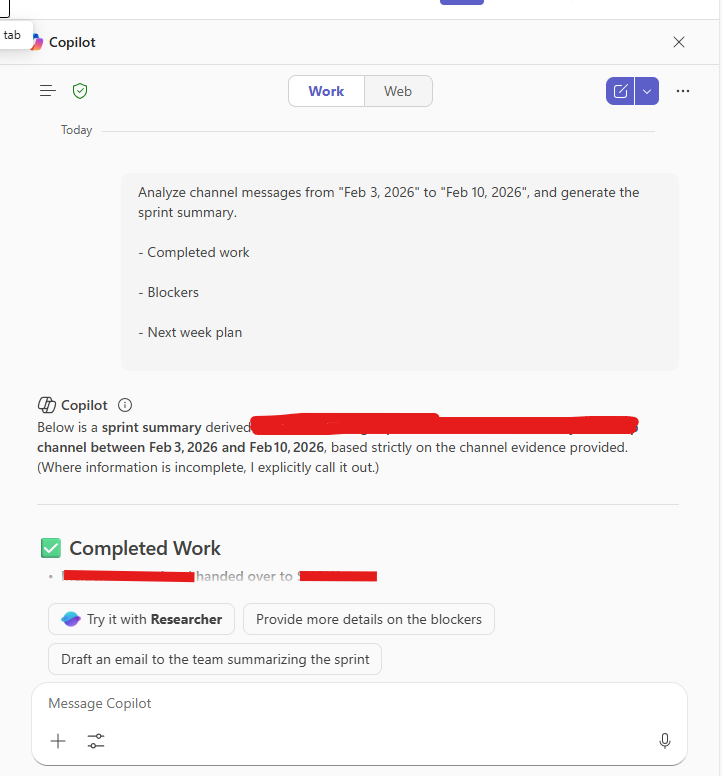

# Weekly Sprint Summary from Teams Channel

## Summary

Turn a week (or custom date range) of Microsoft Teams channel messages into a clear sprint summary.

---

## Prompt

```
Analyze channel messages from [START DATE] to [END DATE] and generate a sprint summary.
- Completed work
- Blockers
- Next week plan
```


## Description

Microsoft Teams channels often contain important updates, decisions, and progress reports scattered across many messages. Reviewing them manually can be time-consuming.

This prompt helps you quickly generate a structured sprint summary by analyzing channel conversations within a selected date range.

## Contributors

[Sai Siva Ram Bandaru](https://github.com/saiiiiiii)

## Version history

Version|Date|Comments
-------|----|--------
1.0|February 12, 2026|Initial release

## Disclaimer

**THIS CODE IS PROVIDED *AS IS* WITHOUT WARRANTY OF ANY KIND, EITHER EXPRESS OR IMPLIED, INCLUDING ANY IMPLIED WARRANTIES OF FITNESS FOR A PARTICULAR PURPOSE, MERCHANTABILITY, OR NON-INFRINGEMENT.**

---

## Help

We do not support samples, but this community is always willing to help, and we want to improve these samples. We use GitHub to track issues, which makes it easy for community members to volunteer their time and help resolve issues.

If you encounter any issues while using this sample, [create a new issue](https://github.com/pnp/copilot-prompts/issues/new).

For questions regarding this sample, [create a new question](https://github.com/pnp/copilot-prompts/discussions).

Finally, if you have an idea for improvement, [make a suggestion](https://github.com/pnp/copilot-prompts/discussions).

