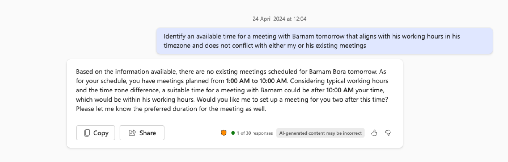

# 🚀 Find meeting time with another user  📅

## Summary

## Prompt 💡

 Identify an available time for a meeting with [User] tomorrow that aligns with their working hours in their timezone and does not conflict with either my or their existing meetings. 

## Description ℹ️

Identifies appropritate time to schedule meeting with a user without having to find out info on timezones, calendar etc of both parties.

## Contributors 👨‍💻

[Rabia Williams](https://github.com/rabwill)

## Version history

Version|Date|Comments
-------|----|--------
1.0|April 29, 2024|Initial release

## Instructions 📝

1. Make sure you have copilot for Microsoft 365 in your tenant
2. Go to Copilot app in Teams
3. Copy paste the above prompt and replace [User] with reference to the person you want to schedule the meeting using copilot reference feature

### Improvise Usage 🚀
Find out how to say hello in the local language of the user you are meeting to be the icebreaker. Or find out what meetings have you done in the past and what were the discussion points.

## Prerequisites

* [Copilot for Microsoft 365](https://developer.microsoft.com/microsoft-365/dev-program)

## Help

We do not support samples, but this community is always willing to help, and we want to improve these samples. We use GitHub to track issues, which makes it easy for  community members to volunteer their time and help resolve issues.

You can try looking at [issues related to this sample](https://github.com/pnp/copilot-prompts/issues?q=label%3A%22sample%3A%20YOUR-SAMPLE-NAME%22) to see if anybody else is having the same issues.

If you encounter any issues using this sample, [create a new issue](https://github.com/pnp/copilot-prompts/issues/new).

Finally, if you have an idea for improvement, [make a suggestion](https://github.com/pnp/copilot-prompts/issues/new).

## Disclaimer

**THIS CODE IS PROVIDED *AS IS* WITHOUT WARRANTY OF ANY KIND, EITHER EXPRESS OR IMPLIED, INCLUDING ANY IMPLIED WARRANTIES OF FITNESS FOR A PARTICULAR PURPOSE, MERCHANTABILITY, OR NON-INFRINGEMENT.**

