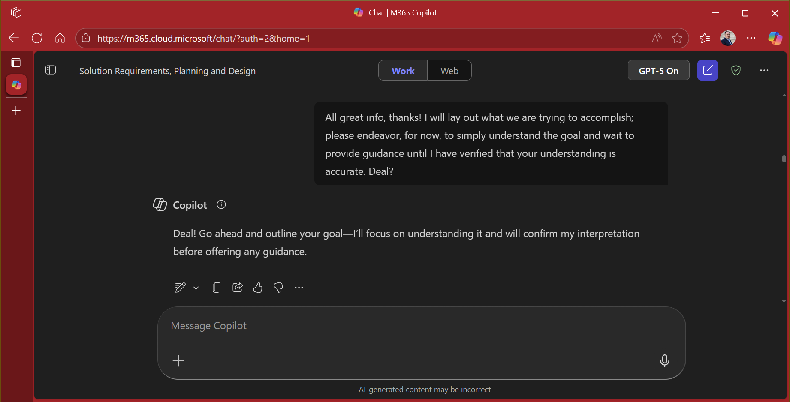

# 🤖 Confirming Understanding mode 📃

## Summary
This prompt is designed to put Copilot into a "confirm understanding" mode.
## Prompt💡

I will explain what we are trying to accomplish. Please endeavor, for now, to simply understand the goal and wait to provide guidance or a solution until I have verified that your understanding is accurate. Deal?

### Description ℹ️
Ocassionally, Copilot will go straight to the "solution" before fully understanding what your actual goal is. With GPT-5 this "premature solution" might be even more long-winded and detailed, but not really the solution you need.
This prompt can be used to ensure that Copilot doesn't offer a solution until you have verified that it understands the issue sufficiently.

## Contributors 👨‍💻

[Jim Duncan](https://github.com/sparkitect)

## Version history

Version|Date|Comments
-------|----|--------
1.0|September 18, 2025|Initial release

## Instructions 📝

1. Make sure you have Copilot for Microsoft 365 in your tenant
2. Start with this prompt; for a bornus, add "Feel free to ask clarifying questions if needed" to the prompt.
3. Explain your scenario, issue and/or goal, over multiple prompts (you're having a *conversation* with Copilot)
4. At each response Copilot should/might summarize its understanding so far though you may have to ask it to do so
6. When you are confident that Copilot understands things sufficiently, tell it so

## Prerequisites

* [Copilot for Microsoft 365](https://developer.microsoft.com/microsoft-365/dev-program)

## Help

We do not support samples, but this community is always willing to help, and we want to improve these samples. We use GitHub to track issues, which makes it easy for  community members to volunteer their time and help resolve issues.

You can try looking at [issues related to this sample](https://github.com/pnp/copilot-prompts/issues?q=is%3Aissue%20m365-understanding-mode) to see if anybody else is having the same issues.

If you encounter any issues using this sample, [create a new issue](https://github.com/pnp/copilot-prompts/issues/new).

Finally, if you have an idea for improvement, [make a suggestion](https://github.com/pnp/copilot-prompts/issues/new).

## Disclaimer

**THIS CODE IS PROVIDED *AS IS* WITHOUT WARRANTY OF ANY KIND, EITHER EXPRESS OR IMPLIED, INCLUDING ANY IMPLIED WARRANTIES OF FITNESS FOR A PARTICULAR PURPOSE, MERCHANTABILITY, OR NON-INFRINGEMENT.**

