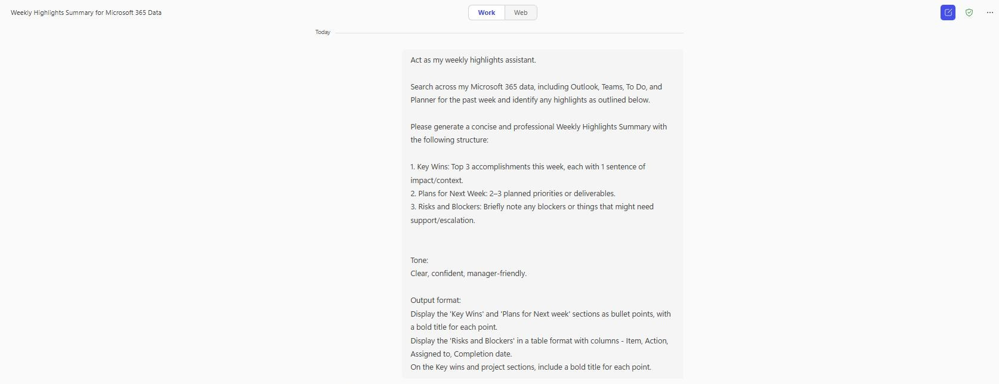

# 🚀 Weekly Highlights Summary

## Summary
A weekly highlights summary prompt which scans Outlook, Teams, To Do, and Planner to generate a consise summary of key wins, upcoming plans and blockers.

## Prompt💡

Act as my weekly highlights assistant.

Search across my Microsoft 365 data, including Outlook, Teams, To Do, and Planner for the past week and identify any highlights as outlined below.

Please generate a concise and professional Weekly Highlights Summary with the following structure:

1. Key Wins: Top 3 accomplishments this week, each with 1 sentence of impact/context.
2. Plans for Next Week: 2–3 planned priorities or deliverables.
3. Risks and Blockers: Briefly note any blockers or things that might need support/escalation.

Tone: Clear, confident, manager-friendly.

Output format:
Display the 'Key Wins' and 'Plans for Next week' sections as bullet points, with a bold title for each point.
Display the 'Risks and Blockers' in a table format with columns - Item, Action, Assigned to, Completion date.
On the Key wins and project sections, include a bold title for each point.

### Description ℹ️
This prompt acts as a Weekly Highlights Assistant by searching across Microsoft 365 data sources such as Outlook, Teams, To Do, and Planner, for the past week. It compiles a professional summary with three structured sections: Key Wins (top 3 accomplishments), Plans for Next Week (upcoming priorities), and Risks and Blockers (presented in a clear table format). The tone is confident and manager-friendly, making it ideal for weekly reporting, stakeholder updates, or performance tracking. The output is formatted for easy copy and paste into emails.

## Contributors 👨‍💻

[Adam Bezance](https://github.com/bezanca84)

## Version history

Version|Date|Comments
-------|----|--------
1.0|Jul 25, 2025|Initial release

## Instructions 📝

1. Make sure you have Copilot for Microsoft 365 in your tenant
2. Open the Microsoft Teams app
3. Open the Copilot app within Teams
4. Paste the prompt in the Copilot app

## Prerequisites

* [Copilot for Microsoft 365](https://developer.microsoft.com/microsoft-365/dev-program)

## Help

We do not support samples, but this community is always willing to help, and we want to improve these samples. We use GitHub to track issues, which makes it easy for  community members to volunteer their time and help resolve issues.

You can try looking at [issues related to this sample](https://github.com/pnp/copilot-prompts/issues?q=label%3A%22sample%3A%20m365-weekly-highlights-summary%22) to see if anybody else is having the same issues.

If you encounter any issues using this sample, [create a new issue](https://github.com/pnp/copilot-prompts/issues/new).

Finally, if you have an idea for improvement, [make a suggestion](https://github.com/pnp/copilot-prompts/issues/new).

## Disclaimer

**THIS CODE IS PROVIDED *AS IS* WITHOUT WARRANTY OF ANY KIND, EITHER EXPRESS OR IMPLIED, INCLUDING ANY IMPLIED WARRANTIES OF FITNESS FOR A PARTICULAR PURPOSE, MERCHANTABILITY, OR NON-INFRINGEMENT.**

