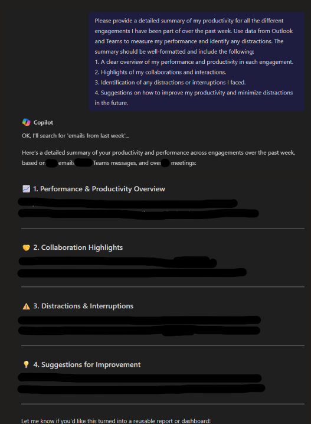

# 🚀 Check for work productivity and distractions 📄

## Summary
This prompt helps users receive a detailed weekly productivity summary across all their engagements using Outlook and Teams data. It evaluates performance, highlights key collaborations, identifies distractions, and offers actionable suggestions for improvement. The goal is to provide users with clear insights into their work patterns and empower them to enhance focus and efficiency.

## Prompt 💡
Please provide a detailed summary of my productivity for all the different engagements I have been part of over the past week. Use data from Outlook and Teams to measure my performance and identify any distractions. The summary should be well-formatted and include the following:
1. A clear overview of my performance and productivity in each engagement.
2. Highlights of my collaborations and interactions.
3. Identification of any distractions or interruptions I faced.
4. Suggestions on how to improve my productivity and minimize distractions in the future.

### Description ℹ️
This prompt enables users to receive a comprehensive weekly summary of their productivity across all engagements by analyzing Outlook and Teams data. It offers a clear view of performance, highlights key collaborations, identifies potential distractions, and provides actionable suggestions to enhance focus and efficiency. Ideal for professionals aiming to reflect, improve, and stay aligned with their goals.

## Contributors 👨‍💻

[Gourav Bagora](https://github.com/GouravBagora)

## Version history

Version|Date|Comments
-------|----|--------
1.0|June 4, 2025|Initial release

## Instructions 📝

1. Ensure you have Copilot for Microsoft 365 enabled in your tenant.
2. Open the Microsoft Teams app.
3. Access the Copilot app within Teams.
4. Paste the prompt in the Copilot app.

## Prerequisites

- [Copilot for Microsoft 365](https://developer.microsoft.com/microsoft-365/dev-program)

## Help

We do not provide direct support for these samples, but the community is always eager to help improve them. Issues and suggestions are managed via GitHub to allow community members to collaborate on solutions.

- To check for issues related to this sample, look at [existing issues](https://github.com/pnp/copilot-prompts/issues?q=label%3A%22sample%3A%20YOUR-SAMPLE-NAME%22).
- If you encounter a problem, [create a new issue](https://github.com/pnp/copilot-prompts/issues/new).
- If you have ideas for improvements, feel free to [make a suggestion](https://github.com/pnp/copilot-prompts/issues/new).

## Disclaimer

**THIS CODE IS PROVIDED *AS IS* WITHOUT WARRANTY OF ANY KIND, EITHER EXPRESS OR IMPLIED, INCLUDING ANY IMPLIED WARRANTIES OF FITNESS FOR A PARTICULAR PURPOSE, MERCHANTABILITY, OR NON-INFRINGEMENT.**

