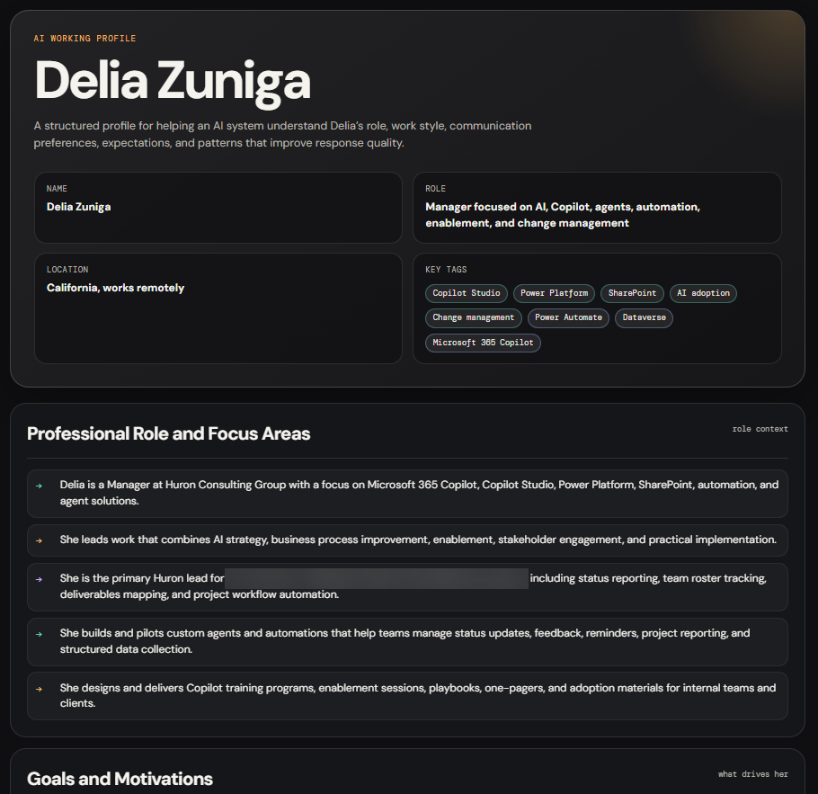

# Generate a Portable AI Profile as HTML

## Summary

This prompt generates a complete, structured profile of a user based on their interaction patterns with an AI assistant. The output is designed to help another AI system quickly understand how to work with the user effectively.

The prompt asks the AI to identify practical, fact-based observations about the user’s role, goals, communication preferences, work style, technical strengths, leadership habits, decision-making patterns, and expectations when using AI.

The final output is a single self-contained HTML file that can be saved and shared with other AI tools.

## Use Cases

- Create a portable AI profile that can be reused across different AI tools.
- Help a new AI assistant quickly understand a user’s work style and preferences.
- Document communication preferences, dislikes, and quality expectations in a structured format.
- Generate a shareable personal operating guide for AI-assisted work.
- Support better personalization when moving between Microsoft 365 Copilot, Copilot Chat, ChatGPT, Claude, or other AI tools.
- Capture practical interaction patterns without relying on long chat histories.
- Help consultants, leaders, makers, and technical users get more consistent AI responses.

## Example Output

The following example shows the generated AI profile HTML output.



## Prompt

```text
Generate a complete, structured summary of everything you know about me based on our past interactions. Your goal is to help another AI system quickly understand how to work with me effectively.

Include the following areas:

- My professional role and focus areas
- My goals and motivations
- My communication style, including tone, structure, preferences, and dislikes
- How I like to work, including problem solving approach, iteration style, and execution habits
- My technical strengths and typical use cases
- My leadership style and work habits
- My decision-making preferences
- My expectations when interacting with AI
- My engagement style and feedback patterns
- My quality standards and tolerance levels
- My intent when using AI
- How you adapt your responses to me
- Any patterns you've observed about me that improve response quality

Include a final section titled "Instructions for Any AI System" that clearly defines how the AI should behave when interacting with me.

Content formatting rules:

- Use clear sections with headings
- Use bullet points instead of long paragraphs
- Keep content concise but complete
- Use plain language and avoid jargon unless necessary
- Phrase everything as fact-based observations derived from interaction patterns
- Do not reference "previous responses" or "earlier context"

Output format:

Produce a single self-contained HTML file I can save and share with other AI tools.

Requirements:

- Use a dark background, such as #0f0f11 or similar
- Use light text
- Use Google Fonts:
  - DM Sans for body text
  - DM Mono for labels and tags
- Separate sections with subtle horizontal rules
- Style bullet point items as rows with a colored arrow or marker, not default browser bullets
- Use tags or chips for skills, tools, and avoid patterns
- Include a two-column metadata strip at the top with name, role, location, and key tags
- Make the "Instructions for Any AI System" section visually prominent
- Make the layout fully responsive
- Do not use external CSS frameworks
- Do not include JavaScript
- Include a footer with the filename and generation date

Think carefully end-to-end before responding. I want this to be high quality and immediately reusable.
