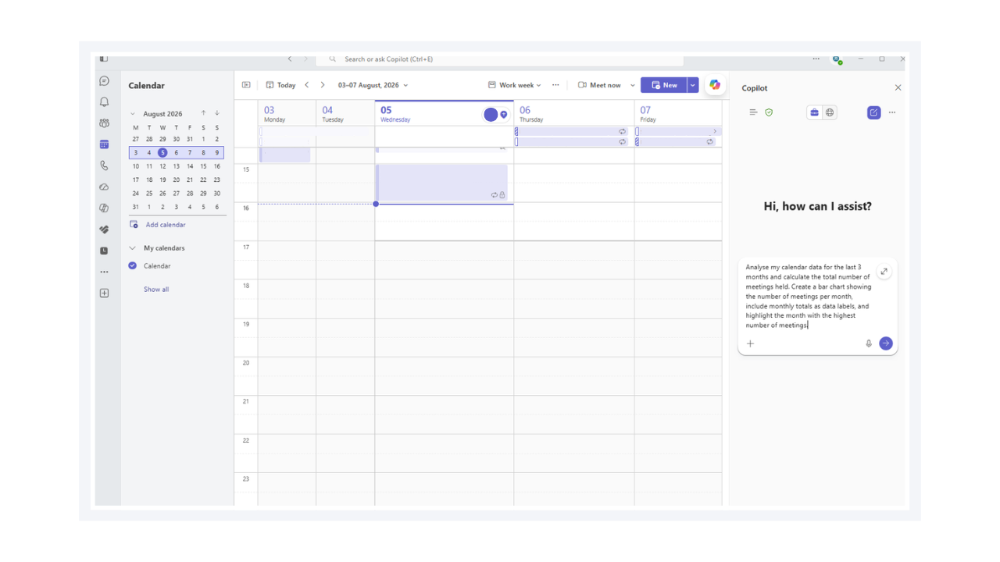
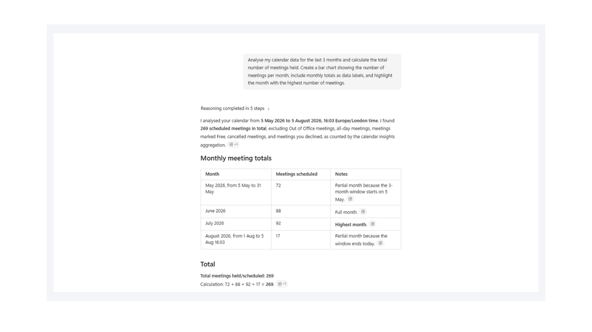
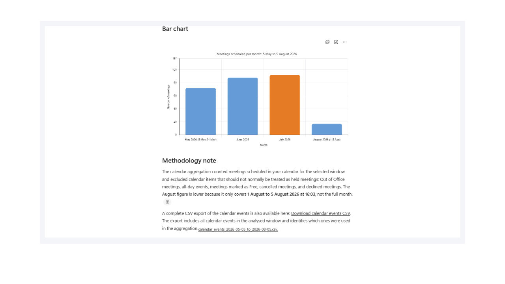

# Generate Meeting Analytics and Visual Reports from Microsoft 365 Calendar Data

## Summary

This prompt analyses Microsoft 365 calendar data from the previous three months to calculate the total number of meetings held and summarise meeting activity by month. It automatically generates a professional bar chart showing the number of meetings for each month, adds monthly totals as data labels for clarity, and highlights the month with the highest meeting volume to make trends immediately visible. The prompt transforms raw calendar data into a clear, visual summary that is easy to interpret and share.

## Why It Matters

This enables Microsoft 365 administrators, IT managers, and business users to quickly understand meeting patterns without manually exporting calendar data or building reports in Excel. By automatically identifying the busiest month and presenting monthly meeting totals in a visual format, the prompt supports workload analysis, resource planning, collaboration reporting, and productivity reviews. It reduces the time spent creating manual reports while providing consistent, presentation-ready insights that can be used for operational monitoring and informed decision-making.

## Prompt 💡

Analyse my calendar data for the last 3 months and calculate the total number of meetings held. Create a bar chart showing the number of meetings per month, include monthly totals as data labels, and highlight the month with the highest number of meetings.

## Contributors 👨‍💻

[Josiah Opiyo](https://github.com/ojopiyo)

*Built with a focus on automation, governance, least privilege, and clean Microsoft 365 tenants - helping M365 admins gain visibility and reduce operational risk.*

## Version history

Version|Date|Comments
-------|----|--------
1.0|Aug 06, 2026|Initial release

## Instructions 📝

1. Make sure you have Copilot in your tenant
2. Open Copilot app
3. Copy and paste the prompt, remember to attach/paste ticket resolution notes then click submit

## Prerequisites

* [Copilot for Microsoft 365](https://developer.microsoft.com/microsoft-365/dev-program)

## Help

We do not support samples, but this community is always willing to help, and we want to improve these samples. We use GitHub to track issues, which makes it easy for  community members to volunteer their time and help resolve issues.

You can try looking at [issues related to this sample](https://github.com/pnp/copilot-prompts/issues?q=label%3A%22sample%3A%20m365-generate-knowledge-base-article-from-ticket-resolution%22) to see if anybody else is having the same issues.

If you encounter any issues using this sample, [create a new issue](https://github.com/pnp/copilot-prompts/issues/new).

Finally, if you have an idea for improvement, [make a suggestion](https://github.com/pnp/copilot-prompts/issues/new).

## Disclaimer

**THIS CODE IS PROVIDED *AS IS* WITHOUT WARRANTY OF ANY KIND, EITHER EXPRESS OR IMPLIED, INCLUDING ANY IMPLIED WARRANTIES OF FITNESS FOR A PARTICULAR PURPOSE, MERCHANTABILITY, OR NON-INFRINGEMENT.**

