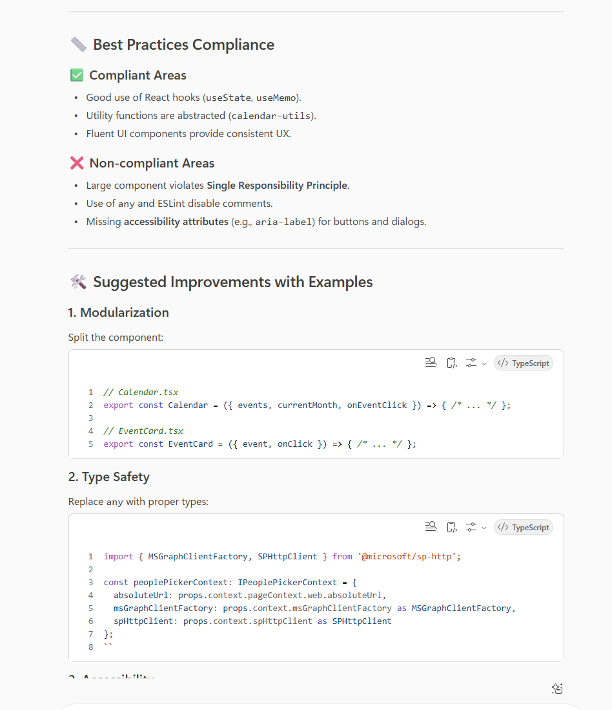

# 🚀 AI-Powered Code Review Feedback Generator 💻

## Summary

This prompt helps developers receive comprehensive, constructive code review feedback on their pull requests or code snippets. It analyzes code quality, security vulnerabilities, performance issues, and best practices compliance.

## Prompt 💡

Review the following code and provide detailed feedback including:
- Code quality assessment (readability, maintainability, complexity)
- Security vulnerabilities or concerns
- Performance optimization opportunities
- Best practices compliance
- Suggested improvements with code examples
- Overall code rating (1-10)

Format the output with clear sections and prioritize issues by severity (Critical, High, Medium, Low).

Code to review:
{Paste_Your_Code_Here}

Programming language: {Specify_Language}

## Description ℹ️

This prompt analyzes code submissions and provides comprehensive feedback covering quality, security, performance, and best practices. It helps developers improve their code before merging and maintains high code standards across teams.

## Contributors 👨‍💻

[Valeras Narbutas](https://github.com/ValerasNarbutas)

## Version history

Version|Date|Comments
-------|----|--------
1.0|Oct 31, 2024|Initial release

## Instructions 📝

1. Make sure you have Copilot for Microsoft 365 in your tenant
2. Open the Microsoft Teams app
3. Open the Copilot app within Teams
4. Paste the prompt in the Copilot app
5. Replace {Paste_Your_Code_Here} with your actual code
6. Specify the programming language

### Improvise Usage 🚀

1. Add specific focus areas (e.g., "Focus on security" or "Focus on performance")
2. Request comparison with industry standards
3. Ask for refactoring suggestions
4. Request documentation improvements

## Prerequisites

* [Copilot for Microsoft 365](https://developer.microsoft.com/microsoft-365/dev-program)

## Help

We do not support samples, but this community is always willing to help, and we want to improve these samples. We use GitHub to track issues, which makes it easy for community members to volunteer their time and help resolve issues.

You can try looking at [issues related to this sample](https://github.com/pnp/copilot-prompts/issues?q=label%3A%22sample%3A%20m365-ai-code-review-feedback%22) to see if anybody else is having the same issues.

If you encounter any issues using this sample, [create a new issue](https://github.com/pnp/copilot-prompts/issues/new).

Finally, if you have an idea for improvement, [make a suggestion](https://github.com/pnp/copilot-prompts/issues/new).

## Disclaimer

**THIS CODE IS PROVIDED *AS IS* WITHOUT WARRANTY OF ANY KIND, EITHER EXPRESS OR IMPLIED, INCLUDING ANY IMPLIED WARRANTIES OF FITNESS FOR A PARTICULAR PURPOSE, MERCHANTABILITY, OR NON-INFRINGEMENT.**

