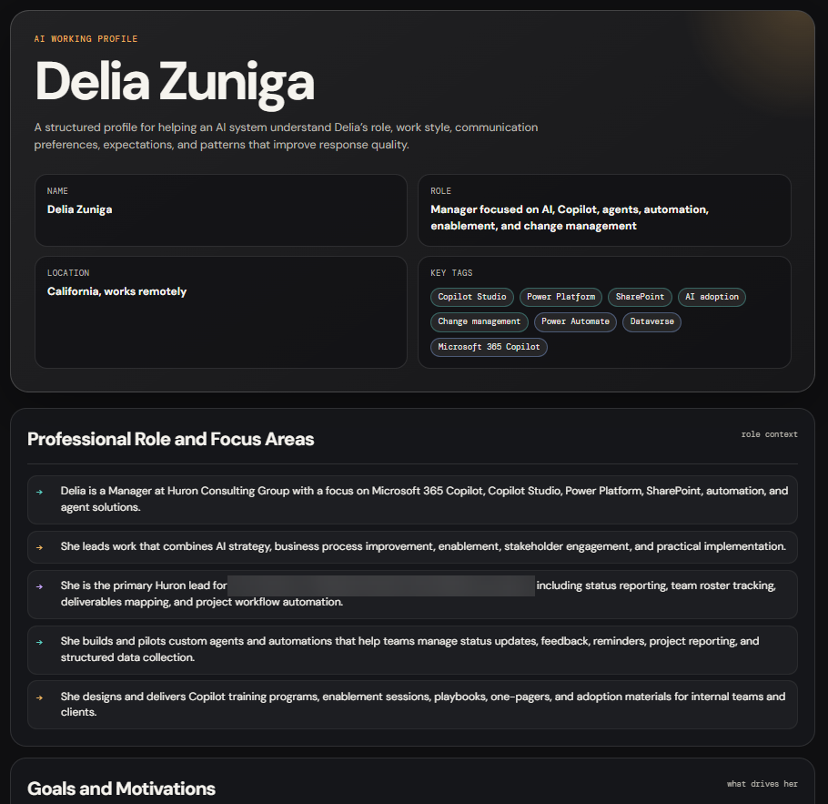

# Generate a Portable AI Profile 

> [!IMPORTANT]
> This prompt can generate personal, professional, and behavioral information based on your conversation history. Review the output and remove any private, confidential, or security-sensitive details before sharing it with another person or AI tool.



> [!NOTE]
> A standard Copilot or agent chat may return the HTML as a code block instead of creating or rendering an HTML file. Run this prompt in Cowork if you want Copilot to create the `.html` file for you. Otherwise, copy the generated HTML into a text editor and save it with an `.html` extension.

## Summary

This prompt generates a portable, structured profile based on your interactions with an AI assistant. The result is a self-contained HTML file that helps other AI tools understand your role, goals, communication preferences, work style, and expectations.

## Prompt 💡

```
Generate a complete, structured summary of everything you know about me based on our past interactions. Your goal is to help another AI system quickly understand how to work with me effectively.

Include the following areas:

- My professional role and focus areas
- My goals and motivations
- My communication style, including tone, structure, preferences, and dislikes
- How I like to work, including problem solving approach, iteration style, and execution habits
- My technical strengths and typical use cases
- My leadership style and work habits
- My decision-making preferences
- My expectations when interacting with AI
- My engagement style and feedback patterns
- My quality standards and tolerance levels
- My intent when using AI
- How you adapt your responses to me
- Any patterns you've observed about me that improve response quality

Include a final section titled "Instructions for Any AI System" that clearly defines how the AI should behave when interacting with me.

Content formatting rules:

- Use clear sections with headings
- Use bullet points instead of long paragraphs
- Keep content concise but complete
- Use plain language and avoid jargon unless necessary
- Phrase everything as fact-based observations derived from interaction patterns
- Do not reference "previous responses" or "earlier context"

Output format:

Produce a single self-contained HTML file I can save and share with other AI tools.

Requirements:

- Use a dark background, such as #0f0f11 or similar
- Use light text
- Use Google Fonts:
  - DM Sans for body text
  - DM Mono for labels and tags
- Separate sections with subtle horizontal rules
- Style bullet point items as rows with a colored arrow or marker, not default browser bullets
- Use tags or chips for skills, tools, and avoid patterns
- Include a two-column metadata strip at the top with name, role, location, and key tags
- Make the "Instructions for Any AI System" section visually prominent
- Make the layout fully responsive
- Do not use external CSS frameworks
- Do not include JavaScript
- Include a footer with the filename and generation date

Think carefully end-to-end before responding. I want this to be high quality and immediately reusable.
```

## Description ℹ️

This prompt creates a shareable personal operating guide for AI-assisted work. It captures practical, fact-based observations without requiring another AI tool to review a long chat history.

Use it to:

- Reuse your AI profile across different AI tools.
- Help a new AI assistant understand your work style and preferences.
- Document your communication preferences, dislikes, and quality expectations.
- Improve personalization when moving between Microsoft Copilot, ChatGPT, Claude, or other AI tools.
- Help consultants, leaders, makers, and technical users receive more consistent responses.

## Contributors 👨‍💻

[Delia Zuniga](https://github.com/dzblanco08)

## Version history

Version|Date|Comments
-------|----|--------
1.0|July 14, 2026|Initial release

## Instructions 📝

1. Open an AI assistant that has access to your previous interactions.
2. Copy the prompt from the **Prompt** section.
3. Paste the prompt into the chat and submit it.
4. Save the generated response as an `.html` file.
5. Open the file in a browser and review the profile for accuracy and sensitive information before sharing it.

### Improvise Usage 🚀

- Ask the AI to focus on a specific context, such as leadership, software development, consulting, or personal productivity.
- Add or remove profile sections to suit how you plan to use the output.
- Change the visual theme, typography, or metadata fields.
- Request both a detailed profile and a shorter version for use as custom instructions.

## Prerequisites

* An AI assistant with access to your interaction history, such as [Microsoft Copilot](https://copilot.microsoft.com/)

## Help

We do not support samples, but this community is always willing to help, and we want to improve these samples. We use GitHub to track issues, which makes it easy for community members to volunteer their time and help resolve issues.

You can try looking at [issues related to this sample](https://github.com/pnp/copilot-prompts/issues?q=label%3A%22sample%3A%20ai-profile%22) to see if anybody else is having the same issues.

If you encounter any issues using this sample, [create a new issue](https://github.com/pnp/copilot-prompts/issues/new).

Finally, if you have an idea for improvement, [make a suggestion](https://github.com/pnp/copilot-prompts/issues/new).

## Disclaimer

**THIS CODE IS PROVIDED *AS IS* WITHOUT WARRANTY OF ANY KIND, EITHER EXPRESS OR IMPLIED, INCLUDING ANY IMPLIED WARRANTIES OF FITNESS FOR A PARTICULAR PURPOSE, MERCHANTABILITY, OR NON-INFRINGEMENT.**

---

