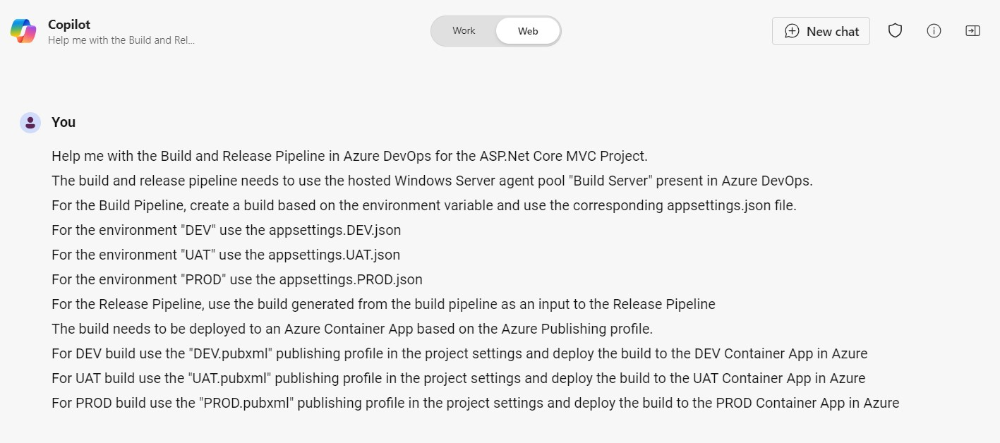
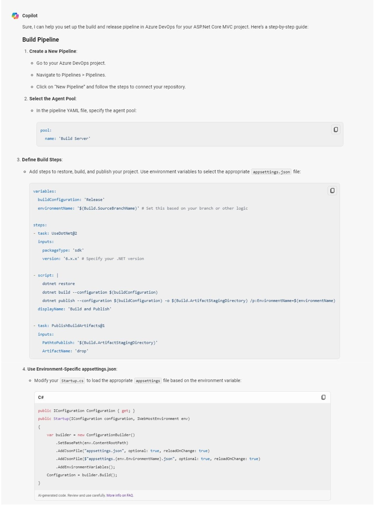

# 💻 Azure DevOps Build and Release Pipelines 🧑‍💻

## Summary

This is a Azure DevOps Build and Release Pipeline Prompt. The purpose is to illustrate the power of precise instructions to get the desired help in deployment automation. 

## Prompt 💡

Help me with the Build and Release Pipeline in Azure DevOps for the ASP.Net Core MVC Project. 
The build and release pipeline needs to use the hosted Windows Server agent pool "Build Server" present in Azure DevOps. 
For the Build Pipeline, create a build based on the environment variable and use the corresponding appsettings.json file. 
For the environment "DEV" use the appsettings.DEV.json 
For the environment "UAT" use the appsettings.UAT.json 
For the environment "PROD" use the appsettings.PROD.json 
For the Release Pipeline, use the build generated from the build pipeline as an input to the Release Pipeline 
The build needs to be deployed to an Azure Container App based on the Azure Publishing profile. 
For DEV build use the "DEV.pubxml" publishing profile in the project settings and deploy the build to the DEV Container App in Azure 
For UAT build use the "UAT.pubxml" publishing profile in the project settings and deploy the build to the UAT Container App in Azure 
For PROD build use the "PROD.pubxml" publishing profile in the project settings and deploy the build to the PROD Container App in Azure 

### Description ℹ️

Create the Build and Release Pipelines in Azure DevOps using Copilot.

## Contributors 👨‍💻

[Arcee Gomes](https://github.com/arceegomes)

## Version history

Version|Date|Comments
-------|----|--------
1.0|October 19, 2024|Initial release

## Instructions 📝

1. Make sure you have Copilot for Microsoft 365 in your tenant
2. Open CoPilot App 
3. Copy and paste the about prompt and click Submit

### Improvise Usage 🚀

You can add more information to the prompt if needed to create more accurate response

## Prerequisites

* [Copilot for Microsoft 365](https://developer.microsoft.com/microsoft-365/dev-program)

## Help

We do not support samples, but this community is always willing to help, and we want to improve these samples. We use GitHub to track issues, which makes it easy for  community members to volunteer their time and help resolve issues.

You can try looking at [issues related to this sample](https://github.com/pnp/copilot-prompts/issues?q=label%3A%22sample%3A%20m365-azure-devops-pipeline-prompt%22) to see if anybody else is having the same issues.

If you encounter any issues using this sample, [create a new issue](https://github.com/pnp/copilot-prompts/issues/new).

Finally, if you have an idea for improvement, [make a suggestion](https://github.com/pnp/copilot-prompts/issues/new).

## Disclaimer

**THIS CODE IS PROVIDED *AS IS* WITHOUT WARRANTY OF ANY KIND, EITHER EXPRESS OR IMPLIED, INCLUDING ANY IMPLIED WARRANTIES OF FITNESS FOR A PARTICULAR PURPOSE, MERCHANTABILITY, OR NON-INFRINGEMENT.**

