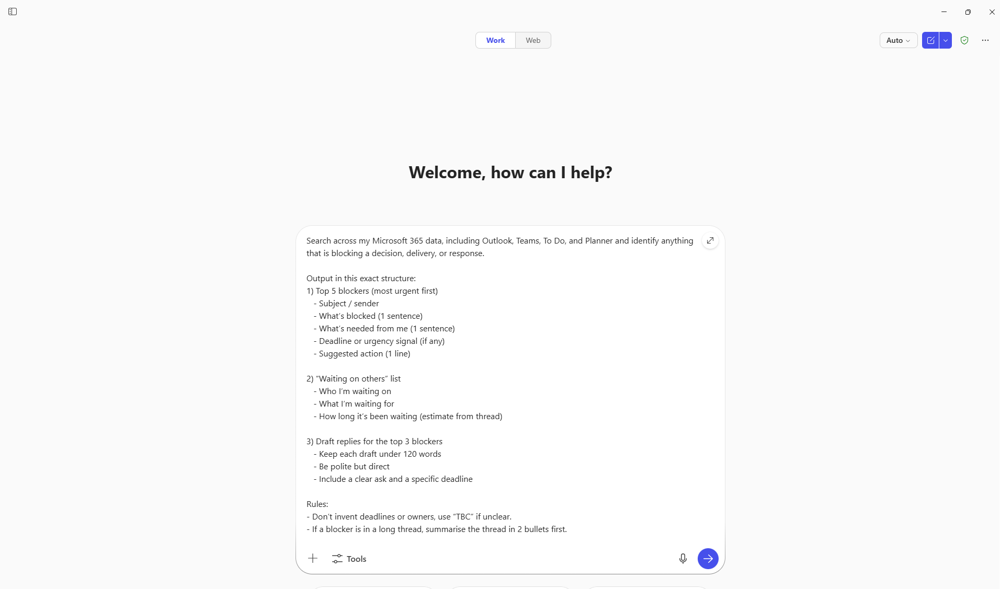
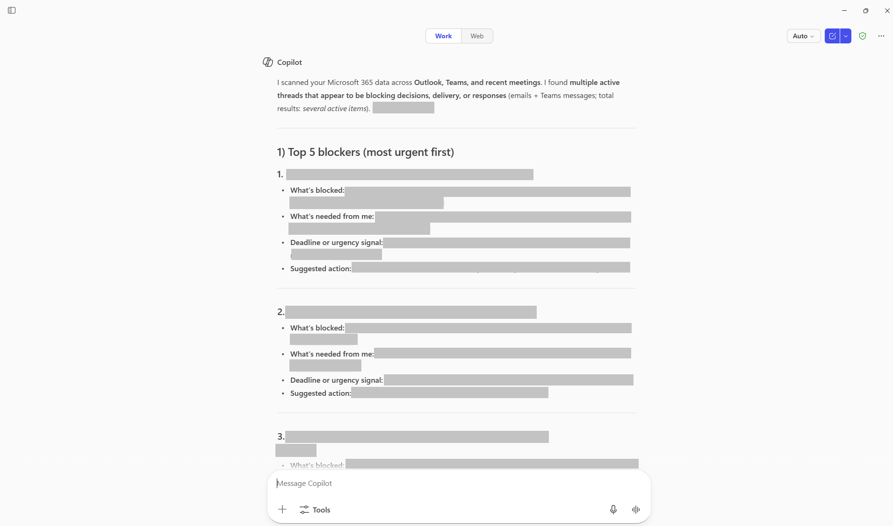
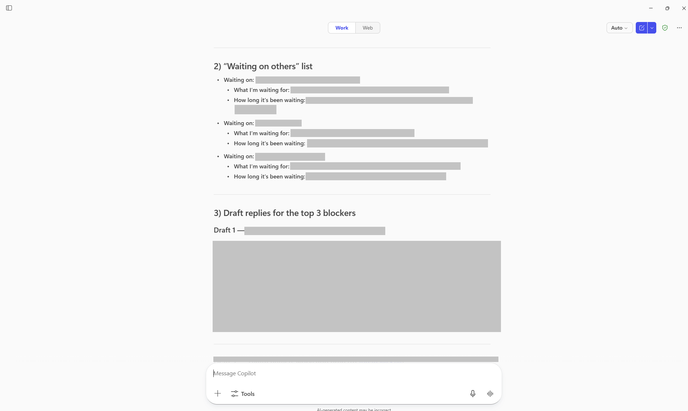

#  Blocker Finder 

## Summary
Identify key blockers across Microsoft 365 and generate clear next actions and replies.

## Prompt💡

Search across my Microsoft 365 data, including Outlook, Teams, To Do, and Planner and identify anything that is blocking a decision, delivery, or response.

Output in this exact structure:
1) Top 5 blockers (most urgent first)
   - Subject / sender
   - What’s blocked (1 sentence)
   - What’s needed from me (1 sentence)
   - Deadline or urgency signal (if any)
   - Suggested action (1 line)

2) “Waiting on others” list
   - Who I’m waiting on
   - What I’m waiting for
   - How long it’s been waiting (estimate from thread)

3) Draft replies for the top 3 blockers
   - Keep each draft under 120 words
   - Be polite but direct
   - Include a clear ask and a specific deadline

Rules:
- Don’t invent deadlines or owners, use “TBC” if unclear.
- If a blocker is in a long thread, summarise the thread in 2 bullets first.

### Description ℹ️
Scan Outlook, Teams, To Do, and Planner to surface urgent blockers, stalled items, and dependencies. Get prioritised actions, “waiting on” insights, and ready-to-send draft responses to keep work moving.

## Contributors 👨‍💻

[Adam Bezance](https://github.com/bezanca84)

## Version history

Version|Date|Comments
-------|----|--------
1.0|Mar 18, 2026|Initial release

## Instructions 📝

1. Make sure you have Copilot for Microsoft 365 in your tenant
2. Open the Microsoft Teams app
3. Open the Copilot app within Teams
4. Paste the prompt in the Copilot app

## Prerequisites

* [Copilot for Microsoft 365](https://developer.microsoft.com/microsoft-365/dev-program)

## Help

We do not support samples, but this community is always willing to help, and we want to improve these samples. We use GitHub to track issues, which makes it easy for  community members to volunteer their time and help resolve issues.

You can try looking at [issues related to this sample](https://github.com/pnp/copilot-prompts/issues?q=label%3A%22sample%3A%20m365-blocker-finder%22) to see if anybody else is having the same issues.

If you encounter any issues using this sample, [create a new issue](https://github.com/pnp/copilot-prompts/issues/new).

Finally, if you have an idea for improvement, [make a suggestion](https://github.com/pnp/copilot-prompts/issues/new).

## Disclaimer

**THIS CODE IS PROVIDED *AS IS* WITHOUT WARRANTY OF ANY KIND, EITHER EXPRESS OR IMPLIED, INCLUDING ANY IMPLIED WARRANTIES OF FITNESS FOR A PARTICULAR PURPOSE, MERCHANTABILITY, OR NON-INFRINGEMENT.**

