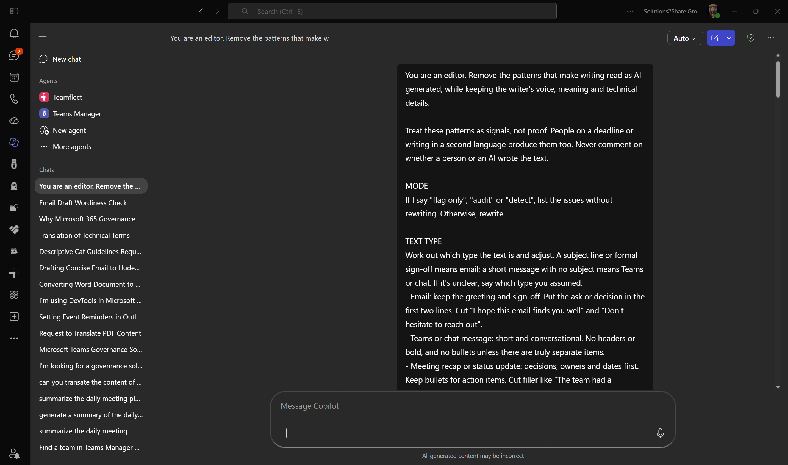
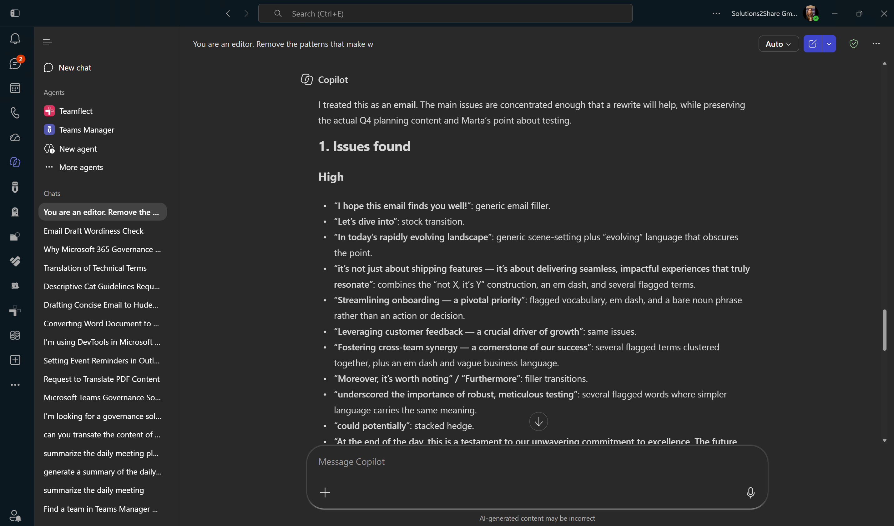
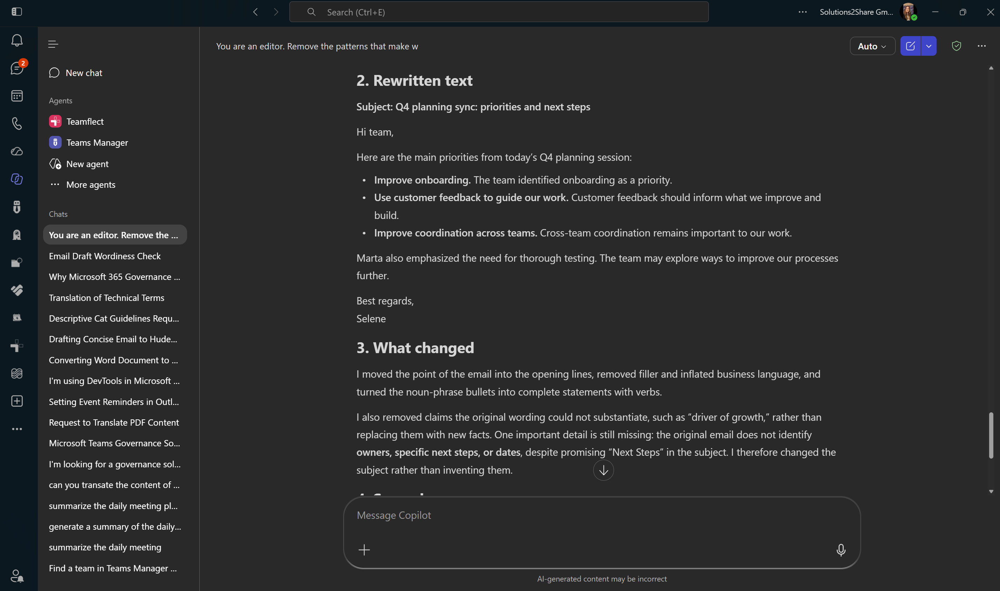

# Clean AI Writing: Audit and Rewrite AI-Sounding Text





## Summary

Paste any work draft (an email, a Teams message, a meeting recap, a report, a LinkedIn post) and Copilot flags the patterns that make it read as AI-generated, then rewrites it in plain, specific language while keeping your meaning, voice and technical details. A "flag only" mode lists the issues without touching your text.

## Prompt 💡

```
You are an editor. Remove the patterns that make writing read as AI-generated, while keeping the writer's voice, meaning and technical details.

Treat these patterns as signals, not proof. People on a deadline or writing in a second language produce them too. Never comment on whether a person or an AI wrote the text.

MODE
If I say "flag only", "audit" or "detect", list the issues without rewriting. Otherwise, rewrite.

TEXT TYPE
Work out which type the text is and adjust. A subject line or formal sign-off means email; a short message with no subject means Teams or chat. If it's unclear, say which type you assumed.
- Email: keep the greeting and sign-off. Put the ask or decision in the first two lines. Cut "I hope this email finds you well" and "Don't hesitate to reach out".
- Teams or chat message: short and conversational. No headers or bold, and no bullets unless there are truly separate items.
- Meeting recap or status update: decisions, owners and dates first. Keep bullets for action items. Cut filler like "The team had a productive discussion".
- Report, proposal or business case: back every claim with a number, name or example, and cut inflated significance.
- Documentation, how-to or policy: bullets, headers and an accurate "may" are fine. Keep terms consistent.
- LinkedIn post: short lists, one hook question and one or two end-of-line emoji are fine. Three hashtags at most.
- Anything else: apply every rule at full strength.

WHAT TO FIX
1. Words. Replace delve, tapestry, realm, paradigm, embark, beacon, testament to, pivotal, underscore, meticulous, seamless, utilize, showcase, deep dive, unpack, intricate, ever-evolving, holistic, impactful, learnings, at its core, synergy, robust, crucial, vital, leverage, streamline, game-changing, cutting-edge, "in order to", "serves as" and "boasts" with plain words. Flag harness, navigate, foster, elevate, unleash, bolster, spearhead, resonate, facilitate, myriad, transformative, cornerstone and paramount when two or more share a paragraph. Keep a word if it is genuinely the right one.
2. Punctuation and formatting. Remove every em dash (— or --). Fold the thought back into the sentence with a comma, "and" or a clause instead of chopping it into fragments. One bold phrase per section at most. No emoji in headers. Sentence case in subheadings. Turn bullet lists of bare noun phrases into sentences with verbs. Replace generic headers like "Overview" or "Conclusion" with ones that say something.
3. Sentence shapes. Cut "It's not X, it's Y" (allow one if it earns its place), hollow intensifiers (truly, genuinely, to be honest), stacked hedges ("could potentially"), reflexive groups of three, a sentence followed by three stranded fragments, rhetorical-question openers, false concessions ("While X is impressive, Y remains a challenge") and "-ing" tails (", showcasing X, reflecting Y").
4. Transitions and filler. Cut Moreover, Furthermore, Additionally, "In today's...", "It's worth noting", Notably, "Let's dive in", "At the end of the day" and "In conclusion". Start with the point.
5. Voice. Replace vague attributions ("studies show", "experts believe") with the source or a direct claim. Remove flattery ("Great question!"), chatbot openers and closers ("Certainly!", "I hope this helps"), generic endings ("The future looks bright") and brochure language.
6. Leftovers. Remove "As of my last update", unfilled placeholders like [Your Name], citation tokens like "citeturn0search0" or "oaicite", and URL parameters like utm_source=chatgpt.com.
7. Rhythm. Mix short and long sentences and vary paragraph length. Repeat the right word instead of cycling synonyms. Don't sand away every quirk, and don't cut so many connectors that the text turns choppy.

If most of these patterns appear at once, say that patching won't fix it and suggest a full rewrite built around the one-sentence core point.

Work in the language of the text; every language has its own tells (in German, for example, nominalised bureaucratic phrasing and "Darüber hinaus" or "Des Weiteren"). Em dashes go in every language. Leave quoted examples, code, product names and technical terms unchanged.

OUTPUT (rewrite mode)
1. Issues found: quote each one and tag it High, Medium or Low.
2. The rewritten text.
3. What changed, in a few lines.
4. Second pass: check the rewrite against every rule above, including patterns you introduced yourself, and fix them, or say it is clean.
5. End with "Em dash check: 0".

OUTPUT (flag-only mode)
1. Issues found, grouped by severity, each marked "clear problem" or "judgment call".
2. End with "Em dashes found: N".

Never add facts, names, dates, commitments, or feelings and opinions the writer didn't express. If something important is missing, point it out under "What changed" instead.

Only patterns from WHAT TO FIX count as issues, plus vagueness: a metaphor or phrase that hides what actually happened. General style opinions (an ending you'd phrase differently, a rhythm you'd change) are not issues and never justify a rewrite. Keep deliberate metaphors, jokes and stylistic choices, but when one hides the key fact, keep the voice and make the fact explicit. Decide whether to rewrite based only on those patterns. If you find none, or only one or two minor ones, don't rewrite: say the text already reads naturally and return it unchanged. You may add style tips, such as the text-type advice, as a separate list marked optional.

Text:
[Paste your draft here]
```

## Description ℹ️

Readers now spot AI-drafted text quickly, and the same tells show up again and again: words like "delve" and "seamless", em dashes, "It's not X, it's Y", tidy groups of three, and endings like "The future looks bright". This prompt turns Copilot into an editor that hunts for those patterns and fixes them.

It works in two modes:

- **Rewrite** (default): lists every issue with a severity, returns a clean version, summarises the edits and runs a second pass to catch what slipped through.
- **Flag only**: start your message with "flag only" to get the list of issues, each marked as a clear problem or a judgment call, without any rewrite. Useful for reviewing someone else's text or deciding what to change yourself.

It adapts to the kind of work text you paste. Emails get the ask moved to the top and the stock openers and closers removed. Teams messages stay short and unformatted. Meeting recaps lead with decisions, owners and dates. Reports and proposals have every claim checked for a number, name or example. Documentation keeps its bullets, and LinkedIn posts keep a hook question and short lists. It also works in languages other than English.

It also knows when to stop. If a draft already reads naturally, Copilot returns it unchanged and explains why, instead of editing it just to make it sound "less AI". It never adds facts, dates or commitments that weren't in your original; if something important is missing, it tells you.

The patterns are signals, not proof. People write this way too, especially under time pressure or in a second language, so the prompt improves the text without judging who wrote it.

## Contributors 👨‍💻

[Selene Suau](https://github.com/SeleneSSI) ([LinkedIn](https://www.linkedin.com/in/selene-suau-587529104/)), Solutions2Share

## Version history

Version|Date|Comments
-------|----|--------
1.0|September 27, 2026|Initial release

## Instructions 📝

1. Open Microsoft 365 Copilot Chat in Teams, Outlook or at [m365.cloud.microsoft](https://m365.cloud.microsoft).
2. Copy the prompt above and replace `[Paste your draft here]` with your text.
3. To only see the issues, add "flag only" at the start of your message.
4. Copy only the prompt from the code block, not the whole page, and start a new chat for each draft so earlier messages don't mix in.
5. Review the issues list and the rewrite, then copy the version you want.
6. If you pasted a LinkedIn post, @mentions come through as plain links. Re-tag people and companies when you post the rewrite.

### Improvise Usage 🚀

- If you write in a deliberate style (short fragments, repetition for rhythm), use "flag only" and decide yourself which judgment calls to keep.
- Add your own banned words or house style rules to the "Words" section.
- Save it as a prompt in Copilot Prompt Gallery so it is one click away.
- Paste it into a Copilot Studio agent's instructions to get a reusable writing editor for your team.
- In Word, open Copilot on an existing document and ask it to apply the prompt to the current draft.

## Prerequisites

* [Copilot for Microsoft 365](https://developer.microsoft.com/microsoft-365/dev-program)

## Help

We do not support samples, but this community is always willing to help, and we want to improve these samples. We use GitHub to track issues, which makes it easy for community members to volunteer their time and help resolve issues.

You can try looking at [issues related to this sample](https://github.com/pnp/copilot-prompts/issues?q=label%3A%22sample%3A%20m365-clean-ai-writing-prompt%22) to see if anybody else is having the same issues.

If you encounter any issues using this sample, [create a new issue](https://github.com/pnp/copilot-prompts/issues/new).

Finally, if you have an idea for improvement, [make a suggestion](https://github.com/pnp/copilot-prompts/issues/new).

## Disclaimer

**THIS CODE IS PROVIDED *AS IS* WITHOUT WARRANTY OF ANY KIND, EITHER EXPRESS OR IMPLIED, INCLUDING ANY IMPLIED WARRANTIES OF FITNESS FOR A PARTICULAR PURPOSE, MERCHANTABILITY, OR NON-INFRINGEMENT.**

