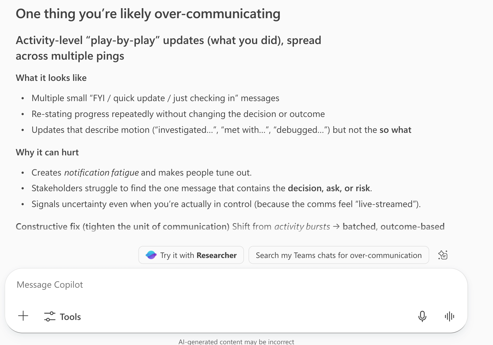

# Communication Balance Analyzer

## Summary

This prompt analyzes your recent work context to identify one area where you may be over‑communicating and one where you may be under‑communicating, helping you fine‑tune how you share information with your team.

## Prompt 💡

Look at my recent work context and tell me one thing I'm over‑communicating and one thing I'm under‑communicating. Be specific and constructive.

## Description ℹ️

Effective communication at work isn't just about saying more or less — it's about saying the right things to the right people. This prompt leverages Microsoft 365 Copilot's awareness of your recent emails, chats, meetings, and documents to surface patterns you might not notice yourself. It returns one concrete area where you may be providing too much detail or repeating yourself, and one area where stakeholders might benefit from hearing more from you. The feedback is specific and constructive so you can take immediate action.

## Contributors 👨‍💻

[Rabia Williams](https://github.com/rabwill)

## Version history

Version|Date|Comments
-------|----|--------
1.0|February 16, 2026|Initial release

## Instructions 📝

1. Open Microsoft 365 Copilot in Microsoft Teams or at [m365copilot.com](https://m365copilot.com).
2. Copy the prompt below and paste it into the chat.
3. Submit the prompt and review the analysis Copilot returns.
4. Use the insights to adjust your communication habits going forward.

### Improvise Usage 🚀

- Ask Copilot to focus on a specific time range (e.g., "over the past two weeks").
- Narrow the scope to a particular channel such as emails only or Teams chats only.
- Follow up by asking for concrete suggestions on how to rebalance your communication.

## Prerequisites

* [Copilot for Microsoft 365](https://developer.microsoft.com/microsoft-365/dev-program)

## Help

We do not support samples, but this community is always willing to help, and we want to improve these samples. We use GitHub to track issues, which makes it easy for community members to volunteer their time and help resolve issues.

You can try looking at [issues related to this sample](https://github.com/pnp/copilot-prompts/issues?q=label%3A%22sample%3A%20m365-communication-balance-analyzer-prompt%22) to see if anybody else is having the same issues.

If you encounter any issues using this sample, [create a new issue](https://github.com/pnp/copilot-prompts/issues/new).

Finally, if you have an idea for improvement, [make a suggestion](https://github.com/pnp/copilot-prompts/issues/new).

## Disclaimer

**THIS CODE IS PROVIDED *AS IS* WITHOUT WARRANTY OF ANY KIND, EITHER EXPRESS OR IMPLIED, INCLUDING ANY IMPLIED WARRANTIES OF FITNESS FOR A PARTICULAR PURPOSE, MERCHANTABILITY, OR NON-INFRINGEMENT.**

