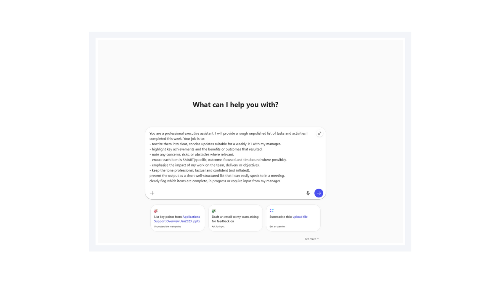
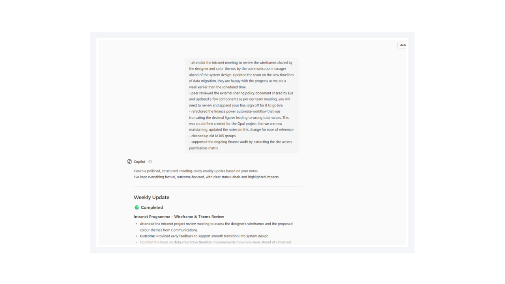
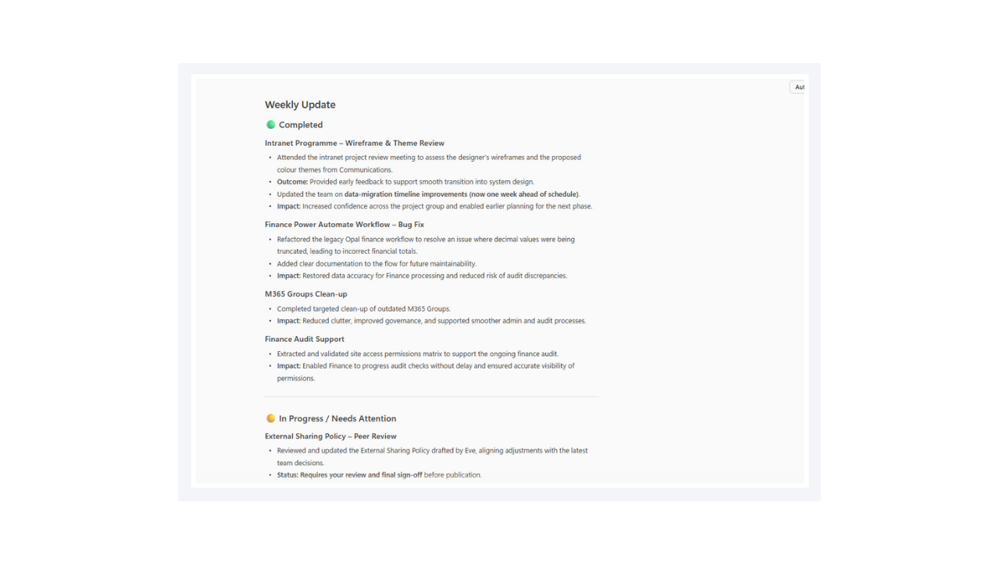

# 🚀 Microsoft 365 Copilot as a Professional Executive Assistant 💻

## Summary

## Prompt 💡

You are a professional executive assistant. I will provide a rough, unpolished list of tasks and activities I completed this week.

Your job is to:

- Rewrite them into clear, concise updates suitable for a weekly 1:1 with my manager
- Highlight key achievements and the benefits or outcomes that resulted
- Note any concerns, risks, or obstacles where relevant
- Ensure each item is SMART (specific, outcome-focused, and time-bound where possible)
- Emphasise the impact of my work on the team, delivery, or objectives

Keep the tone professional, factual, and confident (not inflated)

Present the output as a short, well-structured list that I can easily speak to in a meeting.

Clearly flag which items are complete, in progress, or require input from my manager.

## Description ℹ️

This prompt functions as a professional executive assistant. You provide a rough list of tasks and activities completed during the week, and it generates a concise, well-structured summary suitable for discussion in meetings. Each item is clearly marked as Complete, In Progress, or Requires Manager Input, enabling quick and effective updates.

## Demo Flow
1. Introduce the prompt in Copilot Chat.

2. Copilot interprets the instructions and output requirements defined in the prompt.

3. Submit a sample set of weekly tasks for refinement.

4. Walk through the first section of the structured output generated by Copilot.

5. Walk through the remaining section of the structured output.

## Contributors 👨‍💻

| [Josiah Opiyo](https://github.com/ojopiyo) |

*Built with a focus on automation, governance, least privilege, and clean Microsoft 365 tenants—helping M365 admins gain visibility and reduce operational risk.*

## Version history

Version|Date|Comments
-------|----|--------
1.0|Feb 02, 2026|Initial release

## Instructions 📝

1. Make sure you have copilot for Microsoft 365 in your tenant
2. Go to Microsoft 365 Copilot in Office.com or use Copilot chat in Teams
3. Copy paste the above prompt
4. Copilot will generate a table and excel formula's

### Improvise Usage 🚀
You can use Copilot to help you understand with specific Excel formula's with examples and sample data table or you can use copilot as a tutor to learn about any productivity tools and not just restricted to Microsoft Excel.

## Prerequisites

* [Copilot for Microsoft 365](https://developer.microsoft.com/microsoft-365/dev-program)

## Help

We do not support samples, but this community is always willing to help, and we want to improve these samples. We use GitHub to track issues, which makes it easy for  community members to volunteer their time and help resolve issues.

You can try looking at [issues related to this sample](https://github.com/pnp/copilot-prompts/issues?q=label%3A%22sample%3A%20YOUR-SAMPLE-NAME%22) to see if anybody else is having the same issues.

If you encounter any issues using this sample, [create a new issue](https://github.com/pnp/copilot-prompts/issues/new).

Finally, if you have an idea for improvement, [make a suggestion](https://github.com/pnp/copilot-prompts/issues/new).

## Disclaimer

**THIS CODE IS PROVIDED *AS IS* WITHOUT WARRANTY OF ANY KIND, EITHER EXPRESS OR IMPLIED, INCLUDING ANY IMPLIED WARRANTIES OF FITNESS FOR A PARTICULAR PURPOSE, MERCHANTABILITY, OR NON-INFRINGEMENT.**

