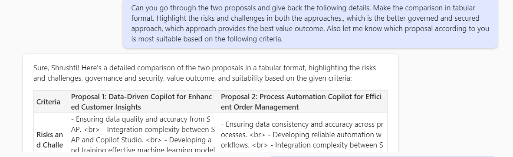
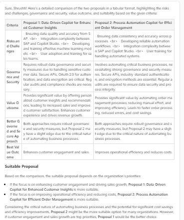

# 🚀 Compare technical proposals to find the suitable proposal based on the defined criteria using Microsoft 365 Copilot 💻

## Summary

This prompt helps in creating a comparison with 2 proposal in tabular format. In this scenario the proposal is compared based on the following criteria, risks & challenges, secure and governed approach and value outcome. Also take recommendation from AI on the suitable proposal based on the provided criteria.

## Prompt 💡

Can you go through the two proposals and give back the following details. Make the comparison in tabular format. Highlight the risks and challenges in both the approaches., which is the better governed and secured approach, which approach provides the best value outcome. Also let me know which proposal according to you is most suitable based on the following criteria.

## Description ℹ️

This prompt compares two proposals to find the suitable proposal based on the specified criteria.

## Contributors 👨‍💻

[Shrushti Shah](https://github.com/Shrusti13)

## Version history

Version|Date|Comments
-------|----|--------
1.0|October 8, 2024|Initial release

## Instructions 📝

1. Make sure you have copilot for Microsoft 365 in your tenant
2. Go to Microsoft 365 Copilot in Office.com or use Copilot chat in Teams
3. Copy paste the above prompt
4. Copilot will generate a comparison based on the provided criteria and a suitable recommendation. 
5. In this scenario I have the proposal in the chat context above but you can attach multiple proposal documents in the prompt as well.

### Improvise Usage 🚀
Anyone using this can modify the prompt and add a different set of criteria's which they are looking for to generate a comparison and this comparison is not restricted to just 2 proposals but can add more proposals for comparison as well.

## Prerequisites

* [Copilot for Microsoft 365](https://developer.microsoft.com/microsoft-365/dev-program)

## Help

We do not support samples, but this community is always willing to help, and we want to improve these samples. We use GitHub to track issues, which makes it easy for  community members to volunteer their time and help resolve issues.

You can try looking at [issues related to this sample](https://github.com/pnp/copilot-prompts/issues?q=label%3A%22sample%3A%20YOUR-SAMPLE-NAME%22) to see if anybody else is having the same issues.

If you encounter any issues using this sample, [create a new issue](https://github.com/pnp/copilot-prompts/issues/new).

Finally, if you have an idea for improvement, [make a suggestion](https://github.com/pnp/copilot-prompts/issues/new).

## Disclaimer

**THIS CODE IS PROVIDED *AS IS* WITHOUT WARRANTY OF ANY KIND, EITHER EXPRESS OR IMPLIED, INCLUDING ANY IMPLIED WARRANTIES OF FITNESS FOR A PARTICULAR PURPOSE, MERCHANTABILITY, OR NON-INFRINGEMENT.**

