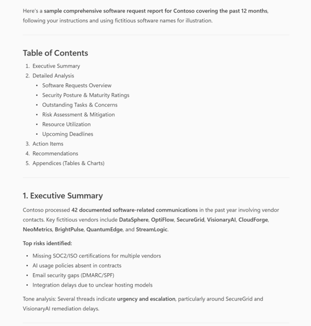
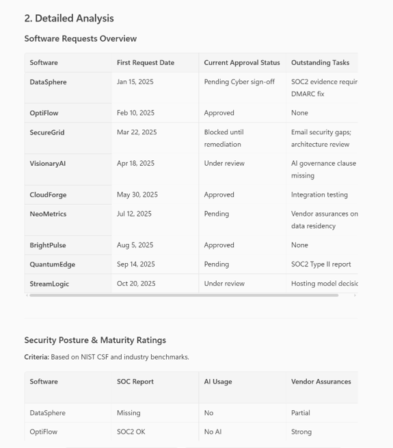

# ✅ Track New Software Requests and Security Review Status

#

## Prompt 💡

Generate a comprehensive software request report for [Your Company Name Here] covering the past 12 months with these steps:

1. Search Outlook emails and Teams chats for all software requests involving any of these addresses: [mrprocurement@yourcompany.com] or [vendorchecklist@yourcompany.com].
2. Validate completeness: include every software mentioned in those communications.
3. For each software:
   - First request date
   - Current approval status (latest email thread)
   - Outstanding tasks or concerns
   - Security posture: SOC report status, AI usage, vendor assurances
   - Assign security maturity rating with justification
   - Assign security maturity rating based on available web search
4. Summarize:
   - Top risks and mitigation plans
   - Progress against milestones
   - Resource utilization (people and tools)
   - Upcoming deadlines (next 30 days)
   - Check for tone for urgency or hostility
5. Generate a professional report with:
   - Executive Summary
   - Detailed Analysis (tables and charts)
   - Action Items with owners and due dates
   - Recommendations
   - Table of Contents
6. Format for email delivery and Teams message.

Complete the requests without asking for additional steps.  Validate your answers and provide any last thoughts based on the output.

## Description ℹ️

This prompt helps IT managers and infrastructure teams track the lifecycle of software acquisition requests across email and Teams communications. It automatically identifies software titles mentioned in the past 12 months, extracts the date of first request, summarizes current approval status, flags outstanding tasks or concerns, and highlights requests involving key contacts (e.g., vendorchecklist@yourcompany.com or mrprocurement@yourcompany.com). It also assesses each software’s security maturity, checks for SOC reports, and verifies AI-related data privacy documentation. The output is a structured report grouped by software title, designed to run on a recurring schedule (e.g., every Monday and Wednesday) to keep stakeholders informed and aligned.

## Contributors 👨‍💻

[Andrew Burns](https://github.com/GeorgiaGit)

## Version history

Version|Date|Comments
-------|----|--------
1.0|November 11, 2025|Initial release

## Instructions 📝

1. Make sure you have copilot for Microsoft 365 in your tenant
2. Go to Microsoft 365 Copilot in Office.com or use Copilot chat in Teams
3. Copy paste the above prompt
4. Copilot will generate a table and excel formula's

### Improvise Usage 🚀
You can use Copilot to help you understand with specific Excel formula's with examples and sample data table or you can use copilot as a tutor to learn about any productivity tools and not just restricted to Microsoft Excel.

## Prerequisites

* [Copilot for Microsoft 365](https://developer.microsoft.com/microsoft-365/dev-program)

## Help

We do not support samples, but this community is always willing to help, and we want to improve these samples. We use GitHub to track issues, which makes it easy for  community members to volunteer their time and help resolve issues.

You can try looking at [issues related to this sample](https://github.com/pnp/copilot-prompts/issues?q=label%3A%22sample%3A%20YOUR-SAMPLE-NAME%22) to see if anybody else is having the same issues.

If you encounter any issues using this sample, [create a new issue](https://github.com/pnp/copilot-prompts/issues/new).

Finally, if you have an idea for improvement, [make a suggestion](https://github.com/pnp/copilot-prompts/issues/new).

## Disclaimer

**THIS CODE IS PROVIDED *AS IS* WITHOUT WARRANTY OF ANY KIND, EITHER EXPRESS OR IMPLIED, INCLUDING ANY IMPLIED WARRANTIES OF FITNESS FOR A PARTICULAR PURPOSE, MERCHANTABILITY, OR NON-INFRINGEMENT.**

