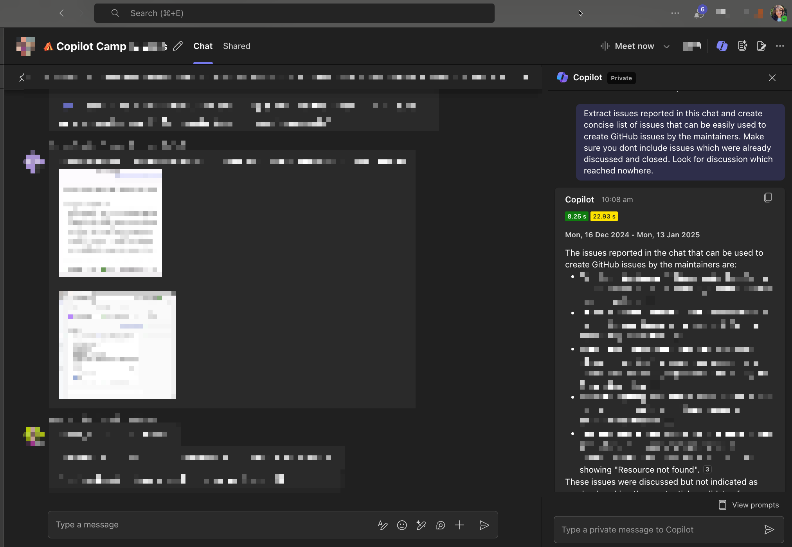

# 🚀 Extract unresolved issues from chat discussions 💬

## Summary

## Prompt 💡

Extract issues reported in this chat and create concise list of issues that can be easily used to create GitHub issues by the maintainers. Make sure you don't include issues which were already discussed and closed. Look for discussion which reached nowhere.

## Description ℹ️

Review the chat and extract a concise list of unresolved issues suitable for creating GitHub issues. Exclude already resolved or closed topics, and focus on discussions that lack clear conclusions. Ensure the list is clear, actionable, and easy for maintainers to use.

## Contributors 👨‍💻

[Rabia Williams](https://github.com/rabwill)

## Version history

Version|Date|Comments
-------|----|--------
1.0|January 13, 2025|Initial release

## Instructions 📝

1. Make sure you have Microsoft 365 Copilot in your tenant
2. Go to Copilot app in a group chat where you disucss issues of a project with your team
3. Copy paste the above prompt

### Improvise Usage 🚀
You can follow up in the chat with Copilot using a prompt like: "Identify potential assignees based on their interactions" to gather more information about assigning these issues.

## Prerequisites

* [Microsoft 365 Copilot](https://developer.microsoft.com/microsoft-365/dev-program)

## Help

We do not support samples, but this community is always willing to help, and we want to improve these samples. We use GitHub to track issues, which makes it easy for  community members to volunteer their time and help resolve issues.

You can try looking at [issues related to this sample](https://github.com/pnp/copilot-prompts/issues?q=label%3A%22sample%3A%20YOUR-SAMPLE-NAME%22) to see if anybody else is having the same issues.

If you encounter any issues using this sample, [create a new issue](https://github.com/pnp/copilot-prompts/issues/new).

Finally, if you have an idea for improvement, [make a suggestion](https://github.com/pnp/copilot-prompts/issues/new).

## Disclaimer

**THIS CODE IS PROVIDED *AS IS* WITHOUT WARRANTY OF ANY KIND, EITHER EXPRESS OR IMPLIED, INCLUDING ANY IMPLIED WARRANTIES OF FITNESS FOR A PARTICULAR PURPOSE, MERCHANTABILITY, OR NON-INFRINGEMENT.**

