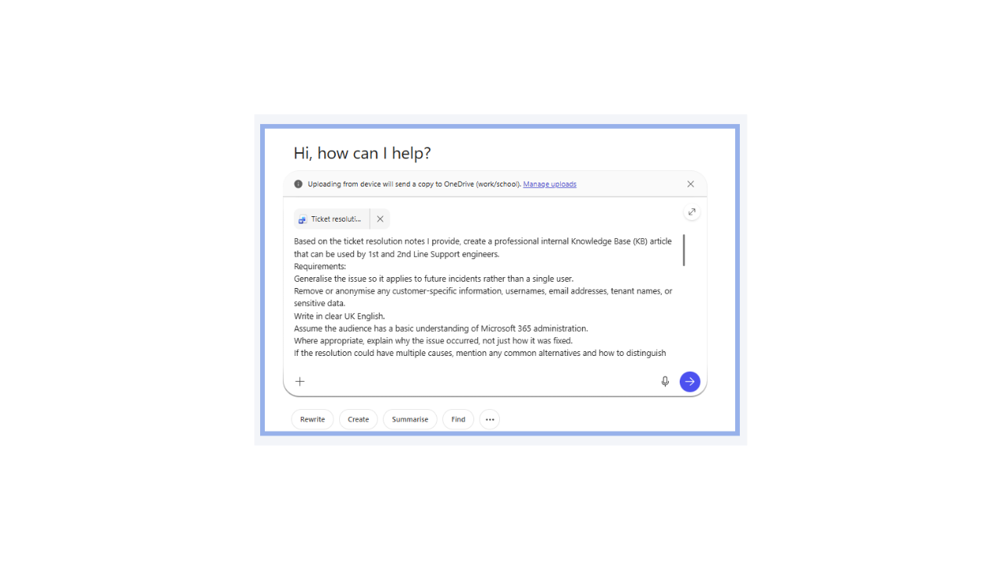
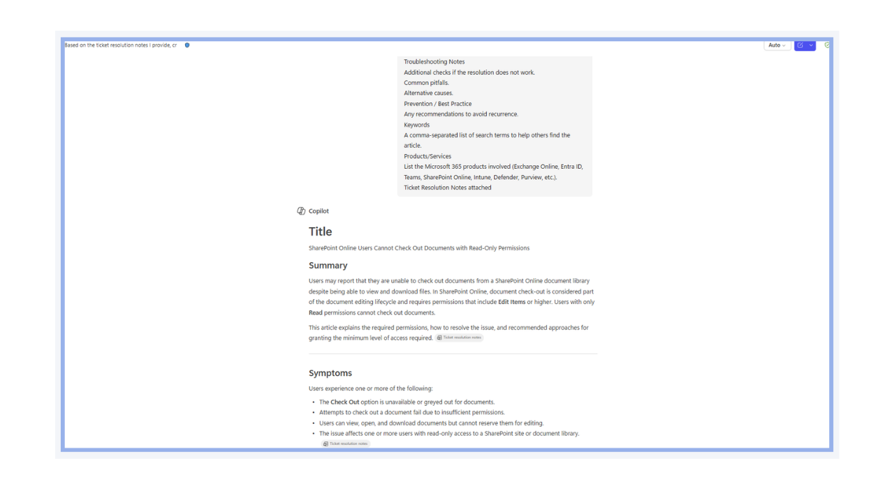
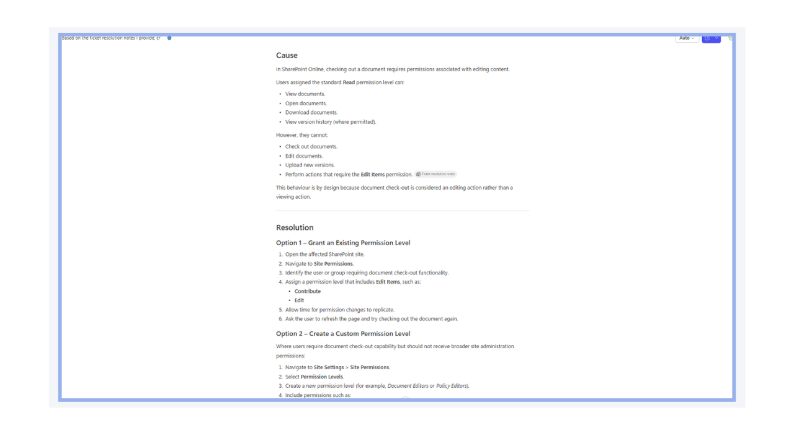
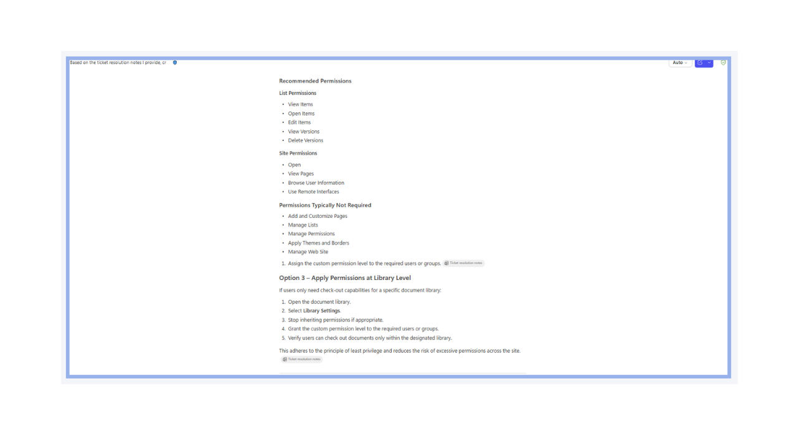
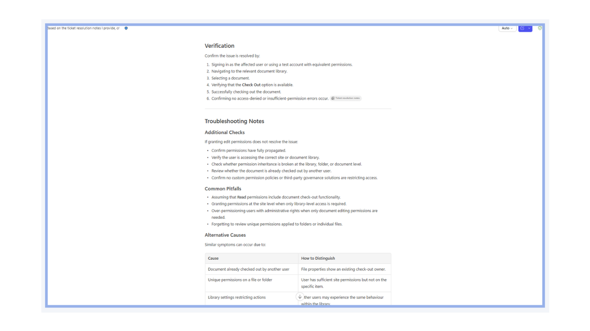
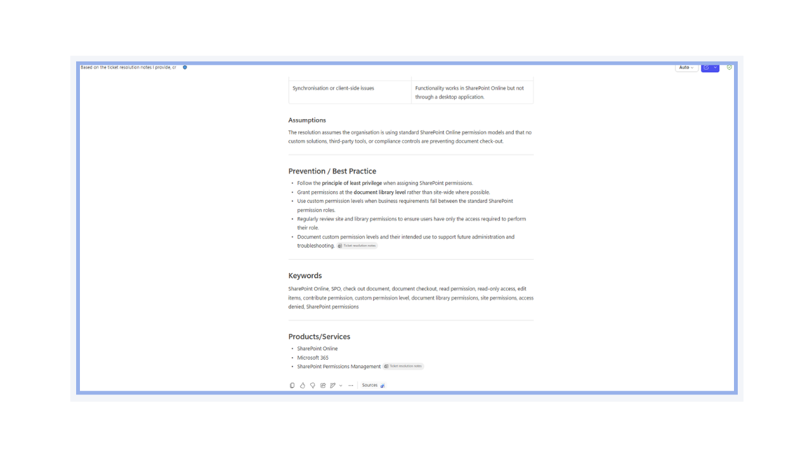
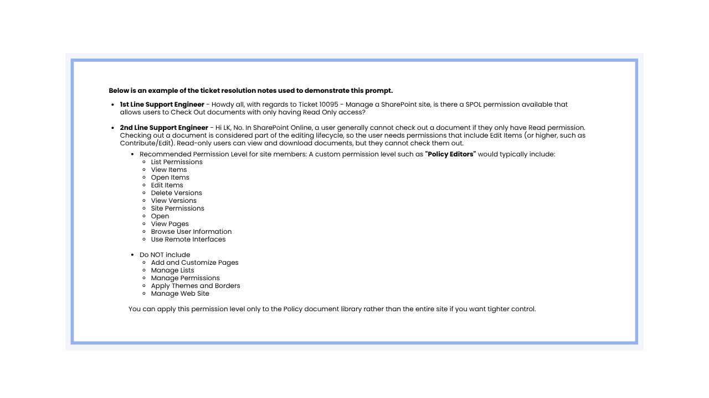

# Generate Knowledge Base Article from Ticket Resolution

## Summary

This prompt transforms support ticket resolution notes into a structured, reusable internal Knowledge Base (KB) article suitable for 1st and 2nd Line Support teams. It analyses the resolution provided, removes customer-specific and sensitive information, generalises the scenario for future incidents, and produces a professional support article using a standardised format. The resulting KB article includes symptoms, cause, resolution steps, verification methods, troubleshooting guidance, preventative recommendation, and relevant product classifications, helping support engineers resolve similar issues consistently and efficiently while promoting knowledge sharing across the service desk.

## Why It Matters

Support ticket resolutions often contain valuable technical knowledge that is lost once the case is closed. By converting resolution notes into standardised Knowledge Base articles, organisations can capture and retain that knowledge in a reusable format.

This approach helps reduce duplicate investigation effort, improves consistency across support teams, and enables faster resolution of recurring issues. It also supports knowledge sharing , accelerates the onboarding of new engineers, and reduces reliance on individual expertise.

By generalising customer specific incidents into reusable guidance, support teams can build a searchable repository of proven solutions that improves first time fix rates, enhances service quality, and promotes Microsoft 365 operational best practices.

## Prompt 💡

You are an experienced Microsoft 365 2nd Line Support Engineer and technical documentation writer. Based on the ticket resolution notes I provide, create a professional internal Knowledge Base (KB) article that can be used by 1st and 2nd Line Support engineers.

Requirements:

- Generalise the issue so it applies to future incidents rather than a single user.
- Remove or anonymise any customer-specific information, usernames, email addresses, tenant names, or sensitive data.
- Write in clear UK English.
- Assume the audience has a basic understanding of Microsoft 365 administration.
- Where appropriate, explain why the issue occurred, not just how it was fixed.
- If the resolution could have multiple causes, mention any common alternatives and how to distinguish them.
- Include any Microsoft best practices or recommendations where relevant.
- If information is missing, identify what assumptions are being made rather than inventing details.

Use the following structure:

- Title: A concise title that describes the issue.
- Summary: Brief overview of the issue.
- Symptoms: Typical symptoms users or support staff would observe.
- Cause: Root cause of the issue.
- Resolution: Step-by-step resolution procedure.
- Verification: How to confirm the issue has been resolved.
- Troubleshooting Notes: Additional checks if the resolution does not work.
- Common pitfalls: Alternative causes.
- Prevention / Best Practice: Any recommendations to avoid recurrence.
- Keywords: A comma-separated list of search terms to help others find the article.
- Products/Services: List the Microsoft 365 products involved (Exchange Online, Entra ID, Teams, SharePoint Online, Intune, Defender, Purview, etc.).

[Attach/paste ticket resolution notes here]

## Contributors 👨‍💻

[Josiah Opiyo](https://github.com/ojopiyo)

*Built with a focus on automation, governance, least privilege, and clean Microsoft 365 tenants - helping M365 admins gain visibility and reduce operational risk.*

## Version history

Version|Date|Comments
-------|----|--------
1.0|Jul 13, 2026|Initial release

## Instructions 📝

1. Make sure you have Copilot in your tenant
2. Open Copilot app
3. Copy and paste the prompt, remember to attach/paste ticket resolution notes then click submit

## Prerequisites

* [Copilot for Microsoft 365](https://developer.microsoft.com/microsoft-365/dev-program)

## Help

We do not support samples, but this community is always willing to help, and we want to improve these samples. We use GitHub to track issues, which makes it easy for  community members to volunteer their time and help resolve issues.

You can try looking at [issues related to this sample](https://github.com/pnp/copilot-prompts/issues?q=label%3A%22sample%3A%20m365-generate-knowledge-base-article-from-ticket-resolution%22) to see if anybody else is having the same issues.

If you encounter any issues using this sample, [create a new issue](https://github.com/pnp/copilot-prompts/issues/new).

Finally, if you have an idea for improvement, [make a suggestion](https://github.com/pnp/copilot-prompts/issues/new).

## Disclaimer

**THIS CODE IS PROVIDED *AS IS* WITHOUT WARRANTY OF ANY KIND, EITHER EXPRESS OR IMPLIED, INCLUDING ANY IMPLIED WARRANTIES OF FITNESS FOR A PARTICULAR PURPOSE, MERCHANTABILITY, OR NON-INFRINGEMENT.**

