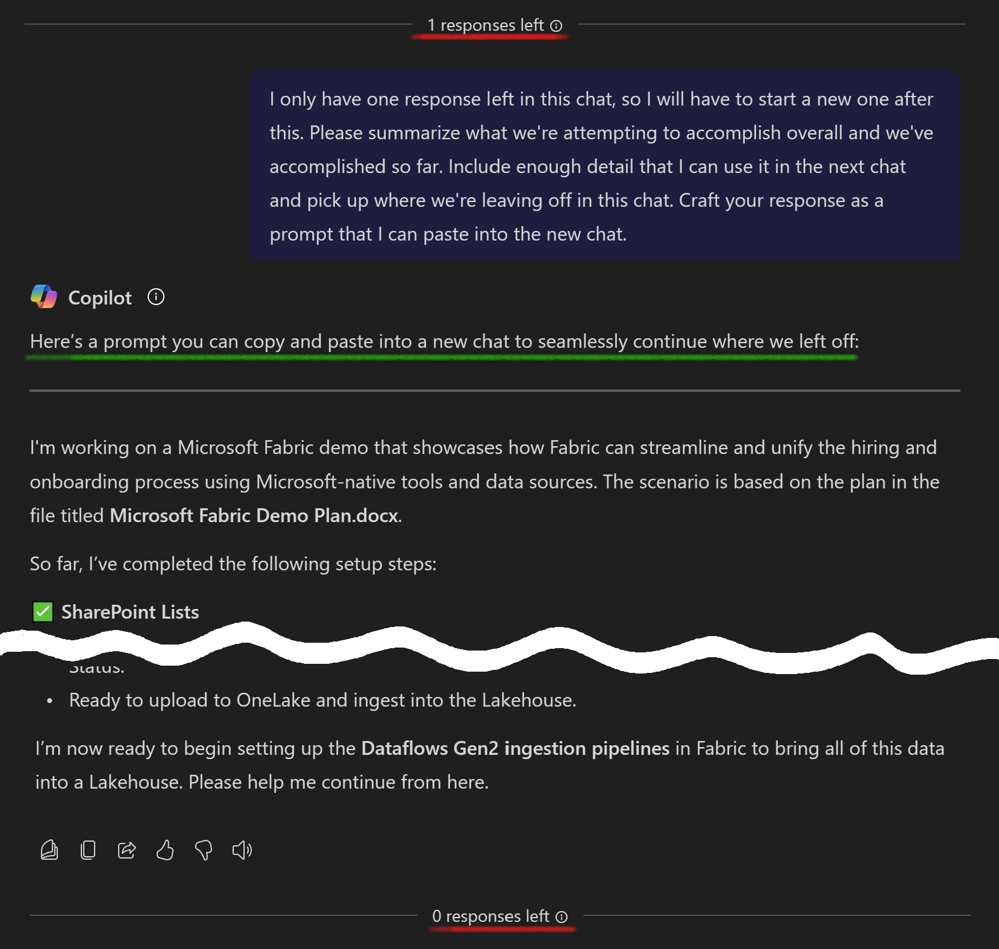

# 🤖 Generate Prompt for new chat 📃

## Summary
This prompt is designed to generate a prompt for starting a new chat continuing a chat that has run out of responses.

## Prompt💡

I only have one response left in this chat, so I will have to start a new one after this. Please summarize what we're attempting to accomplish overall and what we've accomplished so far. Include enough detail that I can use it in the next chat and pick up where we're leaving off in this chat. Craft your response as a prompt that I can paste into the new chat.

### Description ℹ️
Sometimes you need to have a chat with Copilot that is longer than the limited number of responses in a single session. This prompt can be used when you have only one response left and it will generate a prompt that you can paste into a new chat session to pick up right where you left off, limiting the need to repeat yourself.

## Contributors 👨‍💻

[Jim Duncan](https://github.com/sparkitect)

## Version history

Version|Date|Comments
-------|----|--------
1.0|June 4, 2025|Initial release

## Instructions 📝

1. Make sure you have Copilot for Microsoft 365 in your tenant
2. Have a long, drawn out conversation with Copilot
3. Keep an eye on the number of responses you have remaining, watching for it to get down to one
4. End the conversation using this prompt
5. Copy the response and paste into a new Copilot chat to pick up where you left off

## Prerequisites

* [Copilot for Microsoft 365](https://developer.microsoft.com/microsoft-365/dev-program)

## Help

We do not support samples, but this community is always willing to help, and we want to improve these samples. We use GitHub to track issues, which makes it easy for  community members to volunteer their time and help resolve issues.

You can try looking at [issues related to this sample](https://github.com/pnp/copilot-prompts/issues?q=is%3Aissue%20m365-generate-prompt-for-next-chat) to see if anybody else is having the same issues.

If you encounter any issues using this sample, [create a new issue](https://github.com/pnp/copilot-prompts/issues/new).

Finally, if you have an idea for improvement, [make a suggestion](https://github.com/pnp/copilot-prompts/issues/new).

## Disclaimer

**THIS CODE IS PROVIDED *AS IS* WITHOUT WARRANTY OF ANY KIND, EITHER EXPRESS OR IMPLIED, INCLUDING ANY IMPLIED WARRANTIES OF FITNESS FOR A PARTICULAR PURPOSE, MERCHANTABILITY, OR NON-INFRINGEMENT.**

