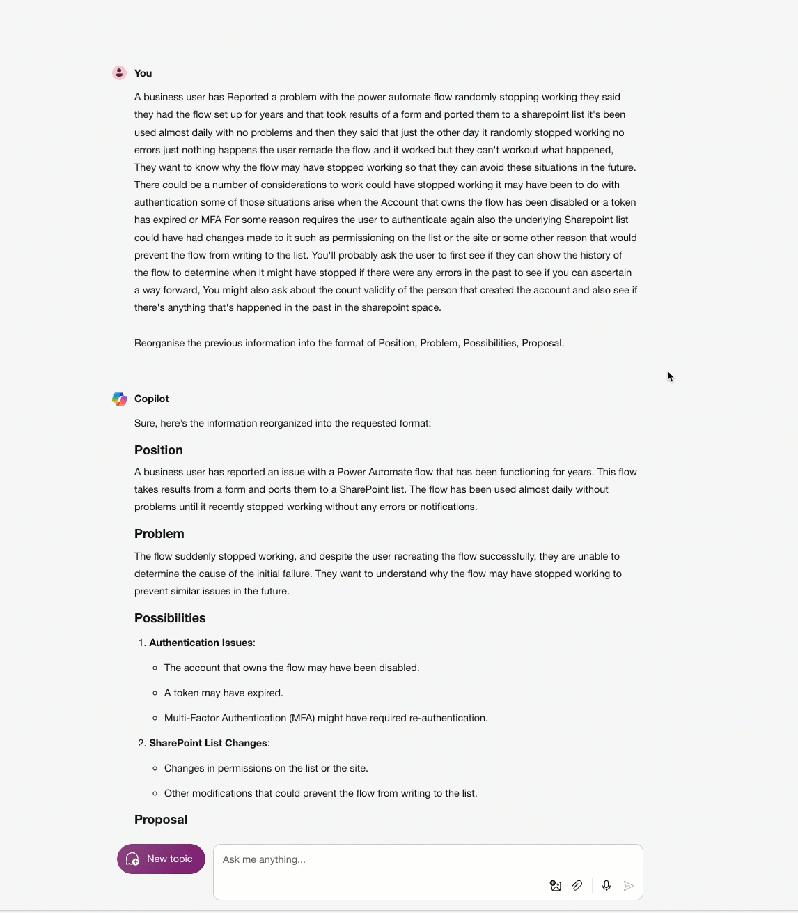

# 🚀 Using the 4Ps framework to organise information with Microsoft Copilot.

## Summary 📜

This prompt utilises Microsoft Copilot to transform data into a structure that aligns with the user's preferred information framework.
It is an example where the 'context' has been gathered using speech to text, or copied and pasted from an email chain or chat and then appended with '
Reorganise the previous information into the format of Position, Problem, Possibilities, Proposal.'

## Prompt 💡
[*your context*] Reorganise the previous information into the format of Position, Problem, Possibilities, Proposal.

Example:

*A business user has Reported a problem with the power automate flow randomly stopping working they said they had the flow set up for years and that took results of a form and ported them to a sharepoint list it's been used almost daily with no problems and then they said that just the other day it randomly stopped working no errors just nothing happens the user remade the flow and it worked but they can't workout what happened, They want to know why the flow may have stopped working so that they can avoid these situations in the future. There could be a number of considerations to work could have stopped working it may have been to do with authentication some of those situations arise when the Account that owns the flow has been disabled or a token has expired or MFA For some reason requires the user to authenticate again also the underlying Sharepoint list could have had changes made to it such as permissioning on the list or the site or some other reason that would prevent the flow from writing to the list. You'll probably ask the user to first see if they can show the history of the flow to determine when it might have stopped if there were any errors in the past to see if you can ascertain a way forward, You might also ask about the count validity of the person that created the account and also see if there's anything that's happened in the past in the sharepoint space.*
 
Reorganise the previous information into the format of Position, Problem, Possibilities, Proposal.

## Description ℹ️

It is an example prompt where the 'context' has been gathered using speech to text, or copied and pasted from an email chain or chat and then appended with '
Reorganise the previous information into the format of Position, Problem, Possibilities, Proposal.'

## Contributors 👨‍💻

[Andrew Jolly](https://www.linkedin.com/in/andrewjolly/)

## Version history 📋

Version|Date|Comments
-------|----|--------
1.0|Aug 5, 2024|Initial release

## Instructions 📝

1. Go to Microsoft Copilot
2. Copy paste the  prompt and replace [*your context*] with your actual context/text.

### Improvise Usage 🚀

You can try updating the prompt to format the response in a table or bulletted list.

## Help 💁

We do not support samples, but this community is always willing to help, and we want to improve these samples. We use GitHub to track issues, which makes it easy for  community members to volunteer their time and help resolve issues.

You can try looking at [issues related to this sample](https://github.com/pnp/copilot-prompts/issues?q=label%3A%22sample%3A%20YOUR-SAMPLE-NAME%22) to see if anybody else is having the same issues.

If you encounter any issues using this sample, [create a new issue](https://github.com/pnp/copilot-prompts/issues/new).

Finally, if you have an idea for improvement, [make a suggestion](https://github.com/pnp/copilot-prompts/issues/new).

## Disclaimer

**THIS CODE IS PROVIDED *AS IS* WITHOUT WARRANTY OF ANY KIND, EITHER EXPRESS OR IMPLIED, INCLUDING ANY IMPLIED WARRANTIES OF FITNESS FOR A PARTICULAR PURPOSE, MERCHANTABILITY, OR NON-INFRINGEMENT.**

