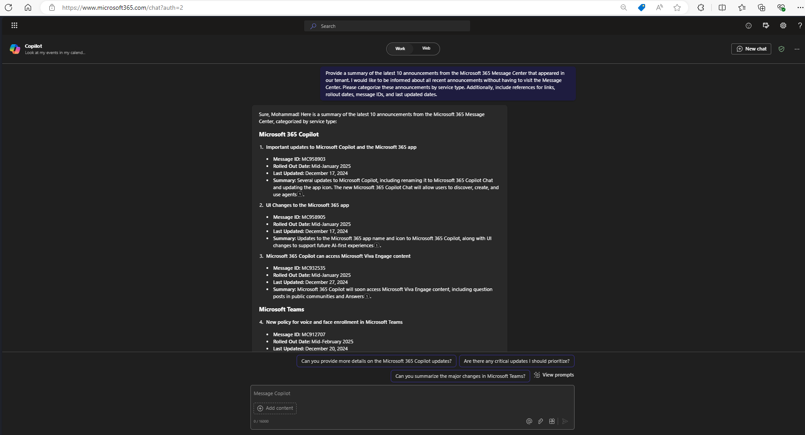
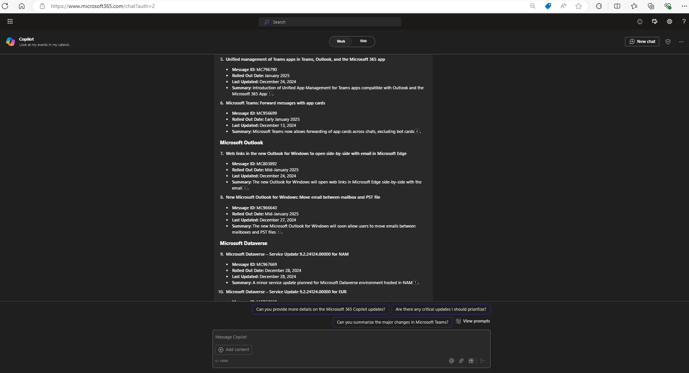

# 🚀 Latest 10 announcements from m365 message center 📅

## Summary
This prompt is designed to generate a concise summary of the latest 10 announcements from the Microsoft 365 Message Center, including links, rollout dates, message IDs, and last updated dates. It provides a summary description for each announcement, helping you stay informed about the latest M365 messages received in your tenant and identify services that may require additional focus to better prepare your organization.

## Prompt💡

Provide a summary of the latest 10 announcements from the Microsoft 365 Message Center that appeared in our tenant. I would like to be informed about all recent announcements without having to visit the Message Center. Please categorize these announcements by service type. Additionally, include references for links, rollout dates, message IDs, and last updated dates.

### Description ℹ️
This prompt will generate a simple summary report of the latest 10 announcements from the Microsoft 365 Message Center.

## Contributors 👨‍💻

[Mohammad Amer](https://github.com/mohammadamer)

## Version history

Version|Date|Comments
-------|----|--------
1.0|Dec 30, 2024|Initial release

## Instructions 📝

1. Make sure you have Copilot for Microsoft 365 in your tenant
2. make sure that you receive Microsoft 365 Message Center announcements in your organizational email
3. Open the Microsoft Teams app
4. Open the Copilot app within Teams
5. Paste the prompt in the Copilot app
6. make sure that you receive Microsoft 365 Message Center announcements in your organizational email

## Prerequisites

* [Copilot for Microsoft 365](https://developer.microsoft.com/microsoft-365/dev-program)

## Help

We do not support samples, but this community is always willing to help, and we want to improve these samples. We use GitHub to track issues, which makes it easy for  community members to volunteer their time and help resolve issues.

You can try looking at [issues related to this sample](https://github.com/pnp/copilot-prompts/issues?q=label%3A%22sample%3A%20YOUR-SAMPLE-NAME%22) to see if anybody else is having the same issues.

If you encounter any issues using this sample, [create a new issue](https://github.com/pnp/copilot-prompts/issues/new).

Finally, if you have an idea for improvement, [make a suggestion](https://github.com/pnp/copilot-prompts/issues/new).

## Disclaimer

**THIS CODE IS PROVIDED *AS IS* WITHOUT WARRANTY OF ANY KIND, EITHER EXPRESS OR IMPLIED, INCLUDING ANY IMPLIED WARRANTIES OF FITNESS FOR A PARTICULAR PURPOSE, MERCHANTABILITY, OR NON-INFRINGEMENT.**

