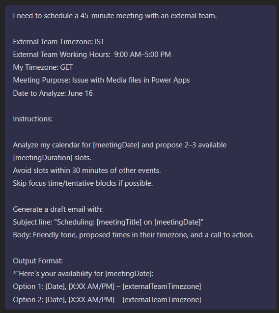

# 🚀 Find a slot for a meeting 📅

|  |  |
|-------------------------------------|-------------------------------------|
| *Request*                         | *Copilot Response*                         |

## Summary

This prompt analyzes calendar availability and timezone differences to propose optimal meeting slots for external teams. It generates ready-to-send scheduling requests with auto-converted time slots.

## Prompt💡
I need to schedule a 45-minute meeting with an external team.

- External Team Timezone: [externalTeamTimezone]
- External Team Working Hours: [externalTeamWorkingHours] (e.g., 9:00 AM–5:00 PM)
- My Timezone: [currentUserTimezone]
- Meeting Purpose: [meetingTitle]
- Date to Analyze: [meetingDate]

Instructions:

Analyze my calendar for [meetingDate] and propose 2–3 available [meetingDuration] slots.
Avoid slots within 30 minutes of other events.
Skip focus time/tentative blocks if possible.

Generate a draft email with:
- Subject line: "Scheduling: [meetingTitle] on [meetingDate]"
- Body: Friendly tone, proposed times in their timezone, and a call to action.

Output Format:
*"Here’s your availability for [meetingDate]:
- Option 1: [Date], [X:XX AM/PM] – [externalTeamTimezone]
- Option 2: [Date], [X:XX AM/PM] – [externalTeamTimezone]

## Contributors 👨‍💻

[Antanina Druzhkina](https://github.com/Ateina)

## Version history

Version|Date|Comments
-------|----|--------
1.0|Jun 14, 2025|Initial release

## Instructions 📝

1. Make sure you have copilot for Microsoft 365 in your tenant
2. Go to Copilot app in Teams
3. Copy paste the above prompt
4. Replace the [meetingDuration], [externalTeamTimezone], [externalTeamWorkingHours], [currentUserTimezone], [meetingTitle], [meetingDate] with actual values in prompt, don't update values in Instructions section.

## Prerequisites

* [Microsoft 365 Copilot](https://developer.microsoft.com/microsoft-365/dev-program)

## Help

We do not support samples, but this community is always willing to help, and we want to improve these samples. We use GitHub to track issues, which makes it easy for  community members to volunteer their time and help resolve issues.

You can try looking at [issues related to this sample](https://github.com/pnp/copilot-prompts/issues?q=label%3A%22sample%3A%20YOUR-SAMPLE-NAME%22) to see if anybody else is having the same issues.

If you encounter any issues using this sample, [create a new issue](https://github.com/pnp/copilot-prompts/issues/new).

Finally, if you have an idea for improvement, [make a suggestion](https://github.com/pnp/copilot-prompts/issues/new).

## Disclaimer

**THIS CODE IS PROVIDED *AS IS* WITHOUT WARRANTY OF ANY KIND, EITHER EXPRESS OR IMPLIED, INCLUDING ANY IMPLIED WARRANTIES OF FITNESS FOR A PARTICULAR PURPOSE, MERCHANTABILITY, OR NON-INFRINGEMENT.**

