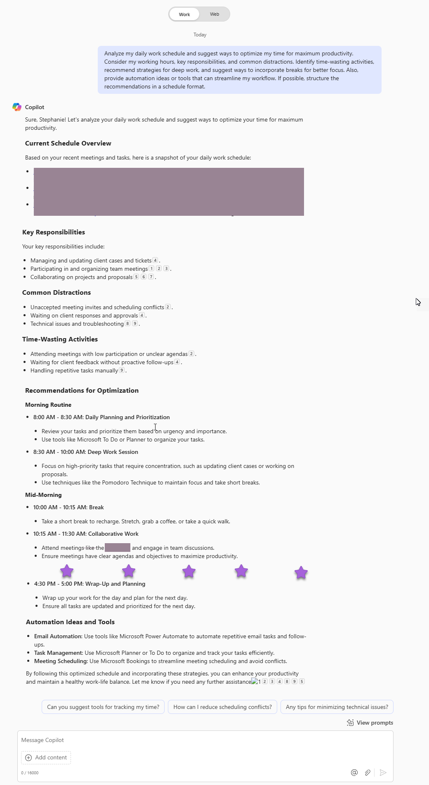

# 🚀 Help me optimize my daily work schedule 📅

## Summary 📜

This prompt helps analyze and optimize your daily work schedule by identifying inefficiencies, prioritizing tasks, and incorporating productivity strategies such as deep work sessions, time-blocking, and automation. It provides a structured approach to balancing focused work, meetings, and breaks while reducing distractions and improving time management. The goal is to enhance efficiency, minimize wasted time, and create a more sustainable and productive workflow.

## Prompt💡

Analyze my daily work schedule and suggest ways to optimize my time for maximum productivity. Consider my working hours, key responsibilities, and common distractions. Identify time-wasting activities, recommend strategies for deep work, and suggest ways to incorporate breaks for better focus. Also, provide automation ideas or tools that can streamline my workflow. If possible, structure the recommendations in a schedule format.

## Contributors 👨‍💻

* [Steph Marshall](https://github.com/stephrosem/)

## Version history

Version|Date|Comments
-------|----|--------
1.0|January 30, 2024|Initial release

## Instructions 📝

1. Make sure you have Copilot for Microsoft 365 in your tenant
2. Open the Microsoft Teams app
3. Open the Copilot app within Teams
4. Paste the prompt in the Copilot app

## Prerequisites

* [Copilot for Microsoft 365](https://developer.microsoft.com/microsoft-365/dev-program)

## Help

We do not support samples, but this community is always willing to help, and we want to improve these samples. We use GitHub to track issues, which makes it easy for  community members to volunteer their time and help resolve issues.

You can try looking at [issues related to this sample](https://github.com/pnp/copilot-prompts/issues?q=label%3A%22sample%3A%20YOUR-SAMPLE-NAME%22) to see if anybody else is having the same issues.

If you encounter any issues using this sample, [create a new issue](https://github.com/pnp/copilot-prompts/issues/new).

Finally, if you have an idea for improvement, [make a suggestion](https://github.com/pnp/copilot-prompts/issues/new).

## Disclaimer

**THIS CODE IS PROVIDED *AS IS* WITHOUT WARRANTY OF ANY KIND, EITHER EXPRESS OR IMPLIED, INCLUDING ANY IMPLIED WARRANTIES OF FITNESS FOR A PARTICULAR PURPOSE, MERCHANTABILITY, OR NON-INFRINGEMENT.**

