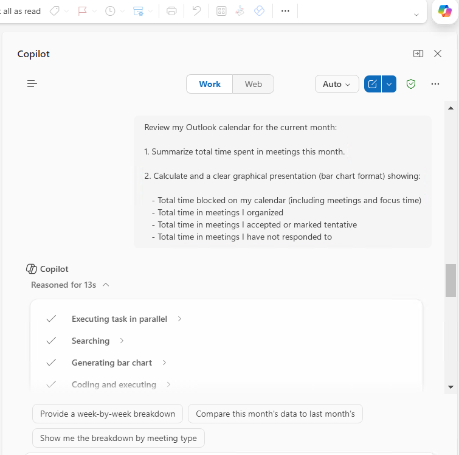
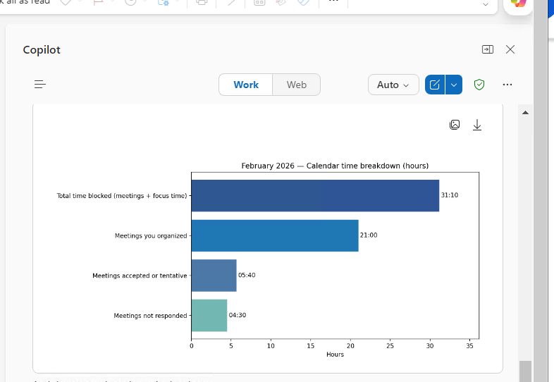

# Outlook Calendar Meeting Analytics

## Summary

Analyze your monthly Outlook calendar and get a clear breakdown of your meeting time with a visual representation.

## Prompt

```
Review my Outlook calendar for the current month:

1. Summarize total time spent in meetings this month.

2. Calculate and provide a clear graphical presentation (bar chart format) showing:

   - Total time blocked on my calendar (including meetings and focus time)
   - Total time in meetings I organized
   - Total time in meetings I accepted or marked tentative
   - Total time in meetings I have not responded to
```



## Description

Understanding how your time is spent in meetings is essential for productivity and workload management.

Use it in Outlook with Microsoft 365 Copilot to evaluate meeting load, identify overload patterns, and optimize your calendar.

## Contributors

[Sai Siva Ram Bandaru](https://github.com/saiiiiiii)

## Version history

Version|Date|Comments
-------|----|--------
1.0|February 25, 2026|Initial release

## Disclaimer

**THIS CODE IS PROVIDED *AS IS* WITHOUT WARRANTY OF ANY KIND, EITHER EXPRESS OR IMPLIED, INCLUDING ANY IMPLIED WARRANTIES OF FITNESS FOR A PARTICULAR PURPOSE, MERCHANTABILITY, OR NON-INFRINGEMENT.**

---

## Help

We do not support samples, but this community is always willing to help, and we want to improve these samples. We use GitHub to track issues, which makes it easy for community members to volunteer their time and help resolve issues.

If you encounter any issues while using this sample, [create a new issue](https://github.com/pnp/copilot-prompts/issues/new).

For questions regarding this sample, [create a new question](https://github.com/pnp/copilot-prompts/discussions).

Finally, if you have an idea for improvement, [make a suggestion](https://github.com/pnp/copilot-prompts/discussions).

