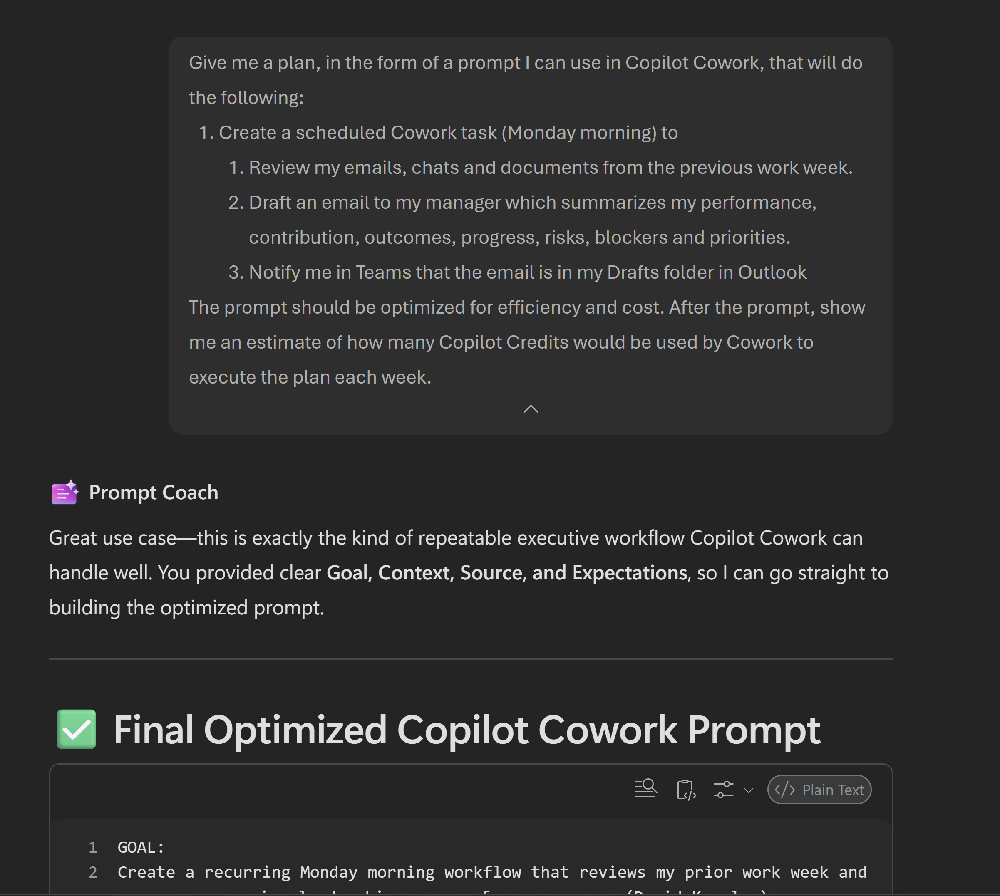
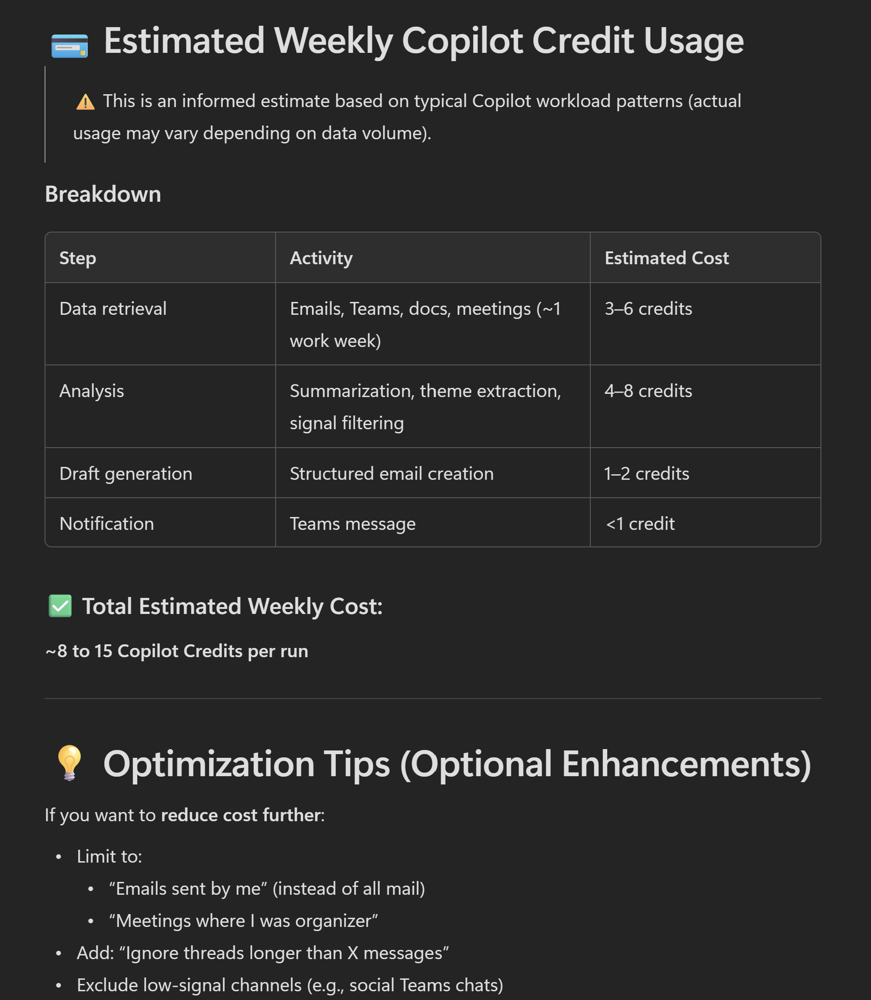

# Prompt Coach: Cowork Task Plan & Approx Estimate

> Microsoft does not publicly publish an exact token-to-credit conversion. Any estimate here is inferred from typical Copilot behavior and should be treated as approximate only.

## Summary

**Prompt Coach: Cowork Task Plan & Approx Estimate** is a meta-prompt that helps you create optimized Copilot Cowork plans for any task. Describe what you need done, and this prompt generates a structured Copilot Cowork prompt and estimates approx Copilot Credit consumption for the task run.

## Prompt 💡

```
Give me a plan, in the form of a prompt I can use in Copilot Cowork, that will do the following:

---
[‌Describe Cowork task]
---

The prompt should be optimized for efficiency and cost. After the prompt, show me an estimate of how many Copilot Credits would be used by Cowork to execute the plan each time.
```
### Example usage

### Example estimate

## Description ℹ️

This meta-prompt is useful for:

- **Workflow automation teams** designing Copilot Cowork processes
- **Project managers** planning automated task workflows
- **Cost-conscious organizations** optimizing Copilot credit usage
- **Development teams** creating reusable Copilot Cowork patterns

Simply describe your task, and the prompt generates both an optimized Copilot Cowork plan and a weekly cost estimate in Copilot Credits.

## Contributors 👨‍💻

[sparkitect](https://github.com/sparkitect)

## Version history

| Version | Date | Comments |
|---------|------|----------|
| 1.0 | 2026-06-18 | Initial release |

## Instructions 📝

1. Add/Open the Prompt Coach agent in Microsoft 365 Copilot
2. Copy the full prompt from the **Prompt** section above
3. Paste it into Copilot and describe your task in detail
4. Prompt Coach will generate:
   - An optimized Copilot Cowork prompt for your task
   - An estimate of Copilot Credit consumption
5. Use the generated prompt in your Copilot Cowork processes

### Improvise Usage 🚀

1. Use it to plan complex multi-step workflows with cost visibility
2. Compare credit estimates across different task approaches
3. Optimize existing workflows by re-running this prompt with constraints
4. Use it as a template generator for recurring automation patterns

## Prerequisites

* [Microsoft 365 Copilot](https://developer.microsoft.com/microsoft-365/dev-program)
* Prompt Coach Agent:
  * [Use the Prompt Coach template to build an agent](https://learn.microsoft.com/en-us/microsoft-365/copilot/extensibility/agent-template-prompt-coach)  
    OR
  * [Install the Prompt Coach agent](https://teams.microsoft.com/l/app/90680790-0a82-47bf-bab3-6c60c4221d1d?source=share-app-dialog)
* [Copilot Cowork](https://learn.microsoft.com/en-us/copilot/cowork-overview)

## Help

We do not support samples, but this community is always willing to help, and we want to improve these samples. We use GitHub to track issues, which makes it easy for community members to volunteer.

You can try looking at [issues related to this sample](https://github.com/pnp/copilot-prompts/issues?q=label%3A%22sample%3A+promptcoach-cowork-task-and-estimate%22) to see if anybody else is having the same issues.

If you encounter any issues using this sample, [create a new issue](https://github.com/pnp/copilot-prompts/issues/new).

Finally, if you have an idea for improvement, [make a suggestion](https://github.com/pnp/copilot-prompts/issues/new).

## Disclaimer

**THIS CODE IS PROVIDED *AS IS* WITHOUT WARRANTY OF ANY KIND, EITHER EXPRESS OR IMPLIED, INCLUDING ANY IMPLIED WARRANTIES OF FITNESS FOR A PARTICULAR PURPOSE, MERCHANTABILITY, OR NON-INFRINGEMENT.**


