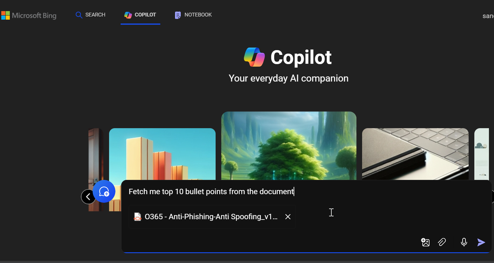

# 🚀 Fetch the top 10 bullet points of a Document

## Summary

This prompt helps to summarize the lengthy/huge documents which can save a lot of time when you only want to know the summary of the document. You can further ask Co-pilot to elaborate on any particular point among the top10

## Prompt 💡

Fetch me top 10 bullet points from the document[attach the Document]

## Description ℹ️

To Get a summarized top 10 bullet points of the document and this can be a document of any filetype like text,word,pdf etc.. 

## Contributors 👨‍💻

[Sabdeep Pothedar](https://github.com/SandeepPothedar)

## Version history

Version|Date|Comments
-------|----|--------
1.0|Sep 26, 2024|Initial release

## Instructions 📝

1. Make sure you have copilot for Microsoft 365 in your tenant
3. Go to Microsoft 365 Copilot in Office.com or use Copilot chat in Teams
4. Copy paste the above prompt
5. Copilot will ftech the top 10 bullet points for of the document

### Improvise Usage 🚀
You can ask Copilot to elaborate on any of the bullet points listed in the result or Create the Script for a PPT that you want to create out of it

## Prerequisites

* [Copilot for Microsoft 365](https://developer.microsoft.com/microsoft-365/dev-program)

## Help

We do not support samples, but this community is always willing to help, and we want to improve these samples. We use GitHub to track issues, which makes it easy for  community members to volunteer their time and help resolve issues.

You can try looking at [issues related to this sample](https://github.com/pnp/copilot-prompts/issues?q=label%3A%22sample%3A%20YOUR-SAMPLE-NAME%22) to see if anybody else is having the same issues.

If you encounter any issues using this sample, [create a new issue](https://github.com/pnp/copilot-prompts/issues/new).

Finally, if you have an idea for improvement, [make a suggestion](https://github.com/pnp/copilot-prompts/issues/new).

## Disclaimer

**THIS CODE IS PROVIDED *AS IS* WITHOUT WARRANTY OF ANY KIND, EITHER EXPRESS OR IMPLIED, INCLUDING ANY IMPLIED WARRANTIES OF FITNESS FOR A PARTICULAR PURPOSE, MERCHANTABILITY, OR NON-INFRINGEMENT.**

