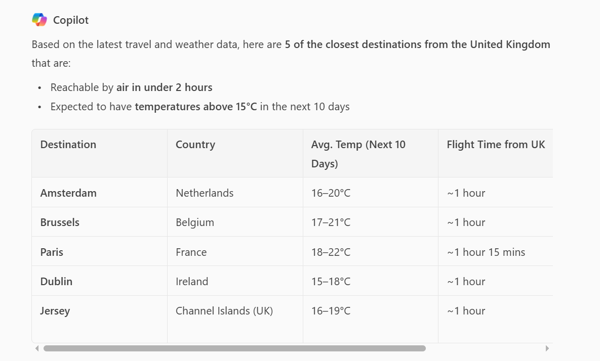

# Websearch Travel destinations

## Prompt

Generate a table using web search that lists the top 5 closest travel destinations from the United Kingdom where the temperature is expected to exceed 15°C over the next 10 days, and which are reachable by air in under 2 hours.

## Description
Generate a table using web search that lists the top 5 closest travel destinations from the United Kingdom where the temperature is expected to exceed 15°C over the next 10 days, and which are reachable by air in under 2 hours.

You can change the location and the search criteria.

##Output

## Contributors
* [Jayshree O](https://github.com/jayshree2020)

## Version history

Version|Date|Comments
-------|----|--------
1.0|May 16, 2025|Initial release

## Prerequisites

* [Copilot for Microsoft 365](https://developer.microsoft.com/microsoft-365/dev-program)

## Help

<!--
You can just search and replace this page with the following values:

Search for:
YOUR-SAMPLE-NAME

Replace with your sample folder name. E.g.: my-prompt

Search for:
@YOURGITHUBUSERNAME

Replace with your GitHub username, prefixed with an "@". If you have more than one author, use %20 to separate them, making sure to prefix everyone's username individually with an "@".

Example:
@rabwill

Or:
@rabwill%20@waldekmastykarz
-->

We do not support samples, but this community is always willing to help, and we want to improve these samples. We use GitHub to track issues, which makes it easy for  community members to volunteer their time and help resolve issues.

You can try looking at [issues related to this sample](https://github.com/pnp/copilot-prompts/issues?q=label%3A%22sample%3A%20YOUR-SAMPLE-NAME%22) to see if anybody else is having the same issues.

If you encounter any issues using this sample, [create a new issue](https://github.com/pnp/copilot-prompts/issues/new).

Finally, if you have an idea for improvement, [make a suggestion](https://github.com/pnp/copilot-prompts/issues/new).

## Disclaimer

**THIS CODE IS PROVIDED *AS IS* WITHOUT WARRANTY OF ANY KIND, EITHER EXPRESS OR IMPLIED, INCLUDING ANY IMPLIED WARRANTIES OF FITNESS FOR A PARTICULAR PURPOSE, MERCHANTABILITY, OR NON-INFRINGEMENT.**

