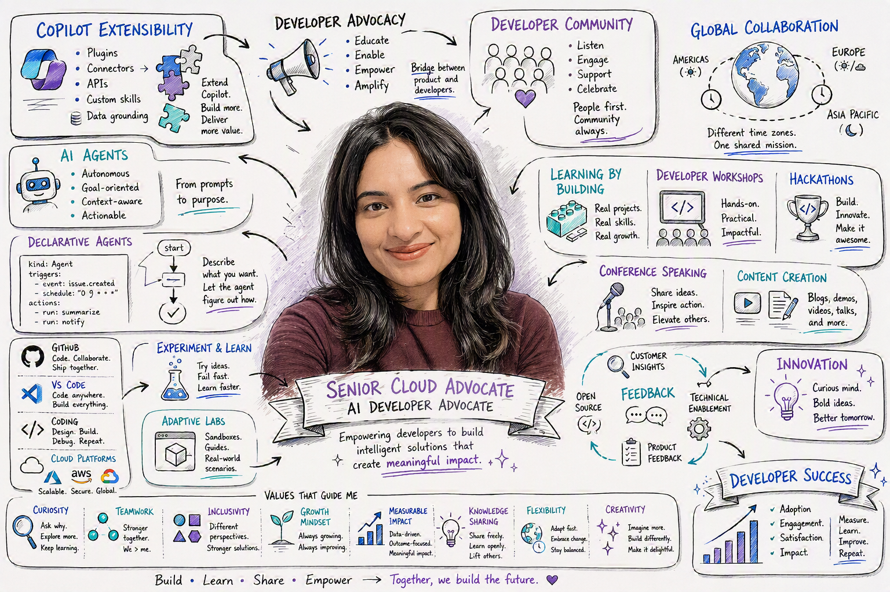

# WorkIQ Persona Sketch



> [!IMPORTANT]
> This prompt is designed to help you better understand and visualise your work. Depending on your data, generated outputs may include references to people you work with, projects, customers, teams, or other organisational details.
>
> If you choose to share the output publicly, we strongly recommend reviewing it first and removing any information that could expose private, confidential, or security-sensitive details. Always follow your organization's privacy and information protection guidelines when publishing generated content.

## Summary

This prompt helps you build a practical persona sketch from your recent work patterns so you can understand how you spend time, collaborate, and where your focus is strongest.

## Prompt 💡

```
Create a photorealistic image in a clean cartoon whiteboard sketch style that visualises my work life. Include what I do, who I work with, my role, my values and what's important to me. I've attached a headshot so you can guide the sketch of me at the center. Ground your research in Work IQ and the public profile for me on LinkedIn. The graphic should be rich in information. For the avatars of the people I work with, avoid guessing and put a generic icon in place or find their actual profile pictures.

```

## Description ℹ️

This prompt turns your recent Microsoft 365 signals into a clear persona sketch you can use for reflection and planning. It is useful for understanding work style trends, balancing collaboration with deep work, and identifying practical improvements without requiring manual analysis.

## Contributors 👨‍💻

[Anthony Shaw](https://github.com/tonybaloney)

## Version history

Version|Date|Comments
-------|----|--------
1.0|June 22, 2026|Initial release

## Instructions 📝

1. Open Copilot in your Microsoft 365 app (for example, Teams or Copilot Chat) with WorkIQ enabled.
2. Copy the prompt from the Prompt section.
3. Paste it into Copilot and run it.
4. Review the generated persona sketch.


## Prerequisites

* [Copilot for Microsoft 365](https://developer.microsoft.com/microsoft-365/dev-program) with WorkIQ

## Help

We do not support samples, but this community is always willing to help, and we want to improve these samples. We use GitHub to track issues, which makes it easy for community members to volunteer their time and help resolve issues.

You can try looking at [issues related to this sample](https://github.com/pnp/copilot-prompts/issues?q=label%3A%22sample%3A%20m365-workiq-persona-sketch%22) to see if anybody else is having the same issues.

If you encounter any issues using this sample, [create a new issue](https://github.com/pnp/copilot-prompts/issues/new).

Finally, if you have an idea for improvement, [make a suggestion](https://github.com/pnp/copilot-prompts/issues/new).

## Disclaimer

**THIS CODE IS PROVIDED *AS IS* WITHOUT WARRANTY OF ANY KIND, EITHER EXPRESS OR IMPLIED, INCLUDING ANY IMPLIED WARRANTIES OF FITNESS FOR A PARTICULAR PURPOSE, MERCHANTABILITY, OR NON-INFRINGEMENT.**

