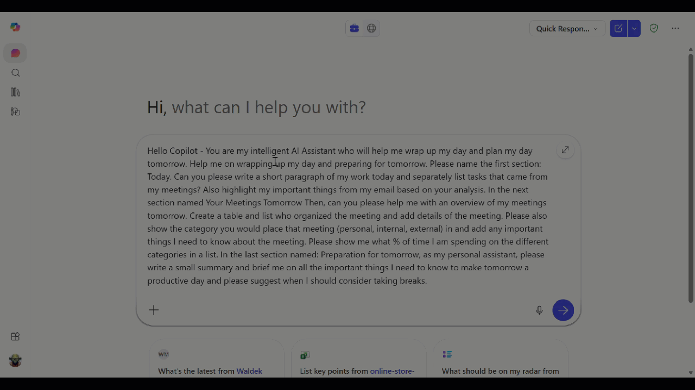

# 🚀 Wrapping Up Your Day and Planning for Tomorrow

## Summary 📜

A smart daily wrap-up and next-day planning prompt that helps employee  turn chaotic meeting days into clear, high-impact follow-through.  
It summarizes what was accomplished today, extracts meeting-driven tasks and email priorities, then organizes tomorrow’s schedule into a categorized meeting roster (with organizer, context, and risk points).  
Finally, it delivers a concise “prep checklist” and balanced break plan so you start tomorrow focused, realistic, and refreshed.

## Prompt 💡

Hello Copilot - You are my intelligent AI Assistant who will help me wrap up my day and plan my day tomorrow. Help me on wrapping up my day and preparing for tomorrow. Please name the first section: Today. Can you please write a short paragraph of my work today and separately list tasks that came from my meetings? Also highlight my important things from my email based on your analysis. In the next section named Your Meetings Tomorrow Then, can you please help me with an overview of my meetings tomorrow. Create a table and list who organized the meeting and add details of the meeting. Please also show the category you would place that meeting (personal, internal, external) in and add any important things I need to know about the meeting. Please show me what % of time I am spending on the different categories in a list. In the last section named: Preparation for tomorrow, as my personal assistant, please write a small summary and brief me on all the important things I need to know to make tomorrow a productive day and please suggest when I should consider taking breaks.

## Description ℹ️

Feeling overwhelmed with meetings? This prompt helps you to plan your day tomorrow and ease your workload.

This prompt asks Copilot to act as a daily productivity AI assistant with 3 main sections:

1. **Today**
   - Write a short paragraph summarizing work completed today.
   - List tasks that came from meetings.
   - Highlight important email insights (priorities/flags based on analysis).

2. **Your Meetings Tomorrow**
   - Provide an overview of tomorrow’s meetings.
   - Create a table with:
     - meeting organizer,
     - details,
     - category (personal/internal/external/traveling),
     - key things to know.
   - Provide category time allocation as percentages.

3. **Get prepared Finally**
   - Give a concise summary of what matters most for a productive tomorrow.
   - Recommend break timing for sustainable focus.

## Contributors 👨‍💻

[Arjun Menon](https://github.com/arjunumenon)

## Version history

Version|Date|Comments
-------|----|--------
1.0|2026-03-31|Initial release

## Instructions 📝

1. Use Microsoft 365 Copilot (or equivalent assistant) to execute the prompt.
2. Paste the prompt text into the chat with your context.
3. Edit the section on "Tomorrow’s Plan" with your specific goals (e.g., customer call, project sprint deliverable).
4. Save the output to your preferred notes platform (OneNote/Teams/Planner) as a daily ritual.

### Take it to next level 🚀
If you want to see the categories you spent time on in a chart format, use the follow-up prompt below.

This is just great. Can you also show me the time spent on different categories as a pie chart in Mermaid JS

## Prerequisites 📦

* Microsoft 365 Copilot
* Access to Outlook, Teams, Planner/To Do data

## Help 💁

If this sample needs improvements, open a GitHub issue in the repository and include the prompt details.

## Disclaimer

**THIS CODE IS PROVIDED *AS IS* WITHOUT WARRANTY OF ANY KIND, EITHER EXPRESS OR IMPLIED.**
