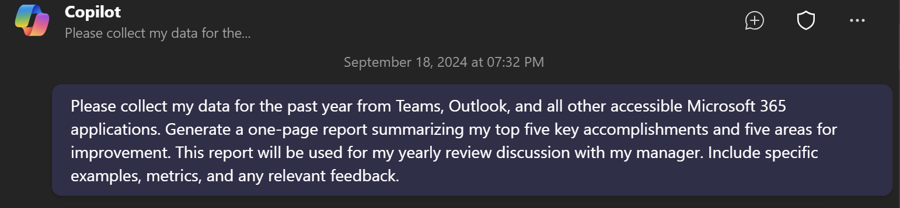

# 🚀 Create A Summary Of Accomplishments For My Yearly Performance Review   📅

## Summary

## Prompt 💡

Please collect my data for the past year from Teams, Outlook, and all other accessible Microsoft 365 applications. Generate a one-page report summarizing my top five key accomplishments and five areas for improvement. This report will be used for my yearly review discussion with my manager. Include specific examples, metrics, and any relevant feedback.

## Description ℹ️

Create a one page report of my key accomplishments as well as recommended ares of improvement for my yearly review discussion with my manager.

## Contributors 👨‍💻

[Diego Domingos da Silva](http://github.com/UnsuckM365)

## Version history

Version|Date|Comments
-------|----|--------
1.0|September 18, 2024|Initial release

## Instructions 📝

1. Make sure you have Copilot for Microsoft 365 in your tenant
2. Open the Microsoft Teams app
3. Open the Copilot app within Teams
4. Paste the prompt in the Copilot app

### Tweak It As Needed🚀
Remember the list generated can be used in YOUR career discussion, so make sure to review the results for accuracy and tweak them as needed for the most accurate results.

## Help

We do not support samples, but this community is always willing to help, and we want to improve these samples. We use GitHub to track issues, which makes it easy for  community members to volunteer their time and help resolve issues.

You can try looking at [issues related to this sample](https://github.com/pnp/copilot-prompts/issues?q=label%3A%22sample%3A%20YOUR-SAMPLE-NAME%22) to see if anybody else is having the same issues.

If you encounter any issues using this sample, [create a new issue](https://github.com/pnp/copilot-prompts/issues/new).

Finally, if you have an idea for improvement, [make a suggestion](https://github.com/pnp/copilot-prompts/issues/new).

## Disclaimer

**THIS CODE IS PROVIDED *AS IS* WITHOUT WARRANTY OF ANY KIND, EITHER EXPRESS OR IMPLIED, INCLUDING ANY IMPLIED WARRANTIES OF FITNESS FOR A PARTICULAR PURPOSE, MERCHANTABILITY, OR NON-INFRINGEMENT.**

