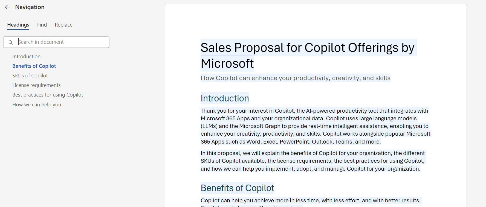

# 🚀 Create a Sales Proposal for a sales lead with content refering from a document in SharePoint in Microsoft Word

## Summary

This prompt helps in creating a sales proposal with content referred from a document uploaded in SharePoint. The proposal elaborates about the product offering, licenses, usage and an opportunity for organization to offer services and make the lead into potential customer. 

## Prompt 💡

 Help me create a sales proposal for an energy sales lead. This proposal is about the Copilot offerings provided by Microsoft, Add different SKUs of copilots. Emphasize on Copilot for Microsoft 365, Add license details, show how to use prompts and how can an organization be prepared for Copilot and manage Copilot for Microsoft 365 . Mention how we as an organization can help this customer in implementing, adopting Copilot for their organization. make sure to add all the content in the presentation from here, copilot-microsoft-365.pdf. The proposal should be crisp and concise with no longer than 3 pages. 

## Description ℹ️

Create a sales proposal for an energy sales lead in Microsoft Word referring the content from a file uploaded in SharePoint. The proposal is expected to be crisp and clear and should fit in less than 3 pages.

## Contributors 👨‍💻

[Shrushti Shah](https://github.com/Shrusti13)

## Version history

Version|Date|Comments
-------|----|--------
1.0|July 4, 2024|Initial release

## Instructions 📝

1. Make sure you have copilot for Microsoft 365 in your tenant
2. Go to Word and Click on draft with Copilot
3. Copy paste the above prompt
4. Add reference files like I have added in the prompt, either from SharePoint or OneDrive for the prompt to refer for adding the content for your sales proposal.

### Improvise Usage 🚀
You can add more information to the prompt if needed to create more accurate proposal. You can also refer the sales proposal template with the prompt and ask the copilot to draft in the given template. Currently, the prompt is not referring any sales proposal document template.

## Prerequisites

* [Copilot for Microsoft 365](https://developer.microsoft.com/microsoft-365/dev-program)

## Help

We do not support samples, but this community is always willing to help, and we want to improve these samples. We use GitHub to track issues, which makes it easy for  community members to volunteer their time and help resolve issues.

You can try looking at [issues related to this sample](https://github.com/pnp/copilot-prompts/issues?q=label%3A%22sample%3A%20YOUR-SAMPLE-NAME%22) to see if anybody else is having the same issues.

If you encounter any issues using this sample, [create a new issue](https://github.com/pnp/copilot-prompts/issues/new).

Finally, if you have an idea for improvement, [make a suggestion](https://github.com/pnp/copilot-prompts/issues/new).

## Disclaimer

**THIS CODE IS PROVIDED *AS IS* WITHOUT WARRANTY OF ANY KIND, EITHER EXPRESS OR IMPLIED, INCLUDING ANY IMPLIED WARRANTIES OF FITNESS FOR A PARTICULAR PURPOSE, MERCHANTABILITY, OR NON-INFRINGEMENT.**

