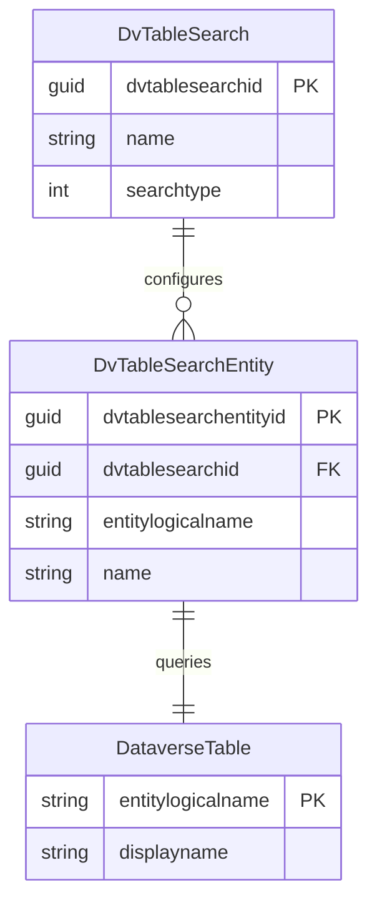

# Copilot Studio Agent Documentor

To generate documentation in a single file, follow this process, using the sections below to analyse and structure the agents within the /Agents/ folder in this repo.

## When to Use This Skill

- User requests documentation for an agent in `Agents/<AgentName>/`
- Analyzing agent capabilities, topics, and integrations
- Creating markdown documentation output in `Docs/Agents/` folder

## Step-by-Step Workflows

### 1. Identify Agent Structure
```bash
# Locate the agent solution
ls Agents/<AgentName>/src/bots/

# List all bot components
ls Agents/<AgentName>/src/botcomponents/
```

### 2. Extract Agent Metadata
Read key files in this order:
1. `Agents/<AgentName>/src/Other/Solution.xml` - Publisher, version, solution name
2. `Agents/<AgentName>/src/bots/<prefix>_<agentname>/bot.xml` - Agent metadata
3. `Agents/<AgentName>/src/bots/<prefix>_<agentname>/configuration.json` - Agent configuration

### 3. Document Agent Components

#### Topics (Conversation Flows)
- Pattern: `botcomponents/<prefix>_<agent>.topic.<TopicName>/`
- Read `botcomponent.xml` for topic name and state
- Check `data` file for conversation logic (if present)
- Document standard topics: ConversationStart, Greeting, Fallback, Escalate, OnError
- Highlight custom topics (non-standard names)

#### GPT Instructions
- Pattern: `botcomponents/<prefix>_<agent>.gpt.default/`
- Extract AI instructions from `data` file
- Document the agent's generative capabilities and system prompt

#### Connector Actions
- Pattern: `botcomponents/<prefix>_<agent>.action.<Connector-Operation>/`
- Example: `.action.ServiceNow-GetRecord`, `.action.ServiceNow-Orderitem`
- List all external actions the agent can perform
- Cross-reference with `Assets/botcomponent_connectionreferenceset.xml`

#### Multi-Agent Orchestration
- Pattern: `botcomponents/<prefix>_<agent>.InvokeConnectedAgentTaskAction.<ChildAgent>/`
- Document agent-to-agent handoffs
- Map parent agents to their specialized sub-agents
- Orchestration uses `InvokeConnectedAgentTaskAction` components to route conversations.

#### Test Phrases (Evaluation Sets)
- Pattern: `botcomponents/mspva_<GUID>/botcomponent.xml` with `<category>Testing</category>`
- Component type: `<componenttype>19</componenttype>`
- Extract test phrases from `<description>` or `<name>` elements
- These are sample questions/prompts used to evaluate agent responses
- Group test phrases by parent agent (`<parentbotid>`)
- Document which agent or topic each test phrase targets

### 4. Document Components and External Integrations 

### File Structure (per component)
```
botcomponents/<componentschema>/
├── botcomponent.xml    # Metadata (name, parent, state)
└── data                # Optional binary/additional data
```

### Solution Metadata
- `Other/Solution.xml` - Publisher, version, localization settings
- `Assets/botcomponent_*.xml` - Cross-cutting configuration sets
- Schema name → physical folder name mapping is 1:1

#### Connection References
Read `Agents/<AgentName>/src/Other/Customizations.xml`:
- Extract `<connectionreference>` elements
- Document `connectorid` (e.g., `/providers/Microsoft.PowerApps/apis/shared_service-now`)
- Note connection display names

#### Knowledge Sources
Read `Agents/<AgentName>/src/unstructuredfilesearchentities/*.meta.xml`:
- Extract `<sourceurl>` values (external API endpoints)
- Document knowledge source types (`<knowledgesource>` codes)

#### Dataverse Tables and Entities
Agents may include Dataverse table search capabilities for querying business data. These are found in:
- `Agents/<AgentName>/src/dvtablesearchs/` - Search configurations
- `Agents/<AgentName>/src/dvtablesearchentities/` - Entity/table mappings


**Relationship Structure:**
1. Each `dvtablesearch.xml` defines a search configuration with a unique `<dvtablesearchid>`
2. Each `dvtablesearchentity.xml` links to a search via `<dvtablesearchid>` and specifies the `<entitylogicalname>` (table)
3. Multiple entities can be associated with a single search configuration

**Analysis Process:**

To find Dataverse table searches:

```bash
# Find all Dataverse table searches
ls Agents/<AgentName>/src/dvtablesearchs/

# Find all entity mappings
ls Agents/<AgentName>/src/dvtablesearchentities/
```

For each dvtablesearch:
1. Read `dvtablesearchs/<guid>/dvtablesearch.xml` - Extract search name and ID
2. Find related entities by searching for the `dvtablesearchid` in dvtablesearchentities
3. Read each `dvtablesearchentities/<guid>/dvtablesearchentity.xml` - Extract entity logical name and display name

**Generate ERD Diagram:**
Create a Mermaid entity-relationship diagram showing:
- Tables/entities involved in the search
- Relationships between search configurations and entities
- Entity attributes when available



**Example Mapping:**
- Search: `PeopleonAccount_Account_sKtInwp9Jyd91zLl63PSV` (ID: c5010e77-c900-4bf1-898d-c4c0ab9eed30)
- Entity: `account` (Account table)

### 5. Extract Test Phrases for Evaluation

Search for bot components with `<category>Testing</category>`:
```bash
grep -r "<category>Testing</category>" Agents/<AgentName>/src/botcomponents/ -l
```

For each testing component:
1. Read `botcomponents/<guid>/botcomponent.xml`
2. Extract `<description>` and `<name>` fields - these contain the test phrases
3. Note the `<parentbotid>` to identify which agent the test is for
4. Group test phrases by agent for documentation

Test phrases are used for:
- Evaluating agent responses to common queries
- Regression testing after agent updates
- Demonstrating agent capabilities with sample questions

### 6. Generate Documentation Output

Create markdown file in `Docs/<AgentName>.md` with sections:

```markdown
# <Agent Display Name>

**Solution Name:** <from Solution.xml>
**Version:** <from Solution.xml>
**Publisher:** <from Solution.xml>

## Overview
<Brief description of agent purpose>

## Agent Architecture
<Multi-agent diagram if applicable>

## Topics
### Standard Topics
- List ConversationStart, Greeting, Fallback, etc.

### Custom Topics
- Document business-specific conversation flows

## GPT Instructions
<System prompt summary>

## External Integrations
### Connectors
- **ServiceNow**: <list actions>
- **<OtherConnector>**: <list actions>

### Knowledge Sources
- URL: <sourceurl>
- Type: <description>

### Dataverse Tables
<If dvtablesearch components exist>

The agent has access to the following Dataverse tables for data queries:

#### Entity Relationship Diagram
```mermaid
erDiagram
    <SearchName> ||--o{ <EntityName> : "searches"
    <EntityName> {
        string entitylogicalname
        string displayname
    }
```

#### Configured Searches
| Search Name | Search ID | Entity | Description |
|-------------|-----------|--------|-------------|
| <name> | <dvtablesearchid> | <entitylogicalname> | <purpose> |

## Component Inventory
- Total Topics: <count>
- Total Actions: <count>
- Child Agents: <list if orchestrator>
- Dataverse Table Searches: <count>
- Dataverse Entities: <count>

## Test Phrases & Evaluation Sets
<Group test phrases by agent>

### <Agent Name>
- "<test phrase 1>"
- "<test phrase 2>"
- "<test phrase 3>"

### <Another Agent Name>
- "<test phrase 1>"
- "<test phrase 2>"
```

### Naming Conventions to Recognize

#### Component Schema Names
- Format: `<customizationprefix>_<logicalname>.<componenttype>.<descriptor>`
- Example: `cr667_primaryPortalAgent.InvokeConnectedAgentTaskAction.ClientExplorer`
- The prefix (e.g., `cr667`, `pkb`) comes from the Dataverse publisher

#### Topic Naming Patterns
- Standard: `.topic.Greeting`, `.topic.Fallback`, `.topic.OnError`
- Custom: `.topic.<Intent>_<GUID>` or `.topic.<FriendlyName>`

#### Action Naming Pattern
- Format: `.action.<ConnectorName>-<OperationName>`
- Example: `.action.ServiceNow-Getcatalogitems`

### Common Analysis Commands

```bash
# Count topics for an agent
ls Agents/<AgentName>/src/botcomponents/ | grep "\.topic\." | wc -l

# Find all connector actions
ls Agents/<AgentName>/src/botcomponents/ | grep "\.action\."

# Check for multi-agent orchestration
ls Agents/<AgentName>/src/botcomponents/ | grep "InvokeConnectedAgentTaskAction"

# Find external service URLs
grep -r "sourceurl\|connectorid" Agents/<AgentName>/src/

# List all agents in solution
ls Agents/<AgentName>/src/bots/

# Find all test phrases/evaluation sets
grep -r "<category>Testing</category>" Agents/<AgentName>/src/botcomponents/ -A 3

# Check for Dataverse table searches
ls Agents/<AgentName>/src/dvtablesearchs/ 2>/dev/null || echo "No Dataverse searches"

# List Dataverse entities
ls Agents/<AgentName>/src/dvtablesearchentities/ 2>/dev/null || echo "No Dataverse entities"

# Find entity-to-search mappings
grep -r "dvtablesearchid" Agents/<AgentName>/src/dvtablesearchentities/
```

### Output Best Practices

1. **Always output to `Docs/`** - Never create documentation in other folders
2. **Use agent name as filename** - `Docs/<AgentName>.md`
3. **Include file references** - Link back to source files when describing components
4. **Configuration** - List out in a table the configuration of each othe bots.
5. **Document multi-agent relationships** - Show parent-child agent hierarchies in a mermaid diagram. Group all the documentation by the agent, showing documentation topics underneath each group. 
6. **Highlight integrations** - External APIs and connectors are critical for understanding agent capabilities
7. **Count components** - Provide metrics (# topics, # actions, # child agents)
8. **Include test phrases** - Document evaluation test phrases grouped by agent to demonstrate capabilities and provide testing examples
9. **Other documentation** - Remove references to other documentation in the repository. This file should be standalone. 
10. **Technical depth** - Include some explainations of components, assuming that the audience less technical and may not know what these components mean - unless the request asks for highly technical output.

### Example: multiagentdemo Analysis

The `multiagentdemo` solution contains 5 agents:
- **primaryPortalAgent** (orchestrator)
- **getSkillName** (People Skills Finder)
- **myServices** (ServiceNow integration with 3 actions)
- **serviceNowKnowledgeAgent** (knowledge base queries)
- **whoWhat** (account lookups)

ServiceNow integration found:
- Connector: `shared_service-now`
- Actions: GetRecord, Getcatalogitems, Orderitem
- Knowledge URL: `https://<instance-name>.service-now.com/`

### Key Files Reference

- `Solution.xml` - Version, publisher, solution metadata
- `Customizations.xml` - Connection references to external services
- `botcomponent_connectionreferenceset.xml` - Bot-to-connector mappings
- `unstructuredfilesearchentities/*.meta.xml` - Knowledge source URLs
- `botcomponents/*/botcomponent.xml` - Individual component metadata
- `botcomponents/*/data` - Individual component data files
- `bots/*/bot.xml` - Top-level bot definitions
- `bots/*/configuration.json` - Bot configuration settings
- `dvtablesearchs/*/dvtablesearch.xml` - Dataverse table search configurations
- `dvtablesearchentities/*/dvtablesearchentity.xml` - Dataverse entity/table mappings


When you are building references to files, navigate from the repo root, as the generated document can existing under a subfolder when generated.