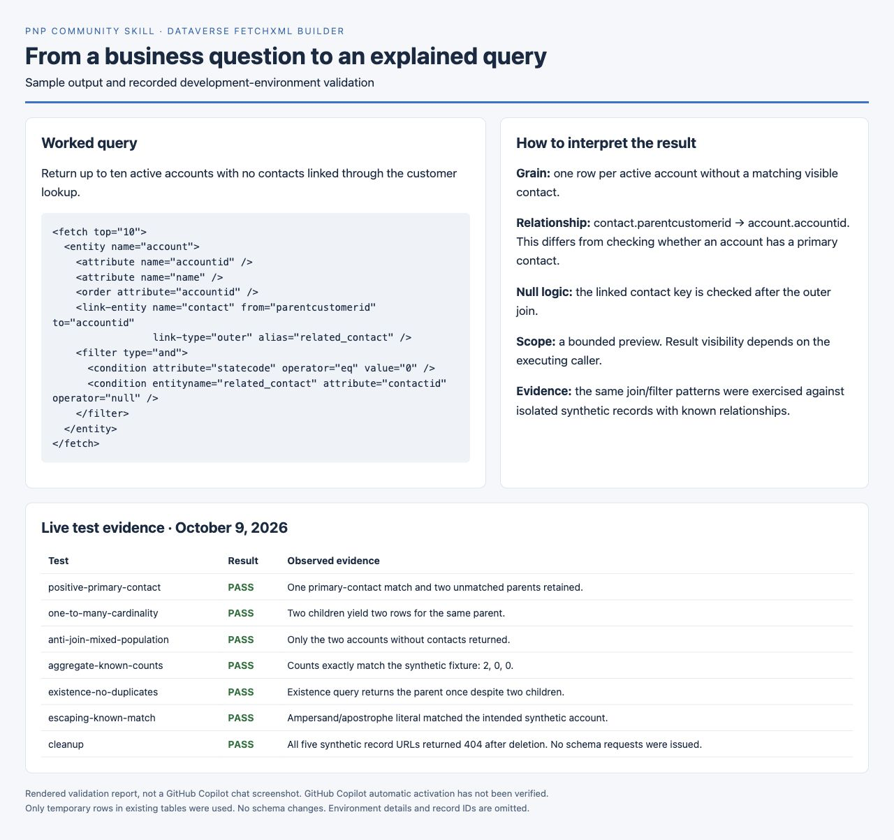

# Dataverse FetchXML Builder for GitHub Copilot

*Preview of sample output and the recorded validation report; this is not a GitHub Copilot chat capture.*

## Summary

Build and troubleshoot FetchXML queries using business requirements and verified Dataverse schema. The skill explains relationship direction, result cardinality, null filters, aggregates, and paging while distinguishing static review from live execution.

## Skill 💡

The full definition is in [SKILL.md](./SKILL.md). Copy it into `.github/skills/dataverse-fetchxml-builder/SKILL.md` in your workspace.

### Trigger Phrases

- "Write a FetchXML query for active accounts with no contacts."
- "Build a FetchXML aggregate using this Dataverse metadata."
- "Fix this FetchXML query; it returns duplicate accounts."
- "Explain why my FetchXML outer join drops accounts."

## Description ℹ️

The skill resolves logical names and relationships, establishes what each result row represents, builds the query, and checks it against the available evidence. It asks for missing custom schema instead of inventing names. Optional live validation uses an existing authenticated connection and read-only queries.

Output consists of FetchXML, schema evidence, an explanation, instructions for the selected client, and a validation summary. It does not install an execution tool, provision an environment, or create test records.

## Contributors 👨‍💻

[Summit Bajracharya](https://github.com/summitbaj)

## Version history

Version|Date|Comments
-------|----|--------
1.0|October 9, 2026|Initial contribution with live Dataverse query validation

## Instructions 📝

1. Copy [SKILL.md](./SKILL.md) into `.github/skills/dataverse-fetchxml-builder/SKILL.md`.
2. Open your workspace in VS Code with GitHub Copilot enabled.
3. Supply the business question and relevant Dataverse metadata or solution files.
4. Ask: "Write a FetchXML query using this schema and explain the result grain."
5. Review any schema questions, the query, and the reported validation status.
6. If you want execution, identify the environment and request a read-only test using an available authenticated tool.

### Example

Ask for up to ten active accounts with no contacts related through `contact.parentcustomerid`, returning account ID and name. Supply schema evidence for these tables and the active state value. The worked example in SKILL.md demonstrates the outer join and post-join null test.

### Customization 🚀

Specify a target client (Power Automate, Web API, SDK, or PAC CLI), the output columns, row limit, and ordering. For date filters, provide the intended time zone and interval. For custom tables, include logical names, column types, and relationship metadata.

## Prerequisites

* [GitHub Copilot](https://copilot.github.com/)
* [Visual Studio Code](https://code.visualstudio.com/)
* Relevant Dataverse metadata or an authorized way to retrieve it
* For optional execution: an authenticated Dataverse development environment and a read-only query tool

## Validation status

Development-environment tests have verified schema discovery, filtered queries against an independent OData comparison, outer-join retention for accounts without contacts, zero contact-count aggregates, two-page retrieval with a paging cookie, and XML escaping. Additional authorized synthetic-record tests verified positive joins, one-to-many row multiplication, anti-joins, exact contact counts of 2/0/0, existence queries without duplicates, and special-character matching. All five temporary records were deleted and cleanup was verified; no schema changes were made. See [validation evidence](./VALIDATION.md) for scope and limitations.

GitHub Copilot automatic activation has not been tested. The preview shows the worked query and recorded validation results. Successful server execution and verified expected results are recorded separately.

## Help

We do not support samples, but this community is always willing to help, and we want to improve these samples. We use GitHub to track issues, which makes it easy for community members to volunteer their time and help resolve issues.

You can try looking at [issues related to this sample](https://github.com/pnp/copilot-prompts/issues?q=label%3A%22sample%3A%20dataverse-fetchxml-builder%22) to see if anybody else is having the same issues.

If you encounter any issues using this sample, [create a new issue](https://github.com/pnp/copilot-prompts/issues/new).

Finally, if you have an idea for improvement, [make a suggestion](https://github.com/pnp/copilot-prompts/issues/new).

## Disclaimer

**THIS CODE IS PROVIDED *AS IS* WITHOUT WARRANTY OF ANY KIND, EITHER EXPRESS OR IMPLIED, INCLUDING ANY IMPLIED WARRANTIES OF FITNESS FOR A PARTICULAR PURPOSE, MERCHANTABILITY, OR NON-INFRINGEMENT.**

